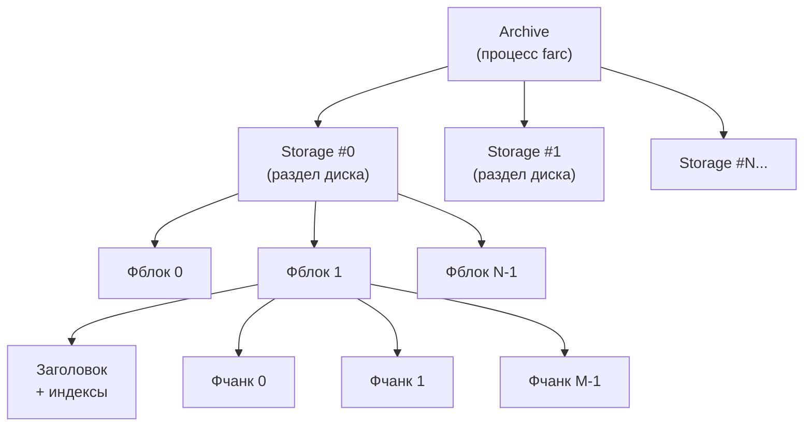
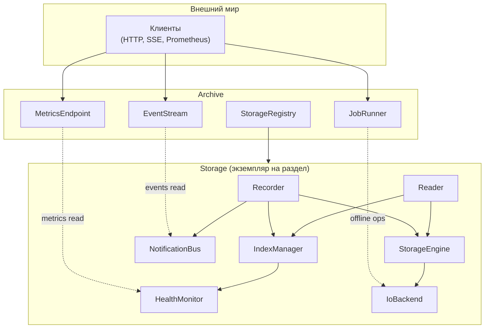
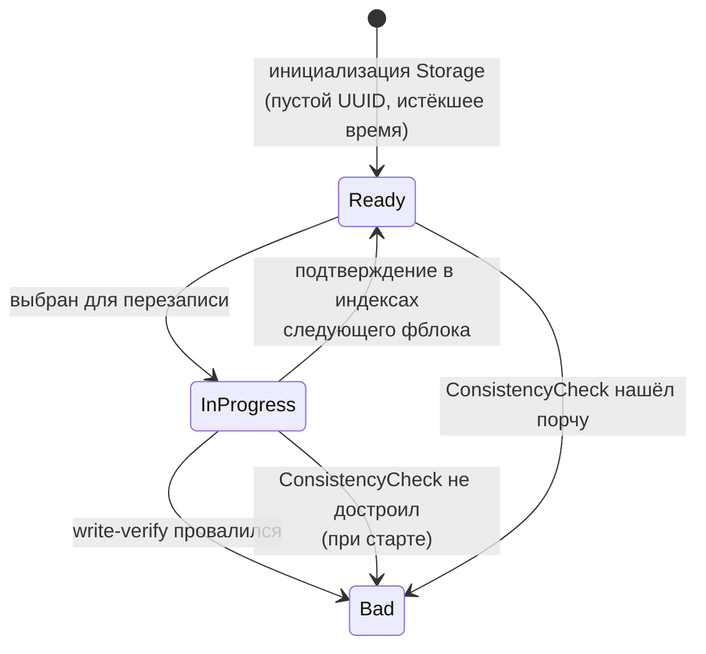
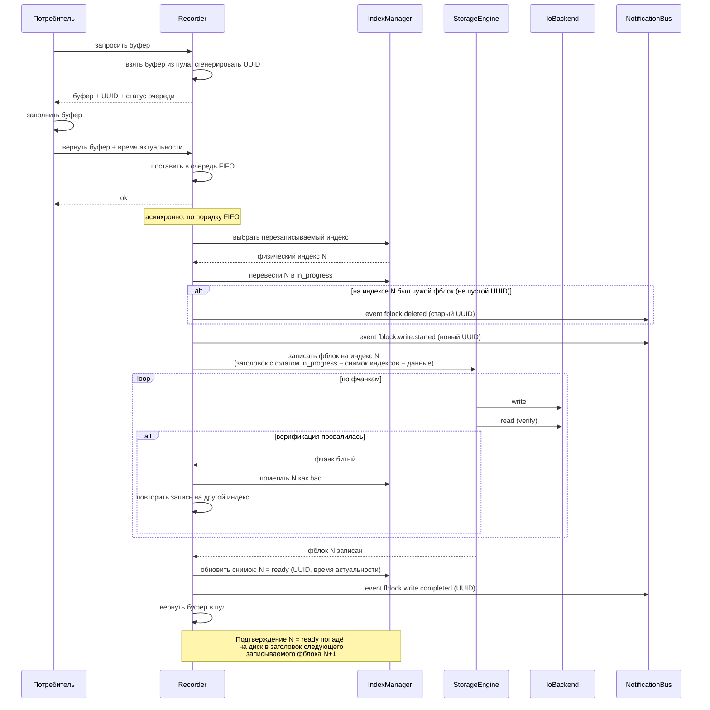
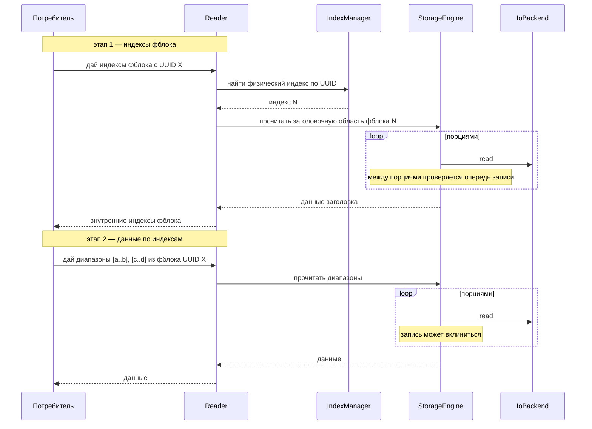

# Концептуальный дизайн системы хранения

## 1. Назначение документа

Документ описывает внутреннее устройство farc на концептуальном уровне: модель данных, компоненты и их ответственность, жизненный цикл фблока, потоки данных, модель конкурентности.

Документ **не описывает**:
- Бинарный формат фблока, заголовка и контрольных сумм — см. `02-storage-format.md`.
- Конкретные алгоритмы операций (поиск индексов при старте, выбор фблока для записи, расширение, сужение, импорт) — см. `03-storage-operations.md`.
- Публичный API, технологии транспорта, протоколы — это предмет отдельной документации.

Документ не привязан к языку реализации. Имена компонентов — логические обозначения зон ответственности, а не классы или структуры.

## 2. Модель данных

### 2.1. Иерархия

- **Archive** — процесс farc целиком. В один момент времени на одном сервере работает один Archive.
- **Storage** — один раздел (файл или блочное устройство), с которым farc работает эксклюзивно через файловую блокировку.
- **Фблок** — логическая единица фиксированного размера внутри Storage. Количество фблоков в Storage меняется только операцией расширения или сужения.
- **Фчанк** — часть фблока, единица операций write-verify. Размер выбирается при инициализации Storage.

### 2.2. Индексы хранилища

Индексы хранилища — это карта всех фблоков Storage. Для каждого физического индекса хранятся:
- состояние (`in_progress` / `ready` / `bad`);
- флаг `protected`;
- UUID;
- время начала и окончания актуальности.

Физически индексы распределены по заголовкам фблоков (ADR-002): каждый фблок хранит в своём заголовке копию индексов всего Storage. При записи очередного фблока в его заголовок попадает актуальный на этот момент снимок индексов.

**Ключевое свойство снимка.** В заголовке фблока `N` снимок отражает состояние Storage на момент начала записи `N`. В частности:
- Сам `N` в собственном снимке помечен `in_progress`.
- Предыдущий успешно записанный фблок `N-1` помечен `ready`.

Именно это свойство обеспечивает отложенное подтверждение записи: факт «фблок `M` успешно записан» попадает на диск в заголовке следующего записанного фблока `M+1`, а не в заголовке самого `M`.

Индексы загружаются в память при старте Storage компонентом `IndexManager` (см. 4.2.3) и живут в ней всё время работы Storage. Дисковые копии обновляются автоматически как побочный эффект записи фблоков.

### 2.3. Идентификация фблока

Фблок имеет два идентификатора с разным назначением:

- **Физический индекс** (0..N-1) — адрес фблока в Storage. Используется только внутренней реализацией, потребителю не показывается.
- **UUID** (UUIDv4) — логический идентификатор, уникальный в пределах Storage и стабильный во времени. Потребитель работает с фблоками только по UUID.

UUID генерируется библиотекой в момент, когда Recorder выдаёт буфер потребителю (см. 4.1.2), и записывается в заголовок фблока при его сохранении на диск.

### 2.4. Состояния фблока

Базовые состояния:

| Состояние | Описание |
|-----------|----------|
| `in_progress` | Запись начата, не завершена. Подтверждение успешной записи появляется только в индексах следующего записанного фблока. |
| `ready` | Данные записаны и верифицированы, доступны для чтения. |
| `bad` | Содержит битые фчанки. |

Ортогональный модификатор:

| Модификатор | Описание |
|-------------|----------|
| `protected` | Read-only, применим только поверх `ready`. |

**Актуальность** — не состояние, а вычисляемое свойство: фблок в состоянии `ready` считается актуальным, если текущее время меньше времени окончания актуальности в его заголовке.

**Перезаписываемый** = `ready` AND NOT `protected` AND время_окончания_актуальности < сейчас.

После инициализации Storage все фблоки сразу `ready` с пустым UUID и истёкшим временем — все перезаписываемы. Отдельного состояния «свободен» в системе нет.

Машина состояний — раздел 5.

## 3. Архитектурные слои

Компоненты системы распределены по двум логическим уровням:

- **Уровень Archive** — единая точка входа для внешнего мира, оркестрация долгих операций, агрегация метрик и событий со всех Storage.
- **Уровень Storage** — работа с конкретным разделом: запись, чтение, состояние, метрики и события раздела.

Компоненты Storage существуют параллельно для каждого экземпляра Storage: один Recorder на Storage, один IndexManager на Storage и т.д.

## 4. Компоненты

### 4.1. Уровень Archive

#### 4.1.1. StorageRegistry

**Ответственность:** владеет набором экземпляров Storage, хранит их идентификаторы и текущий статус (`stopped`, `running`, `job-in-progress`). Обеспечивает поиск Storage по идентификатору для остальных компонентов Archive.

**Взаимодействие:**
- Принимает команды «открыть Storage», «закрыть Storage» от Archive (при старте процесса и по явной команде).
- Отдаёт список Storage компонентам `MetricsEndpoint`, `EventStream`, `JobRunner`.
- Блокирует операции, несовместимые со статусом Storage (например, нельзя запустить `Importer` на running Storage).

#### 4.1.2. JobRunner

**Ответственность:** оркеструет долгие операции над Storage: `ConsistencyCheck`, `GeometryManager`, `Importer`. Все эти операции выполняются только над остановленным Storage.

**Взаимодействие:**
- Принимает запросы на запуск операций от внешнего API (через Archive).
- Через `StorageRegistry` переводит целевой Storage в состояние `stopped` (если он работает) и фиксирует статус `job-in-progress`.
- Запускает нужную операцию, которая работает с файлом Storage через `IoBackend` напрямую.
- По завершении операции возвращает Storage в состояние `stopped` или запускает заново, в зависимости от команды.
- Публикует события о начале и завершении операций в `EventStream`.

Детали каждой операции — в `03-storage-operations.md`.

#### 4.1.3. MetricsEndpoint

**Ответственность:** предоставляет метрики состояния всех Storage во внешний мир в формате Prometheus text exposition.

**Взаимодействие:**
- При запросе `/metrics` собирает значения из `HealthMonitor` каждого Storage и возвращает их с label `storage="<id>"`.
- Не хранит историю — все метрики читаются по требованию.

#### 4.1.4. EventStream

**Ответственность:** ретранслирует события со всех `NotificationBus` потребителю через Server-Sent Events.

**Взаимодействие:**
- Подписывается на локальные шины событий каждого Storage.
- Принимает HTTP-подключения клиентов, поддерживает `Last-Event-ID` для навёрстывания пропущенных событий.
- Помечает каждое событие идентификатором Storage-источника.

Типы событий — см. раздел 7.

### 4.2. Уровень Storage

#### 4.2.1. Recorder

**Ответственность:** сторона записи. Владеет пулом буферов фиксированного размера и очередью готовых к записи буферов. Реализует цикл работы потребителя: выдача буфера, приём заполненного, постановка в очередь, передача на запись.

**Взаимодействие:**
- Отвечает на запрос потребителя «дай буфер»: возвращает свободный буфер вместе со статусом очереди (норма/предупреждение/перегрузка/нет буферов), генерирует UUID для будущего фблока и связывает его с буфером.
- Принимает заполненный буфер от потребителя вместе с метаданными (время начала и окончания актуальности), ставит его в очередь.
- Извлекает буферы из очереди в порядке FIFO. Для каждого буфера: запрашивает у `IndexManager` перезаписываемый индекс N, переводит его в `in_progress`, публикует `fblock.write.started` и при необходимости `fblock.deleted` (если в N лежал чужой фблок), передаёт буфер в `StorageEngine` на запись.
- При получении от `StorageEngine` результата записи:
  - Успех — обновляет снимок индексов: `N = ready` с новым UUID и временем актуальности. Физически это подтверждение попадёт на диск при записи следующего фблока. Публикует `fblock.write.completed`, возвращает буфер в пул.
  - Битый — просит `IndexManager` перевести N в `bad`, берёт следующий перезаписываемый индекс и повторяет попытку.

#### 4.2.2. Reader

**Ответственность:** сторона чтения. Обслуживает запросы потребителя на получение данных из фблоков. Реализует многоэтапное чтение (ADR-004).

**Взаимодействие:**
- Принимает запрос потребителя «дай индексы фблока с UUID X»: через `IndexManager` находит физический индекс, через `StorageEngine` читает часть заголовка фблока, содержащую внутренние индексы данных, и возвращает их потребителю.
- Принимает запрос потребителя «дай такие-то диапазоны из фблока с UUID X»: группирует диапазоны, передаёт в `StorageEngine` как набор команд чтения.
- Управляет пулом буферов чтения, чтобы не выделять память на каждый запрос.
- Возвращает потребителю данные по мере их поступления от `StorageEngine`.

#### 4.2.3. IndexManager

**Ответственность:** хранит в памяти индексы хранилища — карту состояний (`in_progress`/`ready`/`bad`, флаг `protected`) и метаданных (UUID, время актуальности) всех фблоков Storage. Отвечает за все переходы состояний фблока и за выбор фблока при записи.

**Взаимодействие:**
- При старте Storage получает от `ConsistencyCheck` уже выверенные индексы и загружает их в память. Детали восстановления — в `03-storage-operations.md`.
- По запросу `Recorder`'а выбирает следующий перезаписываемый физический индекс (раздел 2.4). Если подходящего нет — возвращает признак «нет места», Recorder поднимает алерт через `NotificationBus`.
- По запросу `Reader`'а возвращает физический индекс фблока по UUID (только для `ready`).
- Принимает команды на изменение состояния: `ready → in_progress`, `in_progress → ready`, `* → bad`, установка/снятие `protected` на `ready`.
- Уведомляет `HealthMonitor` о любых изменениях счётчиков состояний.

#### 4.2.4. StorageEngine

**Ответственность:** владеет единственным каналом доступа к диску внутри Storage. Реализует логику write-verify при записи, порционное чтение и арбитраж между записью и чтением.

**Взаимодействие:**
- Принимает команду «записать фблок на физический индекс N» от Recorder: разбивает буфер фблока на фчанки, пишет каждый через `IoBackend`, сразу перечитывает и сравнивает. При расхождении возвращает Recorder'у признак «битый фчанк».
- Принимает команды «прочитать диапазон из фблока N» от Reader: разбивает диапазон на порции небольшого размера (меньше фчанка, ADR-005) и читает порциями через `IoBackend`.
- **Между порциями чтения проверяет очередь записи.** Если есть готовый к записи буфер — сначала выполняет запись, затем продолжает чтение. Это реализация приоритета записи над чтением (ADR-005).
- Не знает о структуре фблока кроме разбиения на фчанки и порции — все смещения и размеры даются в команде.

#### 4.2.5. IoBackend

**Ответственность:** тонкая обёртка над файлом или блочным устройством. Предоставляет только две операции: «записать N байт по смещению», «прочитать M байт по смещению». Единственный компонент системы, делающий системные вызовы к диску.

**Взаимодействие:**
- Принимает команды от `StorageEngine` (в режиме running) или от компонентов JobRunner (при offline-операциях).
- Инкапсулирует различия между платформами и режимами (стандартная библиотека vs O_DIRECT на Linux и т.д.).

Выделение `IoBackend` в отдельный компонент позволяет подменять реализацию под платформу, не затрагивая `StorageEngine` и выше.

#### 4.2.6. NotificationBus

**Ответственность:** локальная шина событий одного Storage.

**Взаимодействие:**
- Принимает события от `Recorder` (начало записи, завершение записи, удаление) и от компонентов уровня Archive (алерты, связанные с этим Storage).
- Транслирует события подписчику — `EventStream` уровня Archive.
- Не хранит историю. Ретрансляция пропущенных событий — забота `EventStream`.

#### 4.2.7. HealthMonitor

**Ответственность:** держит счётчики состояний и метрики одного Storage. Следит за порогами и поднимает алерты.

**Взаимодействие:**
- Принимает обновления счётчиков от `IndexManager` (количество фблоков в каждом состоянии).
- Принимает события записи/чтения от `Recorder` и `Reader` для счётчиков операций.
- Предоставляет текущие значения метрик компоненту `MetricsEndpoint`.
- При пересечении порога (например, доля битых превысила 5%) публикует алерт в `NotificationBus`.

## 5. Машина состояний фблока

Флаг `protected` — ортогональный модификатор, применимый только поверх `ready`. Не изменяет состояние, блокирует переход `ready → in_progress`.

| Переход | Инициатор |
|---------|-----------|
| `[*] → ready` | Инициализация / расширение Storage |
| `ready → in_progress` | `Recorder` через `IndexManager` (фблок выбран для перезаписи) |
| `in_progress → ready` | `Recorder` при записи **следующего** фблока — в его индексах текущий фиксируется как `ready` |
| `in_progress → bad` | `StorageEngine` сообщает о провале верификации, либо `ConsistencyCheck` не смог подтвердить целостность |
| `ready → bad` | `ConsistencyCheck` обнаружил порчу при старте |
| Установка/снятие `protected` | Потребитель явной командой через `IndexManager`, только для `ready` |

**Важные свойства:**
- `in_progress` — состояние, наблюдаемое только внутри системы между началом записи фблока и записью следующего фблока. С точки зрения API потребителю видны только `ready` и `bad`.
- Подтверждение `in_progress → ready` не требует возврата к заголовку записанного фблока: оно приходит «в будущем», через индексы следующей записи.
- Последний по времени записи фблок на момент сбоя всегда находится в состоянии `in_progress` в своём собственном заголовке. Его финальный статус определяет `ConsistencyCheck` при следующем старте (см. 4.10 requirements).
- Переход в `bad` необратим в рамках жизни Storage.

## 6. Потоки данных

### 6.1. Запись фблока

### 6.2. Чтение фблока

**Точка прерывания чтения записью** находится между порциями чтения в `StorageEngine`. После каждой порции `StorageEngine` проверяет очередь `Recorder`'а: если там есть готовый буфер — сначала выполняется запись целиком, затем чтение возобновляется.

## 7. События

Все события публикуются в `NotificationBus` локально и ретранслируются клиентам через `EventStream` на уровне Archive. Каждое событие содержит идентификатор Storage-источника и уникальный сквозной `id` для навёрстывания через SSE `Last-Event-ID`.

| Тип события | Когда | Содержимое (помимо id, storage) |
|-------------|-------|---------------------------------|
| `fblock.write.started` | Перед первым обращением к диску для записи | UUID |
| `fblock.write.completed` | После успешной записи и верификации всех фчанков | UUID |
| `fblock.deleted` | Перед перезаписью старого фблока новыми данными | UUID удаляемого |
| `storage.alert` | При пересечении порога или критическом условии | severity, reason |
| `job.started` | JobRunner начал операцию над Storage | job_type, params |
| `job.completed` | JobRunner завершил операцию | job_type, result |

Особые правила:
- При переносе фблока в рамках сужения (9.2 requirements, стратегия «перенос») события о самом переносимом фблоке не публикуются — его UUID и состояние сохраняются.
- Событие `fblock.deleted` в рамках сужения отправляется только для перезаписываемых целевых фблоков оставшейся зоны.

## 8. Метрики

Метрики предоставляются компонентом `MetricsEndpoint` в формате Prometheus text exposition по HTTP. Все метрики имеют label `storage="<id>"`.

| Метрика | Тип | Смысл |
|---------|-----|-------|
| `farc_fblocks_total` | gauge | Всего фблоков в Storage |
| `farc_fblocks_ready_total` | gauge | В состоянии `ready` (общее число) |
| `farc_fblocks_writable_total` | gauge | Перезаписываемые (`ready`, не `protected`, с истёкшим временем актуальности) |
| `farc_fblocks_actual_total` | gauge | `ready` с неистёкшим временем актуальности |
| `farc_fblocks_protected_total` | gauge | С флагом `protected` |
| `farc_fblocks_bad_total` | gauge | В состоянии `bad` |
| `farc_fblocks_in_progress_total` | gauge | В состоянии `in_progress` (в норме 0 или 1) |
| `farc_write_queue_depth` | gauge | Длина очереди записи |
| `farc_write_queue_status` | gauge | 0=норма, 1=предупреждение, 2=перегрузка |
| `farc_writes_total` | counter | Успешные записи |
| `farc_write_verify_failures_total` | counter | Проваленные верификации |
| `farc_reads_in_progress` | gauge | Активные чтения |
| `farc_storage_state` | gauge | 0=stopped, 1=running, 2=job |

История не хранится. Агрегацией и долговременным хранением занимается внешняя система (Prometheus, VictoriaMetrics).

## 9. Модель конкурентности

### 9.1. Между процессами

На один Storage одновременно может работать не более одного процесса. Защита реализуется файловой блокировкой раздела. Попытка открыть уже заблокированный Storage завершается ошибкой.

CLI-утилита восстановления данных (раздел 8 requirements) работает только с не открытыми Storage.

### 9.2. Внутри Storage (режим running)

Внутри одного Storage одновременно работают:
- **Один логический писатель** — `Recorder` со своей очередью. В любой момент времени только один фблок находится в процессе записи.
- **Несколько читателей** — одновременные запросы к `Reader`, каждый превращается в последовательность команд к `StorageEngine`.

Все команды к `StorageEngine` сериализуются внутри него. Приоритет записи над чтением реализуется так: после завершения каждой порции чтения `StorageEngine` проверяет, есть ли готовый к записи буфер. Если есть — выполняет запись целиком, затем возвращается к отложенным чтениям.

Запись прерывает чтение между порциями. Чтение **не прерывает** запись ни в какой момент.

### 9.3. Долгие операции

`ConsistencyCheck`, `GeometryManager` и `Importer` выполняются только над **остановленным** Storage. Переход Storage в `stopped` и обратно — забота `JobRunner` и `StorageRegistry`. Во время операции файл Storage открыт компонентом JobRunner напрямую через `IoBackend`, и Recorder/Reader не существуют.

Это даёт два практически важных свойства:
- Долгие операции не конкурируют за диск с записью и чтением.
- Долгие операции видят неизменяемое состояние Storage, без гонок с `IndexManager`.

## 10. Границы ответственности

Чтобы избежать разночтений при реализации и в будущих обсуждениях, перечислю явно, что **не** делает farc.

**farc не делает:**
- Не интерпретирует содержимое фблоков. Внутреннее устройство данных внутри фблока — забота потребителя (кодеки, форматы, синхронизация потоков).
- Не отбрасывает данные при перегрузке очереди записи. Только сигнализирует статусом (см. 4.7 requirements).
- Не анализирует важность данных. Решение «что именно писать при перегрузке» — на стороне потребителя.
- Не снимает защиту с фблока автоматически. Только по явной команде потребителя.
- Не восстанавливает данные из повреждённых фблоков. Это задача отдельной CLI-утилиты (раздел 8 requirements).
- Не хранит историю метрик. Эта функция — у внешней системы метрик.
- Не переносит фблоки между Storage автоматически. Перенос — только явной операцией импорта.

**farc делает:**
- Гарантирует атомарность записи с точки зрения потребителя: наружу фблок виден либо как `ready` с полными данными, либо отсутствует (либо помечен `bad`). Состояние `in_progress` — внутреннее.
- Гарантирует сохранность `protected` фблоков между перезапусками.
- Гарантирует переносимость фблока между платформами (при совпадении размера фблока).
- Гарантирует уникальность UUID в пределах Storage.

## 11. Инварианты

Инварианты, истинные в любой момент жизни Storage:

1. **Геометрия.** Размер фблока не меняется. Размер фчанка не меняется. Количество фблоков меняется только операциями расширения/сужения, и только при остановленном Storage.
2. **Адресация.** Физический индекс фблока лежит в `[0, N-1]`, где `N` — текущее количество фблоков.
3. **Уникальность UUID.** В пределах Storage нет двух фблоков с одинаковым непустым UUID в состояниях, отличных от `bad`.
4. **Атомарность для потребителя.** Наружу фблок либо виден как `ready` с полными данными, либо не виден. `in_progress` потребителю не показывается.
5. **Снимок индексов в заголовке.** Снимок, записанный в заголовке фблока `N`, отражает индексы на момент начала записи `N`. В этом снимке сам `N` помечен `in_progress`; фблок `M`, записанный непосредственно перед `N`, помечен `ready`.
6. **Согласованность памяти и диска.** Индексы в памяти `IndexManager`'а в любой момент являются надмножеством снимка с диска: в памяти состояние последнего записанного фблока — `ready`, на диске это подтверждение появится при следующей записи. После `ConsistencyCheck` и перед первой записью в сессии допустимо расхождение ровно на один фблок — последний из предыдущей сессии.
7. **Применимость `protected`.** Флаг `protected` установлен только на фблоках в состоянии `ready`.
8. **Необратимость `bad`.** Фблок, помеченный `bad`, не может быть возвращён в другое состояние без полного пересоздания Storage.
9. **Эксклюзивность доступа.** В любой момент времени с Storage работает ровно один процесс через ровно один экземпляр библиотеки.
10. **Режим работы и долгие операции.** Долгие операции (`ConsistencyCheck`, `GeometryManager`, `Importer`) выполняются только над Storage в состоянии `stopped`. В состоянии `running` они запрещены.

Инварианты проверяются:
- При старте Storage — компонентом `ConsistencyCheck`.
- При изменении состояний — внутренними проверками `IndexManager`.
- В рамках автоматических тестов — для каждой комбинации операций.
