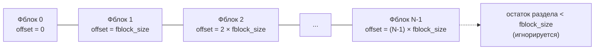
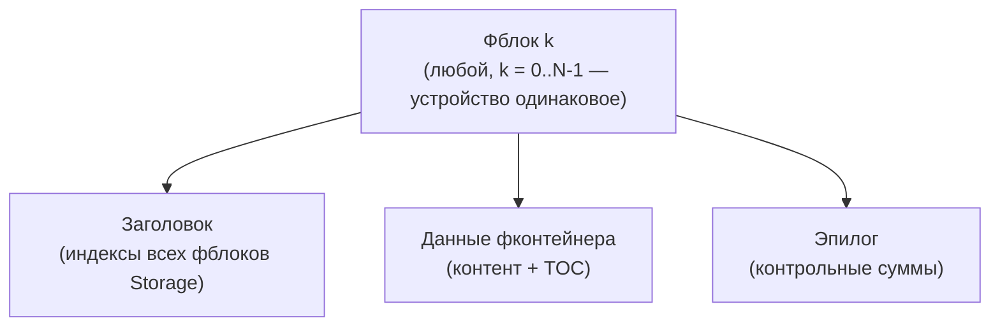
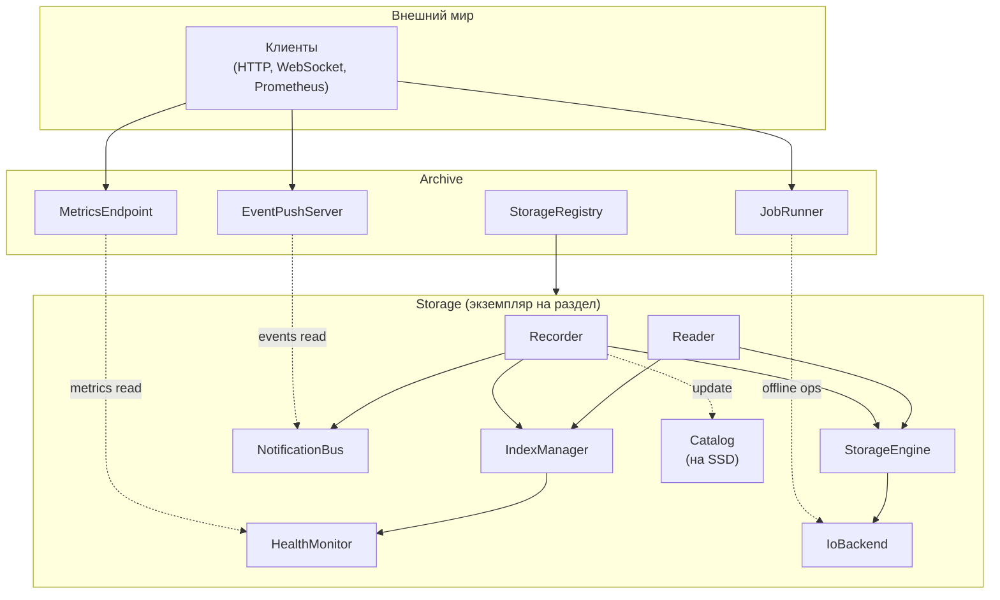
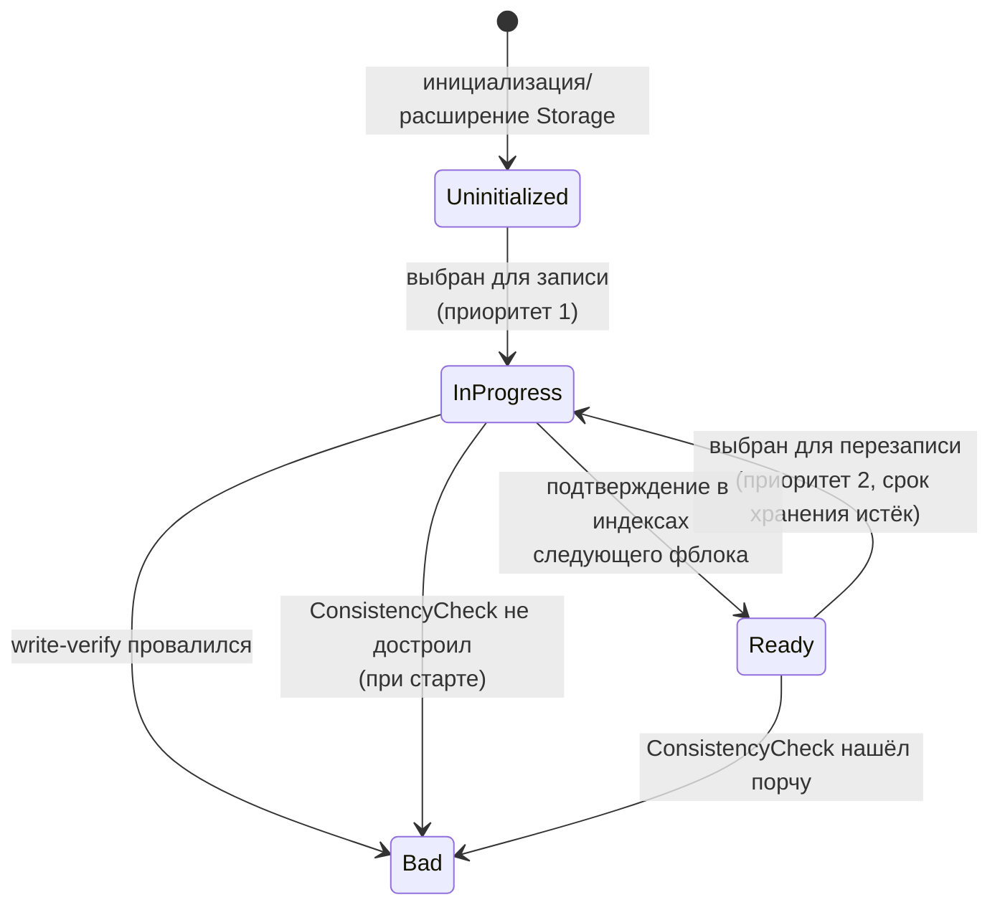
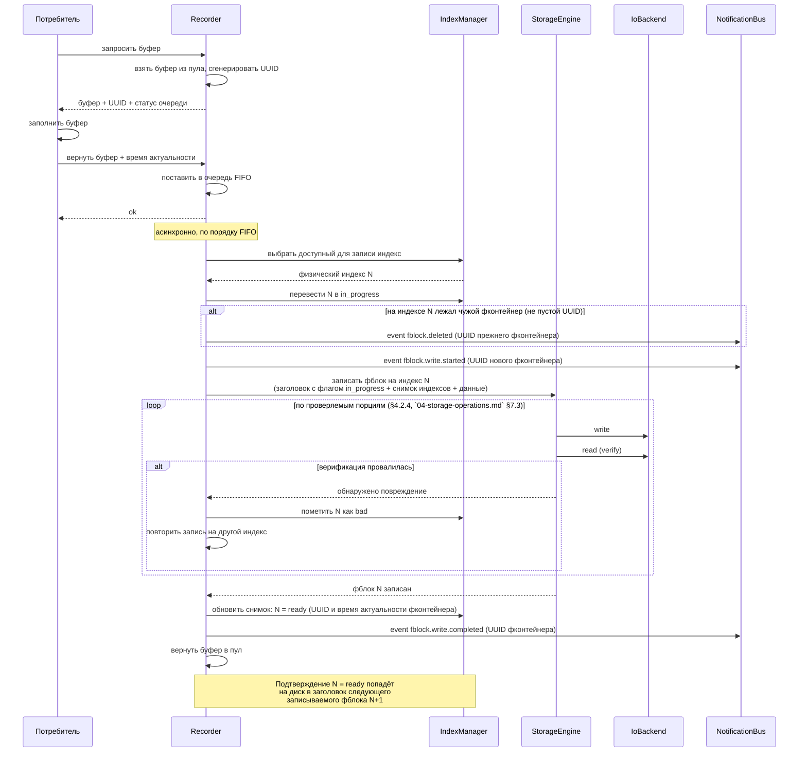
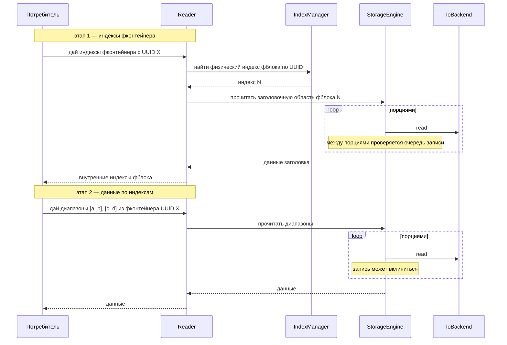

# Концептуальный дизайн системы хранения

## 1. Назначение документа

Документ описывает внутреннее устройство farcd на концептуальном уровне: модель данных, компоненты и их ответственность, жизненный цикл фблока, потоки данных, модель конкурентности.

Документ **не описывает**:
- Бинарный формат фблока, заголовка и контрольных сумм — см. `03-storage-format.md`.
- Конкретные алгоритмы операций (поиск индексов при старте, выбор фблока для записи, расширение, сужение, импорт) — см. `04-storage-operations.md`.
- Публичный API, технологии транспорта, протоколы — это предмет отдельной документации.

Документ не привязан к языку реализации. Имена компонентов — логические обозначения зон ответственности, а не классы или структуры.

## 2. Модель данных и структура Storage

Структура Storage раскрывается ниже с трёх сторон: физическая раскладка на диске (плоский массив фблоков, §2.1), индексы и их расположение (§2.2), идентификация и состояния фблока (§2.3–2.4), и то, как эта структура восстанавливается в памяти при открытии Storage (§2.5).

### 2.1. Иерархия

Storage — это формат данных на диске, а не процесс: раздел или блочное устройство, занятое сплошным массивом одинаковых фблоков, и ничего больше. Ниже — два масштаба этой структуры: массив целиком и внутреннее устройство одного фблока. Место Storage среди процесса `farcd` (Archive, несколько Storage на процесс) — тема раздела 3, здесь речь только о самом хранилище.

**Массив целиком.** Фблоки лежат встык от начала раздела, индекс фблока — его адрес (`offset = index × fblock_size`). Никакого глобального заголовка или таблицы размещения над этим массивом нет — раскладку см. в `03-storage-format.md` §3.1.

Каждый прямоугольник на схеме — весь фблок целиком, не только его данные. Адрес любого фблока вычисляется арифметически, без обращения к диску. Хвост раздела короче `fblock_size` под фблок не выделяется и не используется.

**Устройство одного фблока.** Заголовок лежит не отдельно от массива и не в каком-то одном выделенном фблоке — у **каждого** фблока, включая Фблок 0 и Фблок N-1, одинаковый внутренний состав из трёх частей: заголовок с индексами всех фблоков Storage (ADR-001, ADR-002), данные заполняемого фконтейнера (контент и TOC) и эпилог с контрольными суммами — он читается с конца, без разбора заголовка.

Полная бинарная раскладка секций внутри фблока (пролог, каталог, контрольные суммы заголовка, контент, TOC, эпилог) — `03-storage-format.md` §3.2; здесь — только три укрупнённые части, нужные для дальнейшего изложения этого документа.

Как именно эти три части физически попадают на диск — какими порциями и с какой верификацией — вопрос алгоритма записи, а не структуры фблока; см. `04-storage-operations.md` §7.3–7.4.

- **Фблок** — физический слот фиксированного размера внутри Storage. Количество фблоков в Storage меняется только операцией расширения или сужения.
- **Фконтейнер** — структура и данные, заполняемые потребителем; размещается в области данных одного фблока (ADR-013).

### 2.2. Индексы хранилища

Индексы хранилища — это карта всех фблоков Storage. Для каждого физического индекса хранятся:
- состояние фблока (`uninitialized` / `in_progress` / `ready` / `bad`);
- флаг `protected` фблока;
- UUID лежащего в нём фконтейнера;
- время начала и окончания актуальности фконтейнера;
- битовая маска присутствия каналов фконтейнера (ADR-014).

Дополнительно хранится общий для всего Storage **регистр каналов** — соответствие «номер канала → компактная позиция в маске» (ADR-014). В отличие от per-fblock массивов выше, регистр не растёт с числом фблоков — его ёмкость (`max_channels`) фиксируется при инициализации, как и `fblock_size`.

Физически индексы распределены по заголовкам фблоков (ADR-002): каждый фблок хранит в своём заголовке копию индексов всего Storage. При записи очередного фблока в его заголовок попадает актуальный на этот момент снимок индексов.

**Ключевое свойство снимка.** В заголовке фблока `N` снимок отражает состояние Storage на момент начала записи `N`. В частности:
- Сам `N` в собственном снимке помечен `in_progress`.
- Предыдущий успешно записанный фблок `N-1` помечен `ready`.

Именно это свойство обеспечивает отложенное подтверждение записи: факт «фблок `M` успешно записан» попадает на диск в заголовке следующего записанного фблока `M+1`, а не в заголовке самого `M`.

Индексы загружаются в память при старте Storage компонентом `IndexManager` (см. 4.2.3) и живут в ней всё время работы Storage. Дисковые копии обновляются автоматически как побочный эффект записи фблоков.

**Внешний каталог (ADR-007).** Копия заголовков всех фблоков хранится в отдельном файле на быстром диске (SSD). Каждый раз, когда запись очередного фблока завершается и верифицируется, каталог **сбрасывается (flush) на SSD** тем же снимком, что уже попал в заголовок следующего фблока (см. «ключевое свойство снимка» выше) — то есть каталог никогда не отстаёт от основного диска больше чем на один фблок. Используется для быстрого старта Storage — загрузка индексов из каталога занимает секунды. При отсутствии или повреждении каталога — fallback на сканирование заголовков фблоков на основном диске (§2.5).

### 2.3. Идентификация фблока и фконтейнера

Фблок и лежащий в нём фконтейнер имеют разные идентификаторы (ADR-013):

- **Физический индекс фблока** (0..N-1) — адрес фблока в Storage. Используется только внутренней реализацией, потребителю не показывается.
- **UUID фконтейнера** (UUIDv4) — логический идентификатор, уникальный в пределах Storage и стабильный во времени. Потребитель работает с данными только по UUID.

UUID генерируется библиотекой в момент, когда Recorder выдаёт буфер потребителю (см. 4.1.2), и записывается в заголовок фблока при его сохранении на диск.

### 2.4. Состояния фблока

Базовые состояния:

| Состояние | Описание |
|-----------|----------|
| `uninitialized` | Не содержит валидного заголовка. Доступен для записи, не доступен для чтения. Определяется по отсутствию magic number (ADR-006). |
| `in_progress` | Запись начата, не завершена. Подтверждение успешной записи появляется только в индексах следующего записанного фблока. |
| `ready` | Данные записаны и верифицированы, доступны для чтения. |
| `bad` | Содержит физически повреждённые данные, обнаруженные при записи (`04-storage-operations.md` §7.3). |

Ортогональный модификатор:

| Модификатор | Описание |
|-------------|----------|
| `protected` | Read-only, применим только поверх `ready`. |

**Гарантированный срок хранения** — фблок в состоянии `ready` гарантированно не перезаписывается в течение `retention.days` дней после `end` (последнего timestamp данных фконтейнера, лежащего в фблоке). Задаётся глобальным параметром Storage.

**Доступным для записи** является фблок, удовлетворяющий одному из условий:
- Состояние `uninitialized` (приоритет 1 — сначала заполняем диск).
- `ready` AND NOT `protected` AND `now() - end >= retention.days` (приоритет 2).

Поле `begin` (первый timestamp данных фконтейнера) на доступность для записи не влияет — это бизнес-информация для Reader.

После инициализации Storage все фблоки кроме нулевого — `uninitialized`. Нулевой содержит параметры хранилища и начальный снимок индексов.

Машина состояний — раздел 5.

### 2.5. Открытие Storage

При каждом открытии Storage нужно восстановить в памяти актуальные индексы (§2.2) прежде, чем `Recorder`/`Reader` смогут начать работу. Это делает `ConsistencyCheck` (уровень Archive, оркеструется `JobRunner`'ом — `11-service-composition.md` §5.1.5) до перевода Storage в `running`; результат — индексы, загруженные в `IndexManager`.

Восстановление индексов имеет **несколько путей**, с убывающей скоростью:

1. **Из каталога на SSD (основной путь).** Каталог — не разовый снимок при старте, а копия, которая, как описано в §2.2, сбрасывается на SSD сразу по завершении записи каждого фблока. Поэтому при открытии Storage каталог почти всегда уже содержит состояние на момент последней завершённой записи: он читается целиком за секунды, без обращения к основному диску.
2. **Сканирование заголовков основного хранилища (fallback).** Используется, если каталог отсутствует, повреждён (не совпадает контрольная сумма) или устарел. Среди фблоков ищется тот, чей заголовок валиден и у кого максимален монотонный счётчик `write_sequence` (ADR-008) — не время на стороне ОС, чтобы Storage можно было перенести на другой сервер без рассинхронизации часов.

Оба пути восстанавливают одно и то же — снимок индексов в `IndexManager`; каким путём он получен, дальше никак не влияет на поведение Storage. Пошаговый алгоритм обоих путей, включая деградацию при повреждённых фблоках, — `04-storage-operations.md` §4.

## 3. Архитектурные слои

Компоненты системы распределены по двум логическим уровням:

- **Уровень Archive** — единая точка входа для внешнего мира, оркестрация долгих операций, агрегация метрик и событий со всех Storage.
- **Уровень Storage** — работа с конкретным разделом: запись, чтение, состояние, метрики и события раздела.

Компоненты Storage существуют параллельно для каждого экземпляра Storage: один Recorder на Storage, один IndexManager на Storage и т.д.

## 4. Компоненты

### 4.1. Уровень Archive

#### 4.1.1. StorageRegistry

**Ответственность:** владеет набором экземпляров Storage, хранит их идентификаторы и текущий статус (`stopped`, `running`, `job-in-progress`). Обеспечивает поиск Storage по идентификатору для остальных компонентов Archive.

**Взаимодействие:**
- Принимает команды «открыть Storage», «закрыть Storage» от Archive (при старте процесса и по явной команде).
- Не владеет Storage, пока он не инициализирован — назначение нового Storage архиву регистрирует его здесь только после успешного завершения `Initializer` (см. `JobRunner` ниже).
- Отдаёт список Storage компонентам `MetricsEndpoint`, `EventPushServer`, `JobRunner`.
- Блокирует операции, несовместимые со статусом Storage (например, нельзя запустить `Importer` на running Storage).

#### 4.1.2. JobRunner

**Ответственность:** оркеструет долгие операции над Storage: `Initializer` (первичная инициализация нового Storage, назначенного архиву оператором), `ConsistencyCheck`, `GeometryManager`, `Importer`. Все, кроме `Initializer`, выполняются только над остановленным Storage — `Initializer` работает над Storage, который ещё не зарегистрирован в `StorageRegistry`.

**Взаимодействие:**
- Принимает запросы на запуск операций от внешнего API (через Archive).
- Через `StorageRegistry` переводит целевой Storage в состояние `stopped` (если он работает) и фиксирует статус `job-in-progress`.
- Запускает нужную операцию, которая работает с файлом Storage через `IoBackend` напрямую.
- По завершении операции возвращает Storage в состояние `stopped` или запускает заново, в зависимости от команды.
- Публикует события о начале и завершении операций в `EventPushServer`.

Детали каждой операции — в `04-storage-operations.md`.

#### 4.1.3. MetricsEndpoint

**Ответственность:** предоставляет метрики состояния всех Storage во внешний мир в формате Prometheus text exposition.

**Взаимодействие:**
- При запросе `/metrics` собирает значения из `HealthMonitor` каждого Storage и возвращает их с label `storage="<id>"`.
- Не хранит историю — все метрики читаются по требованию.

#### 4.1.4. EventPushServer

**Ответственность:** единственный WebSocket-сервер farcd, ретранслирующий события со всех `NotificationBus` подписчикам; при подписке на TOC дополнительно пересылает TOC целиком по завершении записи фблока (объединяет то, что раньше называлось `EventStream`, и предложенный отдельно `TocPushServer` — ADR-015, `11-service-composition.md` §4.4).

**Взаимодействие:**
- Подписывается на локальные шины событий каждого Storage.
- Принимает WebSocket-подключения клиентов; при подключении клиент указывает, какие сообщения ему нужны — компактные события, TOC целиком, либо оба.
- Помечает каждое событие идентификатором Storage-источника.
- Восстановление пропущенного при разрыве соединения — открытый вопрос (ADR-015).

Типы событий — см. раздел 7.

### 4.2. Уровень Storage

#### 4.2.1. Recorder

**Ответственность:** сторона записи. Владеет пулом буферов фиксированного размера и очередью готовых к записи буферов. Реализует цикл работы потребителя: выдача буфера, приём заполненного, постановка в очередь, передача на запись.

**Взаимодействие:**
- Отвечает на запрос потребителя «дай буфер»: возвращает свободный буфер (не больше максимального размера фконтейнера, ADR-013) вместе со статусом очереди (норма/предупреждение/перегрузка/нет буферов), генерирует UUID для будущего фконтейнера и связывает его с буфером.
- Принимает заполненный буфер от потребителя вместе с метаданными (время начала и окончания актуальности фконтейнера, список каналов) и ставит его в очередь.
- Извлекает буферы из очереди в порядке FIFO. Для каждого буфера: резолвит каналы буфера в компактные позиции через `IndexManager` (регистрируя новые номера, ADR-014), запрашивает доступный для записи индекс N (с учётом приоритета: сначала `uninitialized`, затем `ready` с истёкшим сроком хранения), переводит его в `in_progress`, публикует `fblock.write.started` и при необходимости `fblock.deleted` (если в фблоке N уже лежал фконтейнер — непустой UUID), передаёт буфер в `StorageEngine` на запись.
- При получении от `StorageEngine` результата записи:
  - Успех — обновляет снимок индексов: `N = ready` с UUID и временем актуальности нового фконтейнера. Физически это подтверждение попадёт на диск при записи следующего фблока. Обновляет каталог на SSD (ADR-007). Публикует `fblock.write.completed`, возвращает буфер в пул.
  - Битый — просит `IndexManager` перевести N в `bad`, берёт следующий доступный для записи индекс и повторяет попытку.

#### 4.2.2. Reader

**Ответственность:** сторона чтения. Обслуживает запросы потребителя на получение данных из фблоков. Реализует многоэтапное чтение (ADR-004).

**Взаимодействие:**
- Принимает запрос потребителя «дай кандидатов по каналу N и времени [t1,t2]» (ADR-014, когда UUID заранее не известен): через `IndexManager` резолвит номер канала в позицию и возвращает список UUID/индексов, чьи `[begin,end]` пересекаются с запросом и у кого установлен соответствующий бит маски.
- Принимает запрос потребителя «дай индексы фконтейнера с UUID X»: через `IndexManager` находит физический индекс фблока, через `StorageEngine` читает TOC — внутренние индексы данных фконтейнера, и возвращает их потребителю.
- Принимает запрос потребителя «дай такие-то диапазоны из фконтейнера с UUID X»: группирует диапазоны, передаёт в `StorageEngine` как набор команд чтения.
- Управляет пулом буферов чтения, чтобы не выделять память на каждый запрос.
- Возвращает потребителю данные по мере их поступления от `StorageEngine`.

#### 4.2.3. IndexManager

**Ответственность:** хранит в памяти индексы хранилища — карту состояний фблоков (`uninitialized`/`in_progress`/`ready`/`bad`, флаг `protected`) и метаданных лежащих в них фконтейнеров (UUID, время актуальности, битовая маска каналов). Владеет регистром каналов (ADR-014). Отвечает за все переходы состояний фблока и за выбор фблока при записи.

**Взаимодействие:**
- При старте Storage получает от `ConsistencyCheck` уже выверенные индексы и загружает их в память. `ConsistencyCheck` загружает индексы из каталога (ADR-007), а при его отсутствии — из заголовков фблоков на основном диске. Детали — в `04-storage-operations.md`.
- По запросу `Recorder`'а выбирает следующий доступный для записи физический индекс с учётом приоритета: сначала `uninitialized`, затем `ready` с истёкшим сроком хранения и без `protected` (раздел 2.4). Если подходящего нет — возвращает признак «нет места», Recorder поднимает алерт через `NotificationBus`.
- По запросу `Recorder`'а резолвит номера каналов буфера в компактные позиции регистра, регистрируя новые номера (переиспользуя позицию со счётчиком ссылок 0, иначе выделяя следующую свободную). Если регистр исчерпан и переиспользовать нечего — возвращает признак «регистр каналов заполнен», Recorder поднимает алерт `channel_registry_full`.
- По запросу `Reader`'а возвращает физический индекс фблока по UUID лежащего в нём фконтейнера (только для `ready`), либо список кандидатов по `(channel_number, t1, t2)` — резолвит номер в позицию, фильтрует по пересечению времени и по установленному биту маски.
- Принимает команды на изменение состояния: `uninitialized → in_progress`, `ready → in_progress`, `in_progress → ready`, `* → bad`, установка/снятие `protected` на `ready`.
- Уведомляет `HealthMonitor` о любых изменениях счётчиков состояний, включая заполненность регистра каналов.

#### 4.2.4. StorageEngine

**Ответственность:** владеет единственным каналом доступа к диску внутри Storage. Реализует логику write-verify при записи, порционное чтение и арбитраж между записью и чтением.

**Взаимодействие:**
- Принимает команду «записать фблок на физический индекс N» от Recorder: пишет буфер фблока порциями через `IoBackend` с верификацией каждой (write-verify, алгоритм — `04-storage-operations.md` §7.3). При расхождении возвращает Recorder'у признак «обнаружено повреждение».
- Не ждёт закрытия фконтейнера потребителем: по достижении `fchunk_size` или по истечении таймаута — что раньше — пишет `floor(готовые_байты / alignment) × alignment`, то есть только целое число выровненных блоков; если готового ещё меньше одного блока выравнивания, не пишет ничего и ждёт следующего триггера (ADR-017). Паддинг не нужен ни разу, кроме одного финального куска при закрытии фконтейнера — его готовит вызывающий код на уровне фконтейнера/фблока, а не сам `StorageEngine` (он не знает структуры, см. выше).
- Принимает команды «прочитать диапазон из фблока N» от Reader: разбивает диапазон на порции небольшого размера (меньше единицы физической записи, ADR-005) и читает порциями через `IoBackend`.
- **Между порциями чтения проверяет очередь записи.** Если есть готовый к записи буфер — сначала выполняет запись, затем продолжает чтение. Это реализация приоритета записи над чтением (ADR-005).
- Не знает о структуре фблока кроме разбиения на порции записи и чтения — все смещения и размеры даются в команде.

#### 4.2.5. IoBackend

**Ответственность:** тонкая обёртка над файлом или блочным устройством. Предоставляет только две операции: «записать N байт по смещению», «прочитать M байт по смещению». Единственный компонент системы, делающий системные вызовы к диску.

**Взаимодействие:**
- Принимает команды от `StorageEngine` (в режиме running) или от компонентов JobRunner (при offline-операциях).
- Инкапсулирует различия между платформами и режимами (стандартная библиотека vs O_DIRECT на Linux и т.д.).
- На чтении бэкенд `direct` сам округляет запрошенный диапазон наружу до границ выравнивания, читает в выровненный внутренний буфер и отдаёт вызывающему только запрошенные байты (ADR-010) — `StorageEngine`/`Reader` просят и получают произвольное, не обязательно выровненное `(смещение, длина)`, ничего не зная про выравнивание.

Выделение `IoBackend` в отдельный компонент позволяет подменять реализацию под платформу, не затрагивая `StorageEngine` и выше.

#### 4.2.6. NotificationBus

**Ответственность:** локальная шина событий одного Storage.

**Взаимодействие:**
- Принимает события от `Recorder` (начало записи, завершение записи, удаление) и от компонентов уровня Archive (алерты, связанные с этим Storage).
- Транслирует события подписчику — `EventPushServer` уровня Archive.
- Не хранит историю. Ретрансляция пропущенных событий — забота `EventPushServer`.

#### 4.2.7. HealthMonitor

**Ответственность:** держит счётчики состояний и метрики одного Storage. Следит за порогами и поднимает алерты.

**Взаимодействие:**
- Принимает обновления счётчиков от `IndexManager` (количество фблоков в каждом состоянии).
- Принимает события записи/чтения от `Recorder` и `Reader` для счётчиков операций.
- Предоставляет текущие значения метрик компоненту `MetricsEndpoint`.
- При пересечении порога (например, доля битых превысила 5%) публикует алерт в `NotificationBus`.

## 5. Машина состояний фблока

Нулевой фблок (index=0) при инициализации сразу записывается как `ready` с параметрами хранилища. Остальные — `uninitialized`.

Флаг `protected` — ортогональный модификатор, применимый только поверх `ready`. Не изменяет состояние, блокирует переход `ready → in_progress`.

| Переход | Инициатор |
|---------|-----------|
| `[*] → uninitialized` | Инициализация / расширение Storage (все фблоки кроме нулевого) |
| `uninitialized → in_progress` | `Recorder` через `IndexManager` (приоритет 1 при выборе) |
| `ready → in_progress` | `Recorder` через `IndexManager` (приоритет 2, истёк срок хранения и нет `protected`) |
| `in_progress → ready` | `Recorder` при записи **следующего** фблока — в его индексах текущий фиксируется как `ready` |
| `in_progress → bad` | `StorageEngine` сообщает о провале верификации, либо `ConsistencyCheck` не смог подтвердить целостность |
| `ready → bad` | `ConsistencyCheck` обнаружил порчу при старте |
| Установка/снятие `protected` | Потребитель явной командой через `IndexManager`, только для `ready` |

**Важные свойства:**
- `uninitialized` и `in_progress` — внутренние состояния. С точки зрения API потребителю видны только `ready` и `bad`.
- Подтверждение `in_progress → ready` не требует возврата к заголовку записанного фблока: оно приходит «в будущем», через индексы следующей записи.
- Последний по времени записи фблок на момент сбоя всегда находится в состоянии `in_progress` в своём собственном заголовке. Его финальный статус определяет `ConsistencyCheck` при следующем старте (см. 4.10 requirements).
- Переход в `bad` необратим в рамках жизни Storage.
- `uninitialized` отличается от `bad` тем, что `uninitialized` доступен для записи, а `bad` — нет.

## 6. Потоки данных

### 6.1. Запись фблока

### 6.2. Чтение фблока

**Точка прерывания чтения записью** находится между порциями чтения в `StorageEngine`. После каждой порции `StorageEngine` проверяет очередь `Recorder`'а: если там есть готовый буфер — сначала выполняется запись целиком, затем чтение возобновляется.

## 7. События

Все события публикуются в `NotificationBus` локально и ретранслируются клиентам через `EventPushServer` на уровне Archive. Каждое событие содержит идентификатор Storage-источника и уникальный сквозной `id`; конкретная схема навёрстывания пропущенного по WebSocket — открытый вопрос ADR-015 (раньше — SSE `Last-Event-ID`, но SSE в этой архитектуре больше не используется).

| Тип события | Когда | Содержимое (помимо id, storage) |
|-------------|-------|---------------------------------|
| `fblock.write.started` | Перед первым обращением к диску для записи | UUID фконтейнера |
| `fblock.write.completed` | После успешной записи и верификации всех данных фблока | UUID фконтейнера |
| `fblock.deleted` | Перед перезаписью фблока новыми данными — теряется прежний фконтейнер | UUID удаляемого фконтейнера |
| `storage.alert` | При пересечении порога или критическом условии | severity, reason |
| `job.started` | JobRunner начал операцию над Storage | job_type, params |
| `job.completed` | JobRunner завершил операцию | job_type, result |

Особые правила:
- При переносе фблока в рамках сужения (8.2 requirements, стратегия «перенос») события о самом переносимом фконтейнере не публикуются — его UUID сохраняется.
- Событие `fblock.deleted` в рамках сужения отправляется только для фконтейнеров целевых фблоков оставшейся зоны, которые перезаписываются при переносе.

## 8. Метрики

Метрики предоставляются компонентом `MetricsEndpoint` в формате Prometheus text exposition по HTTP. Все метрики имеют label `storage="<id>"`.

| Метрика | Тип | Смысл |
|---------|-----|-------|
| `farc_fblocks_total` | gauge | Всего фблоков в Storage |
| `farc_fblocks_uninitialized_total` | gauge | В состоянии `uninitialized` |
| `farc_fblocks_ready_total` | gauge | В состоянии `ready` (общее число) |
| `farc_fblocks_writable_total` | gauge | Доступные для записи (`ready`, не `protected`, истёк срок хранения) |
| `farc_fblocks_retained_total` | gauge | `ready` с непротёкшим сроком хранения |
| `farc_fblocks_protected_total` | gauge | С флагом `protected` |
| `farc_fblocks_bad_total` | gauge | В состоянии `bad` |
| `farc_fblocks_in_progress_total` | gauge | В состоянии `in_progress` (в норме 0 или 1) |
| `farc_write_queue_depth` | gauge | Длина очереди записи |
| `farc_write_queue_status` | gauge | 0=норма, 1=предупреждение, 2=перегрузка |
| `farc_writes_total` | counter | Успешные записи |
| `farc_write_verify_failures_total` | counter | Проваленные верификации |
| `farc_reads_in_progress` | gauge | Активные чтения |
| `farc_storage_state` | gauge | 0=stopped, 1=running, 2=job |
| `farc_channel_registry_used` | gauge | Занятых позиций в регистре каналов (ADR-014) |
| `farc_channel_registry_capacity` | gauge | `max_channels` — ёмкость регистра каналов |

История не хранится. Агрегацией и долговременным хранением занимается внешняя система (Prometheus, VictoriaMetrics) — начиная с `.scratch/observability/spec.md` (2026-08-19), `docker-compose.yaml`/`deploy/docker-compose.release.yaml` по умолчанию поднимают такую систему сами (Prometheus + Loki + Promtail + Grafana с готовыми дашбордами), но это удобство деплоя, а не изменение архитектурной границы: `MetricsEndpoint` остаётся тем же stateless HTTP-эндпойнтом, читаемым по требованию, и продолжит работать с любым внешним Prometheus-совместимым скрейпером, поднятым отдельно. `hls_server` получил свои собственные `/metrics` тем же способом (client_golang: свободные `go_*`/`process_*` runtime-метрики плюс доменный гейдж числа подключённых каналов).

## 9. Модель конкурентности

### 9.1. Между процессами

На один Storage одновременно может работать не более одного процесса. Защита реализуется файловой блокировкой раздела. Попытка открыть уже заблокированный Storage завершается ошибкой.

CLI-утилита восстановления данных (раздел 7 requirements) работает только с не открытыми Storage.

### 9.2. Внутри Storage (режим running)

Внутри одного Storage одновременно работают:
- **Один логический писатель** — `Recorder` со своей очередью. В любой момент времени только один фблок находится в процессе записи.
- **Несколько читателей** — одновременные запросы к `Reader`, каждый превращается в последовательность команд к `StorageEngine`.

Все команды к `StorageEngine` сериализуются внутри него. Приоритет записи над чтением реализуется так: после завершения каждой порции чтения `StorageEngine` проверяет, есть ли готовый к записи буфер. Если есть — выполняет запись целиком, затем возвращается к отложенным чтениям.

Запись прерывает чтение между порциями. Чтение **не прерывает** запись ни в какой момент.

### 9.3. Долгие операции

`ConsistencyCheck`, `GeometryManager` и `Importer` выполняются только над **остановленным** Storage. Переход Storage в `stopped` и обратно — забота `JobRunner` и `StorageRegistry`. Во время операции файл Storage открыт компонентом JobRunner напрямую через `IoBackend`, и Recorder/Reader не существуют. `Initializer` — особый случай: он работает над Storage, который ещё не зарегистрирован в `StorageRegistry` вовсе, а не над зарегистрированным и остановленным.

Это даёт два практически важных свойства:
- Долгие операции не конкурируют за диск с записью и чтением.
- Долгие операции видят неизменяемое состояние Storage, без гонок с `IndexManager`.

## 10. Границы ответственности

Чтобы избежать разночтений при реализации и в будущих обсуждениях, перечислю явно, что **не** делает farcd.

**farcd не делает:**
- Не интерпретирует содержимое фконтейнеров. Внутреннее устройство данных внутри фконтейнера — забота потребителя (кодеки, форматы, синхронизация потоков).
- Не отбрасывает данные при перегрузке очереди записи. Только сигнализирует статусом (см. 4.7 requirements).
- Не анализирует важность данных. Решение «что именно писать при перегрузке» — на стороне потребителя.
- Не снимает защиту с фблока автоматически. Только по явной команде потребителя.
- Не восстанавливает фконтейнеры из повреждённых фблоков. Это задача отдельной CLI-утилиты (раздел 7 requirements).
- Не хранит историю метрик. Эта функция — у внешней системы метрик.
- Не переносит фблоки между Storage автоматически. Перенос — только явной операцией импорта.

**farcd делает:**
- Гарантирует атомарность записи с точки зрения потребителя: наружу фблок виден либо как `ready` с полными данными, либо отсутствует (либо помечен `bad`). Состояние `in_progress` — внутреннее.
- Гарантирует сохранность `protected` фблоков между перезапусками.
- Гарантирует переносимость фблока между платформами (при совпадении размера фблока).
- Гарантирует уникальность UUID фконтейнеров в пределах Storage.
- Гарантирует, что переиспользованная позиция регистра каналов никогда не смешивается со старым каналом, который она обозначала (ADR-014).

## 11. Инварианты

Инварианты, истинные в любой момент жизни Storage:

1. **Геометрия.** Размер фблока не меняется. Размер единицы физической записи (`fchunk_size`, `04-storage-operations.md` §7.4) не меняется. Количество фблоков меняется только операциями расширения/сужения, и только при остановленном Storage. Ёмкость регистра каналов (`max_channels`) меняется только отдельной операцией расширения ёмкости (ADR-014, `04-storage-operations.md` §9.3), затрагивающей все существующие фблоки. Максимальный размер фконтейнера не опускается ниже `min_container_share * fblock_size` — это проверяется при инициализации и при каждом расширении, включая расширение ёмкости регистра каналов (ADR-013).
2. **Адресация.** Физический индекс фблока лежит в `[0, N-1]`, где `N` — текущее количество фблоков.
3. **Уникальность UUID.** В пределах Storage нет двух фконтейнеров с одинаковым непустым UUID в фблоках, находящихся в состояниях, отличных от `bad`.
4. **Атомарность для потребителя.** Наружу фблок либо виден как `ready` с полными данными, либо не виден. `uninitialized` и `in_progress` потребителю не показываются.
5. **Снимок индексов в заголовке.** Снимок, записанный в заголовке фблока `N`, отражает индексы на момент начала записи `N`. В этом снимке сам `N` помечен `in_progress`; фблок `M`, записанный непосредственно перед `N`, помечен `ready`.
6. **Согласованность памяти и диска.** Индексы в памяти `IndexManager`'а в любой момент являются надмножеством снимка с диска: в памяти состояние последнего записанного фблока — `ready`, на диске это подтверждение появится при следующей записи. После `ConsistencyCheck` и перед первой записью в сессии допустимо расхождение ровно на один фблок — последний из предыдущей сессии.
7. **Согласованность каталога.** Каталог на SSD содержит копию индексов, не менее актуальную, чем последний снимок на основном диске. При отсутствии каталога инвариант не применяется — система работоспособна без каталога.
8. **Применимость `protected`.** Флаг `protected` установлен только на фблоках в состоянии `ready`.
9. **Необратимость `bad`.** Фблок, помеченный `bad`, не может быть возвращён в другое состояние без полного пересоздания Storage.
10. **Монотонность `uninitialized`.** Количество `uninitialized` фблоков монотонно убывает в течение жизни Storage: однажды записанный фблок не может вернуться в `uninitialized`. Новые `uninitialized` появляются только при расширении.
11. **Эксклюзивность доступа.** В любой момент времени с Storage работает ровно один процесс через ровно один экземпляр библиотеки.
12. **Режим работы и долгие операции.** Долгие операции (`ConsistencyCheck`, `GeometryManager`, `Importer`) выполняются только над Storage в состоянии `stopped`. В состоянии `running` они запрещены. `Initializer` — исключение: он предшествует появлению Storage в `StorageRegistry`, поэтому понятие `stopped`/`running` к нему не применимо.
13. **Безопасность переиспользования позиций регистра каналов.** Позиция регистра переиспользуется под другой номер канала только когда счётчик ссылок на неё (сумма установленных битов этой позиции по всем `N` записям `channel_bitmap[]`) равен нулю — то есть ни один фблок в текущем состоянии каталога не ссылается на прежний номер (ADR-014).

Инварианты проверяются:
- При старте Storage — компонентом `ConsistencyCheck`.
- При изменении состояний — внутренними проверками `IndexManager`.
- В рамках автоматических тестов — для каждой комбинации операций.
