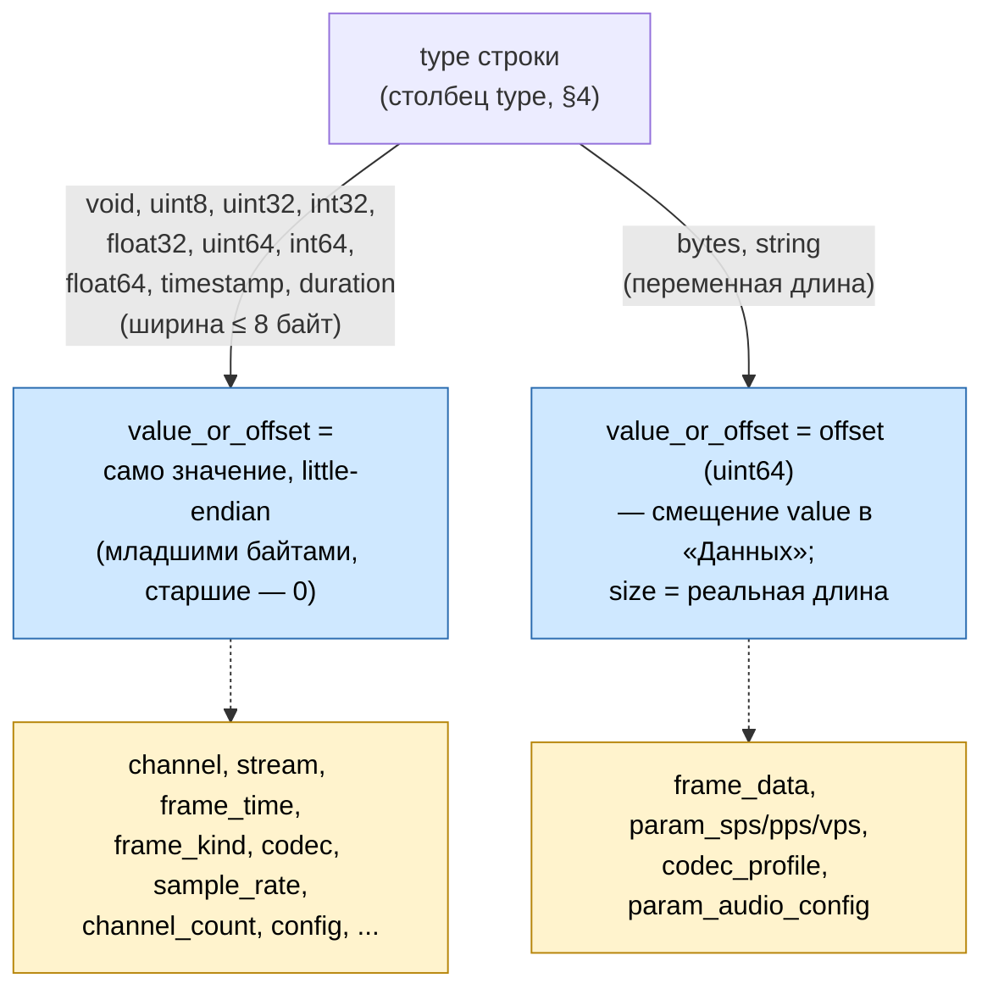

# Бинарный формат TOC

## 1. Назначение документа

Документ описывает секцию «TOC» фконтейнера (`03-storage-format.md` §8.2): оглавление, позволяющее находить и обходить узлы дерева (`05-data-format.md`) без чтения секции «Данные» целиком, и вести поиск по отдельным атрибутам узлов (время, вид кадра и т.п.) и по структуре дерева (поддерево канала, принадлежность узла каналу/потоку) без обхода дерева указателями.

Документ **не описывает**:
- Общий формат узла дерева (`type`, `role`, `parent`, `sibling`, `size`, `value`) в секции «Данные» — см. `05-data-format.md`.
- Доменные типы узлов и их семантику (video/audio-дерево) — см. `07-media-tree.md`.
- Расположение секции TOC внутри фблока, `toc_size`, CRC — см. `03-storage-format.md` §8.2, §9.
- Теорию array-based деревьев (path coordinate matrix, propagation pattern, DFS/BFS-переупорядочение, LCA), на которую этот документ опирается — см. `08-array-trees.md`.

## 2. Общая идея: одна SoA-структура

TOC — **единая** структура на весь фконтейнер, а не деление на «базовый TOC» и «производные индексы» разных бинарных форм. Причина, по которой это возможно: TOC строится **один раз, одним процессом, при финализации фконтейнера** (переход fblock `in_progress` → `ready`, §5), когда дерево уже неизменно. Это ровно предпосылка, при которой Hsu использует **Structure of Arrays** (`08-array-trees.md` §3.7) — в отличие от секции «Данные», которую параллельно заполняют несколько потоков-производителей и где по этой причине выбран Array of Structs (`05-data-format.md` §2). TOC не наследует это ограничение: он никогда не подвергается конкурентной записи, поэтому хранится как набор параллельных массивов (столбцов) — одна запись на узел дерева, столбцы описаны в §4.

Практическое следствие: то, что раньше требовало отдельной структуры («производный индекс», копирующий `value` рядом с `node_id`, чтобы избежать чтения «Данных»), теперь не нужно — нужное `value` уже лежит в столбце `value_or_offset` самого TOC (§4.1). Поиск по значению атрибута (§7) и структурный поиск по дереву (§6) — это два разных способа читать одну и ту же SoA-структуру, не два разных формата.

## 3. Заголовок и раскладка секции TOC

Секция TOC начинается с заголовка, за которым подряд идут столбцы. Каждый столбец обязан начинаться со смещения, кратного **`TOC_ALIGN = 64` байт**, — от начала секции TOC, а не от начала фблока или файла (смещение секции TOC внутри фблока зависит от `toc_size`, `03-storage-format.md` §8.2, и само не обязано быть кратным чему-либо). Это выравнивание не оставлено на решение реализации: расчёт границ столбцов детерминирован (ниже) и одинаков для любой реализации, читающей этот формат.

64 байта — размер кэш-линии на большинстве современных архитектур (x86-64, ARM) и ширина регистра AVX-512; выравнивание на 64 автоматически удовлетворяет и более узким SIMD-регистрам (16 байт SSE, 32 байта AVX2), поскольку 64 кратно им обоим. Гарантия формата — только относительное выравнивание внутри секции TOC; чтобы оно реализовалось как настоящее выравнивание адреса в памяти, читатель должен сам скопировать/отобразить секцию TOC в буфер, начало которого само выровнено на 64 байта (это ответственность реализации Reader, не часть бинарного формата).

Заголовок занимает ровно один блок выравнивания (64 байта):

| Смещение | Поле | Тип | Значение |
|---|------|-----|----------|
| 0 | `toc_format_version_major` | uint16 | Мажорная версия формата TOC (§3.1). |
| 2 | `toc_format_version_minor` | uint16 | Минорная версия формата TOC (§3.1). |
| 4 | `node_count` | uint32 | Число узлов дерева = длина каждого столбца (`n`). |
| 8 | `reserved` | 56 байт | Зарезервировано, должно быть 0. |

Версия читается первой, до `node_count` и любых столбцов — тот же порядок приоритета, что у `magic_prolog`/`format_version_*` в начале пролога фблока (`03-storage-format.md` §5.1): сначала подтвердить, что читатель понимает формат, потом читать содержимое.

### 3.1. Версионирование TOC

TOC — самостоятельная версионируемая структура, **не привязанная** к `format_version_major`/`format_version_minor` фблока (`03-storage-format.md` §4). Причина разделения: TOC непрозрачен для Storage и целиком принадлежит слою потребителя/fcontainer (`03-storage-format.md` §8.2) — его формат может меняться (новая роль, новый столбец) без единого изменения в проле или каталоге фблока, и наоборот. Общая версия формата заставила бы любое такое изменение TOC поднимать версию всего Storage, хотя Storage к содержимому TOC безразличен.

Правила эволюции — та же дисциплина major/minor, что и у формата хранилища (`03-storage-format.md` §4), и та же дисциплина «дописывать в конец, не переиспользуя», что уже принята для кодов `role` (`07-media-tree.md` §3.1):

- **Мажорная версия** — несовместимое изменение: другая ширина, порядок или семантика уже существующего столбца (§4), другое значение `TOC_ALIGN`. Читатель, не поддерживающий эту мажорную версию, обязан отказаться разбирать TOC (может продолжать работать с остальным фблоком — TOC для Storage непрозрачен и на остальные секции не влияет).
- **Минорная версия** — обратно совместимое расширение: **новый столбец, дописанный после `size[]`** (§4), никогда — вставка/переупорядочивание/изменение ширины существующих. Читатель старой минорной версии вычисляет смещения только известных ему столбцов (§3) и не читает ничего после `size[]` — новый столбец для него просто не существует, он не мешает и не требует явного пропуска.

Версия записывается один раз, тем же процессом и на том же проходе, что строит остальной TOC (§5).

После заголовка столбцы идут в фиксированном порядке (§4). Каждый столбец — непрерывный массив из `n` элементов фиксированной ширины, **дополненный справа нулевыми байтами** до следующей границы, кратной 64, если `n × width` не кратно 64 само:

```
offset(столбец 0) = 64
size(столбец k)   = n × width(k)
pad(столбец k)     = (64 - size(столбец k) mod 64) mod 64
offset(столбец k+1) = offset(столбец k) + size(столбец k) + pad(столбец k)
```

```
[заголовок 64B][type[]…pad][role[]…pad][parent[]…pad][sibling[]…pad][value_or_offset[]…pad][size[]]
```

Padding — нулевые байты, не несущие данных; последний столбец (`size[]`) заполнением справа не дополняется, потому что после него в секции TOC ничего нет (следом идёт эпилог фблока, `03-storage-format.md` §9, у которого своё выравнивание с конца).

Цена выравнивания — не более `TOC_ALIGN - 1` (63 байта) паддинга на стык между столбцами, то есть не более `5 × 63 = 315` байт на всю секцию TOC независимо от `n` (стыков между 6 столбцами — 5; сам заголовок уже кратен 64 и стыка не требует). При реалистичных `n` (миллионы узлов, §4 — 27 байт/узел без паддинга) это меньше одной десятитысячной от размера секции — постоянные накладные расходы, не растущие с `n`.

Раскладка и порядок столбцов фиксированы мажорной версией TOC (§3.1) — независимо от версии формата хранилища, по той же логике, что и раскладка каталога фблока фиксирована версией формата хранилища (`03-storage-format.md` §6.2), только на своём, отдельном счётчике версий.

Физическая раскладка секции целиком:

```mermaid
flowchart LR
    HDR["Заголовок TOC — 64 байта<br/>toc_format_version_major/minor · node_count · reserved"]
    C1["type[] · n×1"]
    P1(("pad → 64"))
    C2["role[] · n×2"]
    P2(("pad → 64"))
    C3["parent[] · n×4"]
    P3(("pad → 64"))
    C4["sibling[] · n×4"]
    P4(("pad → 64"))
    C5["value_or_offset[] · n×8"]
    P5(("pad → 64"))
    C6["size[] · n×8"]

    HDR --> C1 --> P1 --> C2 --> P2 --> C3 --> P3 --> C4 --> P4 --> C5 --> P5 --> C6

    classDef hdr fill:#e8e8e8,stroke:#666,color:#000
    classDef col fill:#cfe8ff,stroke:#2b6cb0,color:#000
    classDef pad fill:none,stroke:#999,stroke-dasharray: 3 3,color:#666

    class HDR hdr
    class C1,C2,C3,C4,C5,C6 col
    class P1,P2,P3,P4,P5 pad
```



Каждый синий блок — непрерывный массив длины `n`; пунктирные кружки — паддинг из нулевых байт (§3), присутствующий только когда `n × width` не кратно 64; после `size[]` паддинга нет (следом сразу эпилог фблока).

## 4. Столбцы записи

Одна строка (позиция `i` во всех столбцах сразу) описывает один узел дерева. Позиция `i` — это **id узла после DFS-переупорядочивания** (§5), а не id, под которым узел создавался в «Данных» — см. §5 про перевод `parent`/`sibling`.

| Столбец | Размер элемента | Значение |
|---|---|---|
| `type` | 1 байт | Как в «Данных» (`05-data-format.md` §3.1). |
| `role` | 2 байта | Как в «Данных». |
| `parent` | 4 байта | Id родителя **после** переупорядочивания. Корень — `parent[i] == i`. |
| `sibling` | 4 байта | Id предыдущего (левого) соседа **после** переупорядочивания. Хранится всегда, безусловно — не вычисляется из позиции и не отбрасывается после DFS-переупорядочивания (в отличие от общего замечания `08-array-trees.md` §8.4 о том, что после DFS `sibling` в принципе избыточен): в farc `sibling` — единственный документированный способ найти ключевой кадр GOP для данного кадра (обратный проход по цепочке `sibling` до `frame_kind = I`, `07-media-tree.md` §6), и этот проход не заменяется арифметикой по позиции и размеру поддерева без дополнительного, ломкого предположения о постоянной ширине поддерева `frame` — предположения, которое переставало бы работать при любом будущем расширении состава детей `frame`. |
| `value_or_offset` | 8 байт | См. §4.1. |
| `size` | 8 байт | Значим только для `type` ∈ {`bytes`, `string`} — реальная длина `value` в «Данных», как и в самом узле «Данных» (`05-data-format.md` §3, там же теперь 8 байт). Для остальных типов — `0`, зарезервировано: ширина полностью выводится из `type` (`05-data-format.md` §3.1), хранить её было бы чистой избыточностью. |

**27 байт/узел** (сумма столбцов, без учёта заголовка секции). Отдельного столбца размера поддерева нет — граница поддерева вычисляется на чтении, а не хранится (§6).

### 4.1. `value_or_offset` — union по `type`

Тег — уже существующее поле `type` (то же значение, что и в «Данных» для этого узла), отдельного дискриминатора не заводится:

- `type` ∈ {`void`, `uint8`, `uint32`, `int32`, `float32`, `uint64`, `int64`, `float64`, `timestamp`, `duration`} — ширина `value` фиксирована и ≤ 8 байт (`05-data-format.md` §3.1). `value_or_offset` хранит **само значение**, little-endian, младшими байтами; старшие байты, не занятые значением, — нули. Для `void` всё поле — `0` (значения нет).
- `type` ∈ {`bytes`, `string`} — переменная длина. `value_or_offset` хранит **offset** (uint64) — смещение `value` от начала секции «Данные» (тот же смысл, что у `offset` в предыдущей редакции этого документа); реальная длина — в столбце `size`.

Читатель не может спутать эти два случая — `type` уже известен из соседнего столбца той же строки, ветвление всегда однозначно.



Оба представления занимают ровно 8 байт независимо от того, какой случай применяется к конкретной строке: `value_or_offset` — uniform-колонка SoA-массива, её ширина одна для всех `n` строк. Инлайн значения для узких типов не уменьшает эту ширину (она и так определена худшим случаем — offset), но избавляет читателя от обращения к «Данным» при сканировании ролей `channel`, `stream`, `frame_time`, `frame_kind`, `codec`, `sample_rate`, `channel_count`, `config` — практически всех ролей дерева, кроме самих байтовых блобов (`frame_data`, `param_*`, `codec_profile`).

## 5. Построение при финализации

TOC строится один раз, единственным процессом, на этапе финализации фконтейнера (переход fblock `in_progress` → `ready`) — тем же проходом, что уже выполняется для проверки заголовка и вычисления `crc32_data`/`crc32_toc` (`03-storage-format.md` §9). Отдельной структуры, которую нужно вести во время записи, не требуется: секция «Данные» уже физически лежит строго по возрастанию id (инвариант `parent <= id`, `sibling <= id`, `05-data-format.md` §3) — то есть сама «Данные» и есть вход для построения TOC.

Алгоритм — «способ B» из `08-array-trees.md` §8.2 (рекомендованный, `O(n)` дополнительной памяти, без материализации path coordinate matrix):

1. **Один последовательный проход по «Данным» от начала.** На каждом узле читаются `type`/`role`/`parent`/`sibling`/`size` из самого узла; `offset` — текущая позиция курсора чтения. Результат — массивы `type[]`, `role[]`, `parent[]`, `sibling[]`, `size[]`, `offset[]` в порядке создания (creation order), в памяти финализирующего процесса.
2. **`depth`** — `O(d)` проходов по `parent` (`08-array-trees.md` §6.2).
3. **`size` поддеревьев** (временная величина, только для вычисления `pos` на следующем шаге — на диск не пишется, см. §6) — `O(d)` проходов снизу вверх, от самого глубокого уровня к первому (`08-array-trees.md` §8.2, шаг 2).
4. **`pos` (DFS-позиция)** — сверху вниз, через префиксную сумму по `sibling` в пределах общего родителя (`08-array-trees.md` §8.2, шаг 3).
5. **`old2new = pos`, `new2old = inverse(pos)`** (`08-array-trees.md` §7.2), затем gather всех столбцов по `new2old` и перевод `parent`/`sibling` по правилу §7.3 («индексные векторы переставляют и переводят»): `newParent[k] = old2new[oldParent[new2old[k]]]`, аналогично для `sibling`.
6. Переставленные `type[]`, `role[]`, `parent'[]`, `sibling'[]`, `value_or_offset[]` (построенный из `value`/`offset` по правилу §4.1), `size[]` пишутся на диск в этом порядке (§3). Временные `depth`/`size поддеревьев`/`pos` из шагов 2–4 в TOC не попадают — они нужны только чтобы посчитать перестановку, не как самостоятельные столбцы.

«Данные» при этой перестановке не трогаются вообще — переставляется только TOC. Это работает именно потому, что TOC ссылается на «Данные» по `offset` (явному указателю) для байтовых/строковых узлов, а не по позиции: переезд записи в TOC не требует физически двигать байты в «Данных» (`08-array-trees.md` §8.4).

## 6. DFS-порядок и структурные запросы

После переупорядочивания (§5) узлы лежат в порядке прямого обхода (preorder), и это даёт универсальный, не привязанный к конкретной роли механизм структурного поиска (`08-array-trees.md` §8.4) — без отдельного столбца размера поддерева:

- **Поддерево — непрерывный диапазон, начало которого известно сразу, а конец — вычисляется сканированием вперёд.** Узлы поддерева узла на позиции `k` занимают `[k, end)`, где `end` — первая позиция `i > k`, для которой `parent[i] < k`. Верно потому, что в DFS-порядке любой настоящий потомок `k` имеет родителя внутри уже открытого поддерева (`parent[i] >= k`), а первый узел за пределами поддерева — либо следующий брат `k`, либо узел из ветки более высокого уровня — в обоих случаях его `parent` ссылается на позицию, предшествующую `k`. Стоимость — `O(размер поддерева)` шагов, каждый — одно сравнение; это не `O(1)`, но и не `O(n)` — граница находится за число шагов, пропорциональное самим найденным данным, а не всему дереву.
- **`a` — предок `b`?** — подъём по `parent` от `b` вверх, пока не встретится `a` или корень (`08-array-trees.md` §10.3), `O(depth)` шагов (`d ≈ 10`, `07-media-tree.md` §2, `08-array-trees.md` §16). Дешевле, чем сканирование диапазона, если нужен ответ только про эту одну пару узлов, а не про всё поддерево.
- **К какому каналу/потоку относится узел X** — подъём по `parent` до нужной роли, тем же способом.

Этот механизм один и тот же для любой роли и любой ветки дерева — не нужно заводить отдельную структуру под каждый новый вид структурного вопроса, в отличие от того, как это было устроено в предыдущей редакции документа (там — один bespoke-индекс на атрибут).

## 7. Поиск по значению за пределами одного поддерева

Внутри одного потока кадры уже идут в порядке создания, совпадающем для видео с порядком декодирования (`07-media-tree.md` §2) — то есть уже отсортированы по времени. Поиск «кадр около момента T в потоке S» не требует ничего сверх диапазона, полученного в §6 (поддерево `stream`/`config`) плюс бинарный поиск внутри него по столбцу `value_or_offset`, отфильтрованному по роли `frame_time`.

Отдельная структура нужна только для запросов, **пересекающих границы поддеревьев** по значению — например, «что вообще писалось около момента T» без уточнения канала. Такой запрос сегодня закрывается прямым SIMD-сканом столбца `value_or_offset` по всей длине `n`, отфильтрованным по `role` ∈ {`frame_time` (video, код 19), `frame_time` (audio, код 32)} (`07-media-tree.md` §3.1) — без материализации отдельного индекса: значение уже лежит в TOC (§4.1), копировать его ещё раз незачем.

Если профилирование в будущем покажет, что линейный скан по `value_or_offset` на конкретной инсталляции слишком медленный — можно добавить **дополнительный, чисто вспомогательный столбец**: отсортированную перестановку id по нужному ключу (`uint32` на строку, без копии значения — значение всё равно читается из `value_or_offset` по id на каждом шаге бинарного поиска). Это не требует менять формат TOC заново — только договориться о теге такого столбца и его порядке построения при финализации (§5). Формат ниже это не специфицирует заранее, потому что на сегодня нет данных, что это нужно (см. §9).

Companion-колонки вида `channel_id`/`stream_id` на каждую строку (материализация подъёма по `parent`) в формат по умолчанию не входят — при малом числе каналов/потоков на фконтейнер (ADR-014) подъём по `parent` до нужного предка после того, как кандидаты уже сужены по времени, стоит несколько разыменований, а не отдельного столбца на миллионы строк.

## 8. Пример: резолв (канал, t1, t2) → смещения

Сценарий из ADR-016 (fallback-резолв, когда потребитель не располагает уже разобранным TOC) и `01-architecture.md` §2.5:

1. **Найти узел канала N.** Строк с `role = channel` (код 2, `07-media-tree.md` §3.1) на весь фконтейнер немного (ADR-014) — линейный скан столбцов `role`+`value_or_offset`, сравнение `value_or_offset == N`. Дешевле любой предварительной подготовки.
2. **Взять диапазон поддерева.** `[k, end)`, где `k` — позиция найденного узла `channel`, `end` — первая позиция `i > k` с `parent[i] < k` (§6). Сканирование останавливается на границе именно этого канала, а не идёт до конца TOC.
3. **Отфильтровать по времени внутри диапазона.** Скан строк диапазона с `role` ∈ {`frame_time` (video), `frame_time` (audio)}, сравнение `value_or_offset` с `[t1, t2]` (§7). Результат — id узлов `frame_time`.
4. **Перейти к нужным данным.** Родитель найденного `frame_time` — узел `frame` (`parent[frame_time]`); его дети `frame_data`/`frame_kind` дают байты кадра и, если нужно, GOP через `sibling` (§4).
5. Смещения и размеры — из `value_or_offset`/`size` найденных узлов `frame_data` (тип `bytes`, §4.1). Дальше — обычное чтение у `StorageEngine` по уже готовым смещениям (ADR-004).

Ничего из этого не требует `frame_time_index` или companion-колонок из предыдущей редакции документа — вся процедура работает на одной структуре (§2).

## 9. Открытые вопросы

- Обязателен ли DFS-реордер (§5) как часть финализации при любом профиле нагрузки, или это должно быть настраиваемо по типу Storage — сегодня принято как безусловный шаг финализации, потому что его цена разовая (при финализации), а выгода (§6) — на каждом последующем структурном запросе; отдельно не проверено на реальных объёмах.
- ~~Вспомогательный столбец-перестановка для поиска по значению за пределами одного поддерева~~ — решено: не заводим. Линейный SIMD-скан по `value_or_offset` (§7) остаётся единственным механизмом для этого случая; отдельная структура добавила бы столбец без измеренной необходимости — если профилирование в будущем покажет, что скана недостаточно, к этому можно вернуться отдельным решением, без изменения уже принятой раскладки (§3-§4).
- ~~Выравнивание начала каждого столбца на границу, удобную для SIMD~~ — решено: `TOC_ALIGN = 64` байт зафиксирован как часть формата (§3), не оставлен на решение реализации.
