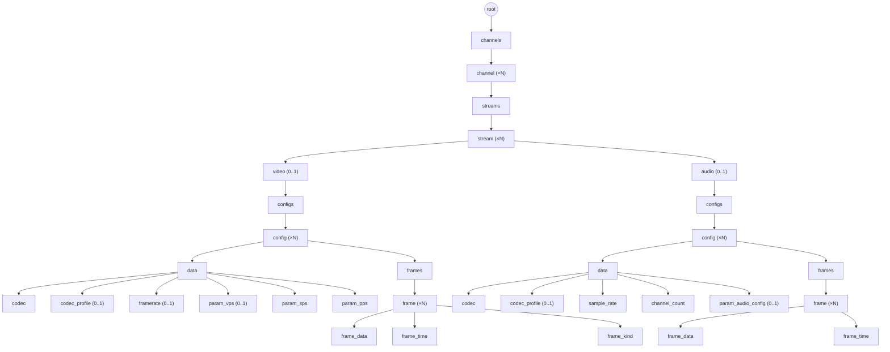

# Дерево данных: каналы, потоки, кадры

## 1. Назначение документа

Документ конкретизирует дерево (`05-data-format.md`) для доменной модели farc: разбиение данных фконтейнера на каналы, потоки (видео/аудио), версии параметров кодека и кадры (I/P, GOP). Определяет набор значений `role`, соответствующий им `type` (физическое представление `value`) и форму `value` для каждой роли.

Документ **не описывает**:
- Общий формат элемента дерева (`type`, `role`, `parent`, `sibling`, `size`, `value`/`offset`) — см. `05-data-format.md`.
- Формат TOC — см. `06-toc-format.md`.
- Внутренний битовый формат самих parameter set'ов (что значат конкретные байты внутри SPS/PPS/VPS/ASC) — специфика кодека, вне области farc. Сам факт, что эти байты — самостоятельные узлы дерева, и их место в иерархии — часть этого документа (§3.2).

## 2. Иерархия

Иерархия в виде схемы (ветка `audio` почти зеркальна ветке `video`, показана свёрнуто); `id` у `channel`/`stream` — доменный идентификатор, не путать с `id` узла дерева (§4):

Video- и audio-ветки почти идентичны по форме и теперь называются одинаково — `configs`, `config`, `data`, `frames`, `frame`, `frame_data`, `frame_time`, `codec_profile` встречаются в обеих ветках — но это не одна и та же роль под общим именем: это восемь пар отдельных ролей с идентичным устройством, но собственным числовым кодом и единственным путём у каждой (см. обоснование в §3.1); имя роли больше не идентифицирует её однозначно — идентификатор это код. Расходятся ветки в одном месте: у видео `frame` несёт третьего ребёнка `frame_kind` (I/P меняется от кадра к кадру — атрибут конкретного кадра), у звука аналога нет — кодек не меняется от кадра к кадру, это свойство потока целиком и хранится один раз в `data` audio-ветки (§3.3), а не дублируется в каждом `frame` audio-ветки. Порядок `frame` под одним `frames` — порядок их `id` при сканировании `parent == frames` соответствующей ветки (`05-data-format.md` §3), совпадающий с физическим порядком создания; для видео он же — порядок декодирования, включая P-кадры внутри GOP.

## 3. Роли узлов

`type` (`05-data-format.md` §3.1) — закрытый набор физических представлений `value`, общий для всего формата, не специфичный для домена. В медиа-дереве встречаются: `void` (нет `value` — контейнер/тег ветки), `uint8`, `uint32`, `float64`, `timestamp`, `bytes`. Отдельного enum-типа нет (как в EBML): перечислимые значения (`frame_kind`, `codec`) физически хранятся как `uint8`, смысл конкретных значений задаёт роль (её код, §3.1), а не `type` (`05-data-format.md` §3.1).

Восемь ролей ниже (`configs`, `config`, `data`, `codec`, `codec_profile`, `frames`, `frame`, `frame_data`, `frame_time`) встречаются в таблице дважды — один раз на video-ветке, один раз на audio-ветке; это разные роли с разными кодами (§3.1), а не переиспользование одной и той же строки. Пометка «(video)»/«(audio)» рядом с именем в столбцах «role»/«Родитель» — не часть имени, а справочное указание, к какой из двух ролей относится строка.

| `role`                | `type`      | Родитель        | Кратность у родителя | `value`                                                               |
| --------------------- | ----------- | --------------- | -------------------- | --------------------------------------------------------------------- |
| `root`                | `void`      | сам себе        | 1 (корень дерева)    | —                                                                     |
| `channels`            | `void`      | `root`          | 1                    | — (контейнер)                                                         |
| `channel`             | `uint32`    | `channels`      | N                    | номер канала                                                          |
| `streams`             | `void`      | `channel`       | 1                    | — (контейнер)                                                         |
| `stream`              | `uint32`    | `streams`       | N                    | номер потока                                                          |
| `video`               | `void`      | `stream`        | 0..1                 | — (тег ветки)                                                         |
| `audio`               | `void`      | `stream`        | 0..1                 | — (тег ветки)                                                         |
| `configs` (video)     | `void`      | `video`         | 1                    | — (контейнер)                                                         |
| `config` (video)      | `timestamp` | `configs` (video) | N                  | — (см. §5)                                                            |
| `data` (video)        | `void`      | `config` (video)| 1                    | — (контейнер, дочерние узлы — §3.2)                                   |
| `codec` (video)       | `uint8`     | `data` (video)  | 1                    | `h264` = 0, `h265` = 1                                                |
| `codec_profile` (video) | `bytes`   | `data` (video)  | 0..1                 | сырой `profile-level-id`/`profile-id` из SDP, как есть, информационно |
| `framerate`           | `float64`   | `data` (video)  | 0..1                 | номинальный fps из SDP `a=framerate`, информационно                   |
| `param_vps`           | `bytes`     | `data` (video)  | 0..1 (только H.265)  | сырой VPS NAL, без старт-кода                                         |
| `param_sps`           | `bytes`     | `data` (video)  | 1                    | сырой SPS NAL, без старт-кода                                         |
| `param_pps`           | `bytes`     | `data` (video)  | 1                    | сырой PPS NAL, без старт-кода                                         |
| `frames` (video)      | `void`      | `config` (video)| 1                    | — (контейнер)                                                         |
| `frame` (video)       | `void`      | `frames` (video)| N                    | — (контейнер, атрибуты в детях)                                       |
| `frame_data` (video)  | `bytes`     | `frame` (video) | 1                    | байты кадра                                                           |
| `frame_time` (video)  | `timestamp` | `frame` (video) | 1                    | время кадра (`05-data-format.md` §3.1)                                |
| `frame_kind`          | `uint8`     | `frame` (video) | 1                    | `I` (ключевой кадр) или `P`                                           |
| `configs` (audio)     | `void`      | `audio`         | 1                    | — (контейнер)                                                         |
| `config` (audio)      | `timestamp` | `configs` (audio)| N                   | — (см. §5)                                                            |
| `data` (audio)        | `void`      | `config` (audio)| 1                    | — (контейнер, дочерние узлы — §3.3)                                   |
| `codec` (audio)       | `uint8`     | `data` (audio)  | 1                    | `pcm` = 0, `aac` = 1, `g711a` (PCMA) = 2, `g711u` (PCMU) = 3          |
| `codec_profile` (audio) | `bytes`   | `data` (audio)  | 0..1                 | сырой `profile-level-id` из SDP, как есть, информационно              |
| `sample_rate`         | `uint32`    | `data` (audio)  | 1                    | частота дискретизации, Гц                                             |
| `channel_count`       | `uint8`     | `data` (audio)  | 1                    | число каналов (обычно 1)                                              |
| `param_audio_config`  | `bytes`     | `data` (audio)  | 0..1 (только AAC)    | сырой AudioSpecificConfig, без изменений                              |
| `frames` (audio)      | `void`      | `config` (audio)| 1                    | — (контейнер)                                                         |
| `frame` (audio)       | `void`      | `frames` (audio)| N                    | — (контейнер, атрибуты в детях)                                       |
| `frame_data` (audio)  | `bytes`     | `frame` (audio) | 1                    | байты кадра                                                           |
| `frame_time` (audio)  | `timestamp` | `frame` (audio) | 1                    | время кадра (`05-data-format.md` §3.1)                                |

Несколько ролей намеренно делят один `type` (`config` и `frame_time` — обе `timestamp`; `frame_kind` и `codec` — обе `uint8`) — это не проблема, а расчётный эффект разделения полей: `type` описывает только физическую раскладку `value`, семантику несёт конкретная роль (её код, §3.1), а не `type`.

`channel` и `stream` физически всегда `uint32` — в закрытом наборе `type` (`05-data-format.md` §3.1) нет `uint16`, а `uint8` (потолок 255) не хватает на диапазон каналов. Логический потолок при этом — `uint16` у обоих: у канала — по ADR-014 (не более 65535 каналов на систему), у потока — зеркально, тем же порядком, без отдельного ADR. Контейнер (`uint32`) и домен (`uint16`) — разные величины: формат резервирует место под больший диапазон, чем фактически используется.

`video`/`audio` — не контейнеры и не повторяются: у потока не более одного узла каждого вида; отсутствие узла означает отсутствие соответствующей дорожки в потоке.

### 3.1. Коды ролей

`role` — открытый, растущий вместе с доменом словарь (§3 выше), но численный код, однажды записанный на диск, фиксируется навсегда: новые роли только дописываются в конец таблицы, существующие коды не переиспользуются и не перенумеровываются (та же дисциплина, что у номеров полей в protobuf). На диск и в дерево пишется только код (`05-data-format.md` §3, поле `role`, 2 байта) — текстовое имя существует только в этом документе, для чтения человеком, и не обязано быть уникальным: восемь ролей с идентичным устройством на video- и audio-ветке (§2, §3) намеренно называются одинаково, различает их только код. Это правило про уже записанные на диск данные — пока идёт проектирование и ни один код нигде не сохранён, ошибочно заведённая роль просто убирается из таблицы, а не остаётся вычеркнутой заглушкой.

Колонка «путь» — не часть кода и не часть формата, а справочная проекция «Родителя» (§3) до корня, для быстрой ориентации; она восстановима из `parent` любого узла (`05-data-format.md` §3) и в дереве нигде отдельно не хранится (то же рассуждение, что для `depth`/`size`, `08-array-trees.md` §3.6, §4). У каждого кода — ровно один путь; общий префикс `root/channels/channel/streams/stream` обозначен `…`. Имя в столбце «role» при этом не уникально — video- и audio-версия одной по структуре роли называются одинаково (§2, §3); столбец «путь» здесь и служит способом различить их на глаз, в действительности различает код.

|  код | `role`                | путь                                                                    |
| ---: | --------------------- | ------------------------------------------------------------------------ |
|    0 | `root`                | `root`                                                                  |
|    1 | `channels`            | `root/channels`                                                         |
|    2 | `channel`             | `root/channels/channel`                                                 |
|    3 | `streams`             | `root/channels/channel/streams`                                         |
|    4 | `stream`              | `root/channels/channel/streams/stream`                                  |
|    5 | `video`               | `…/video`                                                               |
|    6 | `audio`               | `…/audio`                                                               |
|    7 | `configs` (video)     | `…/video/configs`                                                       |
|    8 | `config` (video)      | `…/video/configs/config`                                                |
|    9 | `data` (video)        | `…/video/configs/config/data`                                           |
|   10 | `codec` (video)       | `…/video/configs/config/data/codec`                                     |
|   11 | `param_vps`           | `…/video/configs/config/data/param_vps`                                 |
|   12 | `param_sps`           | `…/video/configs/config/data/param_sps`                                 |
|   13 | `param_pps`           | `…/video/configs/config/data/param_pps`                                 |
|   14 | `framerate`           | `…/video/configs/config/data/framerate`                                 |
|   15 | `codec_profile` (video) | `…/video/configs/config/data/codec_profile`                           |
|   16 | `frames` (video)      | `…/video/configs/config/frames`                                         |
|   17 | `frame` (video)       | `…/video/configs/config/frames/frame`                                   |
|   18 | `frame_data` (video)  | `…/video/configs/config/frames/frame/frame_data`                        |
|   19 | `frame_time` (video)  | `…/video/configs/config/frames/frame/frame_time`                        |
|   20 | `frame_kind`          | `…/video/configs/config/frames/frame/frame_kind`                        |
|   21 | `configs` (audio)     | `…/audio/configs`                                                       |
|   22 | `config` (audio)      | `…/audio/configs/config`                                                |
|   23 | `data` (audio)        | `…/audio/configs/config/data`                                           |
|   24 | `codec` (audio)       | `…/audio/configs/config/data/codec`                                     |
|   25 | `codec_profile` (audio) | `…/audio/configs/config/data/codec_profile`                           |
|   26 | `sample_rate`         | `…/audio/configs/config/data/sample_rate`                               |
|   27 | `channel_count`       | `…/audio/configs/config/data/channel_count`                             |
|   28 | `param_audio_config`  | `…/audio/configs/config/data/param_audio_config`                        |
|   29 | `frames` (audio)      | `…/audio/configs/config/frames`                                         |
|   30 | `frame` (audio)       | `…/audio/configs/config/frames/frame`                                   |
|   31 | `frame_data` (audio)  | `…/audio/configs/config/frames/frame/frame_data`                        |
|   32 | `frame_time` (audio)  | `…/audio/configs/config/frames/frame/frame_time`                        |

Восемь пар ролей (`configs`, `config`, `data`, `frames`, `frame`, `frame_data`, `frame_time`, `codec_profile`) устроены одинаково в обеих ветках и раньше делили один код на двоих — у каждой стороны свой код и свой путь, без исключений (§3 выше); имя при этом одинаковое на обеих ветках — различает video- и audio-версию только код и путь, второго столбца-паттерна в имени больше нет. Цена — почти зеркальное дублирование записи в таблице на каждую пару и необходимость всегда уточнять ветку словами при упоминании роли в прозе, а не только её именем в backtick; отдельные `codec` (video) и `codec` (audio) остаются разными кодами по другой причине — их таблицы значений несовместимы (`h264`/`h265` против `pcm`/`aac`/`g711a`/`g711u`), а не просто из-за парного устройства.

Практическое следствие для TOC (`06-toc-format.md` §4): индексу, которому нужны кадры обеих веток разом (например, «кадры около времени T независимо от video/audio»), приходится участвовать по **двум** кодам роли `frame_time` — video (код 19) и audio (код 32) — вместо одного, хотя имя роли у обоих одно и то же — формат производных индексов такую множественность уже поддерживает (`06-toc-format.md` §3.2, «множество ролей, участвующих в индексе»), это не новое ограничение формата, просто раньше конкретный пример укладывался в одну роль, а теперь — в две (различаемые кодом, не именем).

### 3.2. Параметры потока (дети `data`, video-ветка)

Изначально `data` (в обеих ветках) задумывался как один непрозрачный `bytes`-блоб (параметры кодека целиком, `05-data-format.md` за пределами формата). От этого отказались: параметры потока должны быть прозрачны для farc — читатель узнаёт кодек и достаёт нужный parameter set по коду роли, не парся составной блоб и не зная заранее его внутренней раскладки. `data` — контейнер (`void`), а не хранилище значения.

Источник — SDP RTSP-камеры (`a=rtpmap`/`a=fmtp` для `m=video`). Два реальных примера:

- **H.264**: `a=rtpmap:96 H264/90000`, `a=fmtp:96 packetization-mode=1;profile-level-id=64001F;sprop-parameter-sets=<SPS>,<PPS>`.
- **H.265**: `a=rtpmap:98 H265/90000`, `a=fmtp:98 profile-id=1;sprop-vps=<VPS>;sprop-sps=<SPS>;sprop-pps=<PPS>`.

Разбор на узлы:

| Узел                                | Откуда в SDP                                                                                                                      | Комментарий                                                                                                                                                                                                                                                      |
| ----------------------------------- | --------------------------------------------------------------------------------------------------------------------------------- | ---------------------------------------------------------------------------------------------------------------------------------------------------------------------------------------------------------------------------------------------------------------- |
| `codec` (video)                     | по `rtpmap` (`H264`/`H265`)                                                                                                       | определяет, какие из `param_*` ожидать: H.264 — `param_sps`+`param_pps`; H.265 — дополнительно `param_vps`                                                                                                                                                       |
| `param_vps`/`param_sps`/`param_pps` | `sprop-vps`/`sprop-sps`/`sprop-pps` (H.265) или элементы `sprop-parameter-sets` через запятую (H.264: первый — SPS, второй — PPS) | значение — результат base64-декода **без изменений**: сырой NAL без старт-кода и без длины. Старт-код (Annex B, `0x00000001`) не хранится — `size` узла уже даёт границу, старт-код при необходимости добавляется читателем при склейке в bitstream для декодера |
| `codec_profile` (video)             | `profile-level-id` (H.264, 3 байта, hex-строка) или `profile-id` (H.265, малое целое)                                             | хранится как есть, информационно — те же данные уже есть в первых байтах SPS/VUI, узел не обязателен для декодирования, только чтобы не гонять парсер SPS ради отображения профиля                                                                               |
| `framerate`                         | `a=framerate` (attribute уровня `m=video`, не `fmtp`)                                                                             | номинальное значение источника, не гарантия; фактический fps считается по дельтам `frame_time` (video-ветка)                                                                                                                                                     |

`packetization-mode` из `fmtp` не хранится — это параметр RTP-упаковки (как NAL резался на пакеты по сети), к результату декодирования и к самому потоку данных отношения не имеет.

### 3.3. Параметры потока (дети `data`, audio-ветка)

Источник — та же RTSP-камера, две реальные аудио-дорожки в одном SDP-сеансе (разные `stream`):

- **AAC**: `a=rtpmap:97 MPEG4-GENERIC/48000`, `a=fmtp:97 streamtype=5;profile-level-id=1;mode=AAC-hbr;sizelength=13;indexlength=3;indexdeltalength=3;config=1188`.
- **G.711 A-law**: `a=rtpmap:8 PCMA/8000` (без `fmtp` — кодек статический, RFC 3551, доп. параметры не нужны).

Разбор на узлы:

| Узел                  | Откуда в SDP                                                                                                                                                                                                                       | Комментарий                                                                                                                               |
| --------------------- | ---------------------------------------------------------------------------------------------------------------------------------------------------------------------------------------------------------------------------------- | ----------------------------------------------------------------------------------------------------------------------------------------- |
| `codec` (audio)       | по `rtpmap` (`MPEG4-GENERIC` → `aac`; `PCMA`/`PCMU` → `g711a`/`g711u`)                                                                                                                                                             | код кодека — единственный источник истины, на уровне `config` (audio-ветка); per-frame поля для этого нет (§2)                            |
| `sample_rate`         | клок-рейт из `rtpmap` (второе поле: `MPEG4-GENERIC/48000` → 48000; `PCMA/8000` → 8000)                                                                                                                                             | Гц, для обоих кодеков даётся прямо в `rtpmap`, декодировать `param_audio_config` не нужно                                                 |
| `channel_count`       | для AAC — не в `rtpmap` (там только клок-рейт), а декодируется из `channelConfiguration` внутри `config=` (см. ниже); для G.711 статический тип (`PCMA`/`PCMU`) по RFC 3551 — 1, если `rtpmap` явно не указал третьим полем другое | пример: `config=1188` → 1 (моно)                                                                                                          |
| `codec_profile` (audio) | `profile-level-id` из `fmtp` (AAC) — тот же приём, что и у видео (§3.2, `codec_profile` (video)), но отдельная роль/код (§3.1)                                                                                                  | здесь `profile-level-id=1`, информационно                                                                                                 |
| `param_audio_config`  | `config=` в `fmtp` (только AAC/`mpeg4-generic`)                                                                                                                                                                                    | AudioSpecificConfig (ISO/IEC 14496-3), hex-декод как есть, без изменений; для `pcm`/`g711a`/`g711u` extradata не нужна — узел отсутствует |

Разбор `config=1188` (AudioSpecificConfig, для примера — `channel_count` в дереве получается именно так, парсинг битов не хранится, только результат): байты `0x11 0x88` = `00010001 10001000`. Первые 5 бит — `audioObjectType = 00010 = 2` (AAC LC); следующие 4 бита — `samplingFrequencyIndex = 0011 = 3` (48000 Гц, совпадает с `rtpmap`); следующие 4 бита — `channelConfiguration = 0001 = 1` (моно). Дерево хранит только сырые байты `param_audio_config` и уже готовое число `channel_count = 1` — сам разбор ASC (как и разбор SPS для видео, §3.2) не входит в область farc, только источник данных для его результата, зафиксированного в `channel_count`.

## 4. Доменные идентификаторы vs id узла дерева

`id` узла (см. `05-data-format.md` §3) — позиция элемента при создании, не переиспользуется и не несёт смысла для потребителя. Номер канала и номер потока — доменные идентификаторы, которыми оперирует потребитель (например, «открыть канал 7»); они хранятся в `value` соответствующего узла (`channel`, `stream`), а не в `parent`/`sibling`. У `config` (в обеих ветках) идентификатором служит сам момент смены параметров — `value` узла, `timestamp` (§5); отдельного номера (тем более версии в смысле semver) нет и не нужно.

Поиск узла по доменному идентификатору (например, канала 7 среди детей `channels`) выполняется сканированием `parent == channels` с проверкой `value` — количество каналов/потоков на фконтейнер невелико (см. ADR-014, регистр каналов), поэтому линейный скан не является проблемой производительности.

## 5. Заполнение узлов

- **`data`** (video- и audio-ветка) — контейнер параметров кодека; сами параметры — прозрачные дочерние узлы (`codec`, `param_sps`/`param_pps`/`param_vps`, `framerate`, `codec_profile` — video-ветка, §3.2; `codec`, `sample_rate`, `channel_count`, `param_audio_config`, `codec_profile` — audio-ветка, §3.3), а не единый непрозрачный блоб.
- **`frame`** (video- и audio-ветка) — контейнер; `value` не используется. Атрибуты кадра — в дочерних узлах ниже.
- **`frame_data`** (video- и audio-ветка) — закодированные байты кадра (ключевого или нет — см. `frame_kind`).
- **`frame_time`** (video- и audio-ветка) — `value` — абсолютное время кадра, `timestamp` (`05-data-format.md` §3.1, Unix-наносекунды; источник — микросекундная точность, младшие 3 разряда всегда нулевые).
- **`frame_kind`** — только для video-ветки; `value` — маркер ключевого/неключевого кадра, `uint8`: `I` (начало новой GOP) = `0x49`, `P` (не ключевой, той же GOP) = `0x50` — ASCII-код самой буквы, чтобы значение было самоописательным при hex-дампе (тот же приём, что у `FARCPROL`, `03-storage-format.md`). У audio-ветки аналога нет — кодек не варьируется от кадра к кадру (см. `codec`, audio-ветка, §3.3).
- **`config`** (video- и audio-ветка) — фиксирует момент смены параметров кодека внутри потока (например, смена разрешения); `value` — момент смены, `timestamp`, тот же формат, что и у `frame_time`. Не путать с версией/semver: идентичность узла — момент времени, а не порядковый номер.

## 6. Открытые вопросы

- ~~Точный формат доменного идентификатора в `value` узлов `channel`/`stream`~~ — решено: простое число без дополнительных полей, физически `uint32` (единственный подходящий тип из закрытого набора, `05-data-format.md` §3.1); логический потолок — `uint16` у обоих, согласовано с ADR-014 (§3 выше).
- ~~Конкретное числовое значение `frame_kind` для каждого варианта~~ — решено, см. §5: ASCII-коды `I`/`P`. Значения кодека аудио (`pcm`/`aac`/`g711a`/`g711u`) переехали на уровень потока — см. `codec`, audio-ветка, §3.3.
- ~~Связь P-кадра со своим ключевым кадром GOP~~ — решено: P и I лежат на одном уровне, оба как плоские дети `frames` (video-ветка); связь раньше выражалась через `parent` (`frame_p`, родитель — `frame_i`), теперь видовой признак I/P — атрибут `frame_kind`. Восстановление GOP — сканирование цепочки `sibling` назад до ближайшего `frame` (video-ветка) с `frame_kind = I` (декодер всегда идёт последовательно). Произвольный доступ к «своему» I-кадру без обхода соседей не требуется — дополнительная ссылка не нужна.
- ~~Дублирование кодека аудио на двух уровнях (кадр и поток)~~ — решено: `frame_codec_audio` был ошибкой (кодек — свойство потока, не кадра, у аудио нет per-frame варьирования вроде I/P), роль убрана из таблицы (§3.1), единственный источник — `codec` (audio-ветка) на уровне `data` (audio-ветка) (§3.3).
- ~~Схема дочерних узлов `data`, audio-ветка~~ — решено реальным SDP (AAC/`mpeg4-generic` и G.711 A-law/`PCMA`, §3.3), коды ролей зафиксированы (§3.1: `codec` (audio)=24, `sample_rate`=26, `channel_count`=27, `param_audio_config`=28). G.711 μ-law (`PCMU`) в захвате не встретился, но заведён как `g711u` = 3 по аналогии с `PCMA` (RFC 3551, тот же кодек, другой закон компандирования) — при первом реальном SDP с `PCMU` сверить, что предположение верно.
- ~~Часть ролей делила один код между video/audio, часть — нет (несогласованность в таблице путей)~~ — решено: все восемь общих ролей (`configs`, `config`, `data`, `frames`, `frame`, `frame_data`, `frame_time`, `codec_profile`) получили раздельные коды и пути на video- и audio-ветке (§3.1); у каждого кода теперь ровно один путь (об именовании этих ролей — см. следующий пункт).
- ~~Суффиксы `_video`/`_audio` в имени роли~~ — решено: суффикс убран из имени. У восьми парных ролей (`configs`, `config`, `data`, `frames`, `frame`, `frame_data`, `frame_time`, `codec_profile`), а также у `codec`, video- и audio-версия называются одинаково; уникальный идентификатор роли — числовой код (§3.1), не строка `role`. Различить video- и audio-версию в прозе документа помогает контекст раздела или явное указание ветки в скобках (например, `codec` (video)); в самом дереве различает путь — узел `video`/`audio` уже есть в цепочке `parent` (§3.1).
