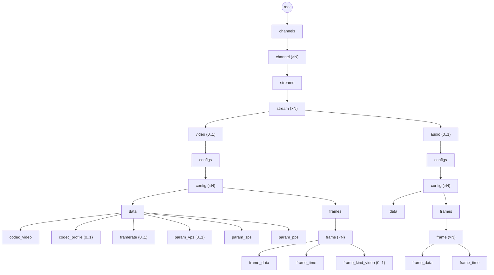

# Дерево данных: каналы, потоки, кадры

## 1. Назначение документа

Документ конкретизирует дерево (`05-data-format.md`) для доменной модели farc: разбиение данных фконтейнера на каналы, потоки (видео/аудио), версии параметров кодека и кадры (I/P, GOP). Определяет набор значений `role`, соответствующий им `type` (физическое представление `value`) и форму `value` для каждой роли.

Документ **не описывает**:
- Общий формат элемента дерева (`type`, `role`, `parent`, `sibling`, `size`, `value`/`offset`) — см. `05-data-format.md`.
- Формат TOC — см. `06-toc-format.md`.
- Внутренний битовый формат самих parameter set'ов (что значат конкретные байты внутри SPS/PPS/VPS/ASC) — специфика кодека, вне области farc. Сам факт, что эти байты — самостоятельные узлы дерева, и их место в иерархии — часть этого документа (§3.2).

## 2. Иерархия

Иерархия в виде схемы (ветка `audio` зеркальна ветке `video`, показана свёрнуто); `id` у `channel`/`stream` — доменный идентификатор, не путать с `id` узла дерева (§4):

`frame` — общий контейнер для видео и звука, но дальше формы у веток расходятся: у видео `frame` несёт третьего ребёнка `frame_kind_video` (I/P меняется от кадра к кадру, это действительно атрибут конкретного кадра), у звука такого третьего ребёнка нет — кодек не меняется от кадра к кадру, это свойство потока целиком и хранится один раз в `data` (§3.3), а не дублируется в каждом `frame`. Порядок `frame` под одним `frames` — порядок их `id` при сканировании `parent == frames` (`05-data-format.md` §3), совпадающий с физическим порядком создания; для видео он же — порядок декодирования, включая P-кадры внутри GOP.

## 3. Роли узлов

`type` (`05-data-format.md` §3.1) — закрытый набор физических представлений `value`, общий для всего формата, не специфичный для домена. В медиа-дереве встречаются: `void` (нет `value` — контейнер/тег ветки), `uint8`, `uint32`, `float64`, `timestamp`, `bytes`. Отдельного enum-типа нет (как в EBML): перечислимые значения (`frame_kind_video`, `codec_video`) физически хранятся как `uint8`, смысл конкретных значений задаёт `role`, а не `type` (`05-data-format.md` §3.1).

| `role`              | `type`   | Родитель          | Кратность у родителя | `value` |
|---------------------|----------|-------------------|-----------------------|---------|
| `root`              | `void`   | сам себе          | 1 (корень дерева)      | — |
| `channels`          | `void`   | `root`            | 1                      | — (контейнер) |
| `channel`           | `uint32` | `channels`        | N                      | номер канала |
| `streams`           | `void`   | `channel`         | 1                      | — (контейнер) |
| `stream`            | `uint32` | `streams`         | N                      | номер потока |
| `video`             | `void`   | `stream`          | 0..1                   | — (тег ветки) |
| `audio`             | `void`   | `stream`          | 0..1                   | — (тег ветки) |
| `configs`           | `void`   | `video` / `audio` | 1                      | — (контейнер) |
| `config`            | `timestamp` | `configs`      | N                      | — (см. §5) |
| `data`              | `void`   | `config`          | 1                      | — (контейнер, дочерние узлы — §3.2) |
| `codec_video`       | `uint8`  | `data` (только video) | 1                  | `h264` = 0, `h265` = 1 |
| `codec_profile`     | `bytes`  | `data` (только video) | 0..1               | сырой `profile-level-id`/`profile-id` из SDP, как есть, информационно |
| `framerate`         | `float64` | `data` (только video) | 0..1              | номинальный fps из SDP `a=framerate`, информационно |
| `param_vps`         | `bytes`  | `data` (только video, H.265) | 0..1        | сырой VPS NAL, без старт-кода |
| `param_sps`         | `bytes`  | `data` (только video) | 1                  | сырой SPS NAL, без старт-кода |
| `param_pps`         | `bytes`  | `data` (только video) | 1                  | сырой PPS NAL, без старт-кода |
| `frames`            | `void`   | `config`          | 1                      | — (контейнер) |
| `frame`             | `void`   | `frames`          | N                      | — (контейнер, атрибуты в детях) |
| `frame_data`        | `bytes`  | `frame`           | 1                      | байты кадра |
| `frame_time`        | `timestamp` | `frame`        | 1                      | время кадра (`05-data-format.md` §3.1) |
| `frame_kind_video`  | `uint8`  | `frame` (только video) | 0..1              | `I` (ключевой кадр) или `P` |

У audio-ветки `frame` не имеет третьего ребёнка: кодек — свойство потока, а не кадра (см. ниже и §3.3), в отличие от `frame_kind_video`, который меняется от кадра к кадру и поэтому обязан быть на самом кадре.

Несколько ролей намеренно делят один `type` (`config`/`frame_time` — обе `timestamp`; `frame_kind_video`/`codec_video` — обе `uint8`) — это не проблема, а расчётный эффект разделения полей: `type` описывает только физическую раскладку `value`, семантику несёт `role`.

`channel` и `stream` физически всегда `uint32` — в закрытом наборе `type` (`05-data-format.md` §3.1) нет `uint16`, а `uint8` (потолок 255) не хватает на диапазон каналов. Логический потолок при этом — `uint16` у обоих: у канала — по ADR-014 (не более 65535 каналов на систему), у потока — зеркально, тем же порядком, без отдельного ADR. Контейнер (`uint32`) и домен (`uint16`) — разные величины: формат резервирует место под больший диапазон, чем фактически используется.

`video`/`audio` — не контейнеры и не повторяются: у потока не более одного узла каждого вида; отсутствие узла означает отсутствие соответствующей дорожки в потоке.

### 3.1. Коды ролей

`role` — открытый, растущий вместе с доменом словарь (§3 выше), но численный код, однажды записанный на диск, фиксируется навсегда: новые роли только дописываются в конец таблицы, существующие коды не переиспользуются и не перенумеровываются (та же дисциплина, что у номеров полей в protobuf).

| код | `role` |
|----:|--------|
| 0  | `root` |
| 1  | `channels` |
| 2  | `channel` |
| 3  | `streams` |
| 4  | `stream` |
| 5  | `video` |
| 6  | `audio` |
| 7  | `configs` |
| 8  | `config` |
| 9  | `data` |
| 10 | `frames` |
| 11 | `frame` |
| 12 | `frame_data` |
| 13 | `frame_time` |
| 14 | `frame_kind_video` |
| 15 | ~~`frame_codec_audio`~~ (удалена — кодек аудио оказался свойством потока, а не кадра, см. §2/§3.3; код не переиспользуется) |
| 16 | `codec_video` |
| 17 | `param_vps` |
| 18 | `param_sps` |
| 19 | `param_pps` |
| 20 | `framerate` |
| 21 | `codec_profile` |

`frame_data` (а не `data`) и `codec_video`/`codec_audio` как отдельные от `frame_kind_video` роли (а не общая роль `kind`/`codec`) — намеренно уникальные роли, а не переиспользование одного и того же имени: одна и та же `role` не должна означать разные вещи в разных ветках или на разных уровнях дерева (иначе подсчёт/индексация по `role` становится неоднозначной, см. `06-toc-format.md`). Роль узла сама по себе однозначно определяет ветку, уровень и семантику — доп. поле-скоуп не нужно.

### 3.2. Параметры потока (дети `data`, видео)

Изначально `data` задумывался как один непрозрачный `bytes`-блоб (параметры кодека целиком, `05-data-format.md` за пределами формата). От этого отказались: параметры потока должны быть прозрачны для farc — читатель узнаёт кодек и достаёт нужный parameter set по `role`, не парся составной блоб и не зная заранее его внутренней раскладки. `data` — контейнер (`void`), а не хранилище значения.

Источник — SDP RTSP-камеры (`a=rtpmap`/`a=fmtp` для `m=video`). Два реальных примера:

- **H.264**: `a=rtpmap:96 H264/90000`, `a=fmtp:96 packetization-mode=1;profile-level-id=64001F;sprop-parameter-sets=<SPS>,<PPS>`.
- **H.265**: `a=rtpmap:98 H265/90000`, `a=fmtp:98 profile-id=1;sprop-vps=<VPS>;sprop-sps=<SPS>;sprop-pps=<PPS>`.

Разбор на узлы:

| Узел | Откуда в SDP | Комментарий |
|---|---|---|
| `codec_video` | по `rtpmap` (`H264`/`H265`) | определяет, какие из `param_*` ожидать: H.264 — `param_sps`+`param_pps`; H.265 — дополнительно `param_vps` |
| `param_vps`/`param_sps`/`param_pps` | `sprop-vps`/`sprop-sps`/`sprop-pps` (H.265) или элементы `sprop-parameter-sets` через запятую (H.264: первый — SPS, второй — PPS) | значение — результат base64-декода **без изменений**: сырой NAL без старт-кода и без длины. Старт-код (Annex B, `0x00000001`) не хранится — `size` узла уже даёт границу, старт-код при необходимости добавляется читателем при склейке в bitstream для декодера |
| `codec_profile` | `profile-level-id` (H.264, 3 байта, hex-строка) или `profile-id` (H.265, малое целое) | хранится как есть, информационно — те же данные уже есть в первых байтах SPS/VUI, узел не обязателен для декодирования, только чтобы не гонять парсер SPS ради отображения профиля |
| `framerate` | `a=framerate` (attribute уровня `m=video`, не `fmtp`) | номинальное значение источника, не гарантия; фактический fps считается по дельтам `frame_time` |

`packetization-mode` из `fmtp` не хранится — это параметр RTP-упаковки (как NAL резался на пакеты по сети), к результату декодирования и к самому потоку данных отношения не имеет.

### 3.3. Параметры потока (дети `data`, аудио) — черновик

Реального SDP с аудио-треком пока не снято, поэтому раздел — набросок по аналогии с RTP-схемами для типичных кодеков (RFC 3640 `mpeg4-generic` для AAC, RFC 3551 для G.711/PCM), **не зафиксирован** и не входит в таблицу кодов ролей (§3.1) до проверки реальным SDP:

| Узел (черновик) | Откуда ожидается | Комментарий |
|---|---|---|
| `codec_audio` | `rtpmap` (`PCMU`/`PCMA`/`mpeg4-generic`) | код кодека (`pcm`/`aac`/`g711`) — единственный источник истины, на уровне `config`; per-frame поля для этого больше нет (§2) |
| `sample_rate` | `rtpmap` (например, `mpeg4-generic/44100/2`) | Гц |
| `channels` | `rtpmap` | обычно 1 или 2 |
| `param_audio_config` | `config=` в `fmtp` (только AAC, `mpeg4-generic`) | AudioSpecificConfig, hex-декод как есть; для `pcm`/`g711` extradata не нужна, узел отсутствует |

## 4. Доменные идентификаторы vs id узла дерева

`id` узла (см. `05-data-format.md` §3) — позиция элемента при создании, не переиспользуется и не несёт смысла для потребителя. Номер канала и номер потока — доменные идентификаторы, которыми оперирует потребитель (например, «открыть канал 7»); они хранятся в `value` соответствующего узла (`channel`, `stream`), а не в `parent`/`sibling`. У `config` идентификатором служит сам момент смены параметров — `value` узла, `timestamp` (§5); отдельного номера (тем более версии в смысле semver) нет и не нужно.

Поиск узла по доменному идентификатору (например, канала 7 среди детей `channels`) выполняется сканированием `parent == channels` с проверкой `value` — количество каналов/потоков на фконтейнер невелико (см. ADR-014, регистр каналов), поэтому линейный скан не является проблемой производительности.

## 5. Заполнение узлов

- **`data`** — контейнер параметров кодека; сами параметры — прозрачные дочерние узлы (`codec_video`, `param_sps`/`param_pps`/`param_vps`, `framerate`, `codec_profile` — видео, §3.2; аудио — черновик, §3.3), а не единый непрозрачный блоб.
- **`frame`** — контейнер; `value` не используется. Атрибуты кадра — в дочерних узлах ниже.
- **`frame_data`** — закодированные байты кадра (ключевого или нет — см. `frame_kind_video`).
- **`frame_time`** — `value` — абсолютное время кадра, `timestamp` (`05-data-format.md` §3.1, Unix-наносекунды; источник — микросекундная точность, младшие 3 разряда всегда нулевые).
- **`frame_kind_video`** — только для video-ветки; `value` — маркер ключевого/неключевого кадра, `uint8`: `I` (начало новой GOP) = `0x49`, `P` (не ключевой, той же GOP) = `0x50` — ASCII-код самой буквы, чтобы значение было самоописательным при hex-дампе (тот же приём, что у `FARCPROL`, `03-storage-format.md`). У audio-ветки аналога нет — кодек не варьируется от кадра к кадру (см. `codec_audio`, §3.3).
- **`config`** — фиксирует момент смены параметров кодека внутри потока (например, смена разрешения); `value` — момент смены, `timestamp`, тот же формат, что и у `frame_time`. Не путать с версией/semver: идентичность узла — момент времени, а не порядковый номер.

## 6. Открытые вопросы

- ~~Точный формат доменного идентификатора в `value` узлов `channel`/`stream`~~ — решено: простое число без дополнительных полей, физически `uint32` (единственный подходящий тип из закрытого набора, `05-data-format.md` §3.1); логический потолок — `uint16` у обоих, согласовано с ADR-014 (§3 выше).
- ~~Конкретное числовое значение `frame_kind_video` для каждого варианта~~ — решено, см. §5: ASCII-коды `I`/`P`. Значения кодека аудио (`pcm`/`aac`/`g711`) переехали на уровень потока — см. §3.3 (черновик).
- ~~Связь P-кадра со своим ключевым кадром GOP~~ — решено: P и I лежат на одном уровне, оба как плоские дети `frames`; связь раньше выражалась через `parent` (`frame_p`, родитель — `frame_i`), теперь видовой признак I/P — атрибут `frame_kind_video`. Восстановление GOP — сканирование цепочки `sibling` назад до ближайшего `frame` с `frame_kind_video = I` (декодер всегда идёт последовательно). Произвольный доступ к «своему» I-кадру без обхода соседей не требуется — дополнительная ссылка не нужна.
- ~~Дублирование кодека аудио на двух уровнях (кадр и поток)~~ — решено: `frame_codec_audio` был ошибкой (кодек — свойство потока, не кадра, у аудио нет per-frame варьирования вроде I/P), роль удалена (§3.1, код 15 отозван), единственный источник — `codec_audio` на уровне `data` (§3.3).
- Схема дочерних узлов `data` для аудио-ветки (§3.3) — черновик по аналогии, не проверен реальным SDP с аудио-треком; коды ролей под неё не выделены.
