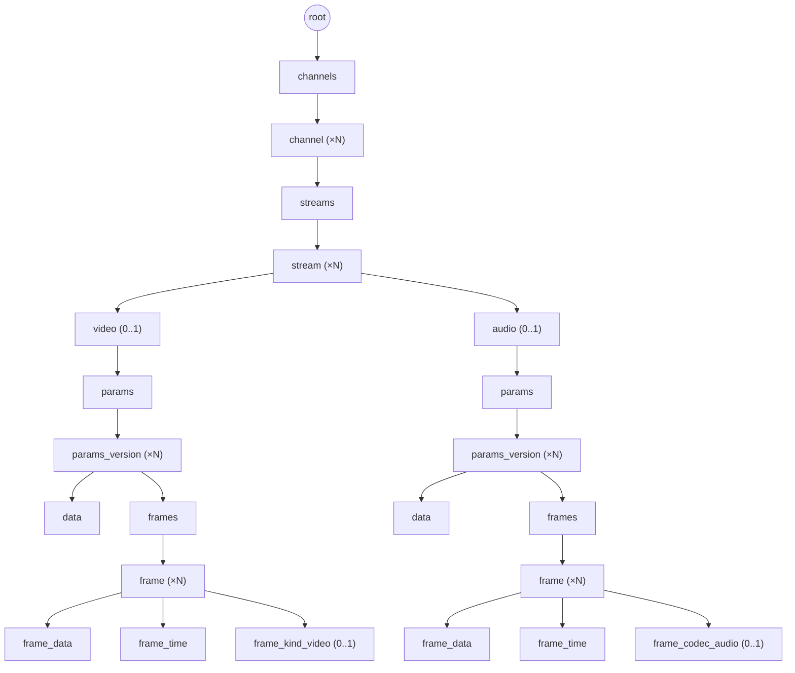

# Дерево данных: каналы, потоки, кадры

## 1. Назначение документа

Документ конкретизирует дерево (`05-data-format.md`) для доменной модели farc: разбиение данных фконтейнера на каналы, потоки (видео/аудио), версии параметров кодека и кадры (I/P, GOP). Определяет набор значений `type` и форму `value` для каждого из них.

Документ **не описывает**:
- Общий формат элемента дерева (`type`, `parent`, `sibling`, `size`, `value`/`offset`) — см. `05-data-format.md`.
- Формат TOC — см. `06-toc-format.md`.
- Формат самих кодек-параметров и кадров (SPS/PPS, ASC и т.п.) — специфика кодека, вне области farc.

## 2. Иерархия

```
/root
/root/channels
/root/channels/id
/root/channels/id/streams
/root/channels/id/streams/id
/root/channels/id/streams/id/{video,audio}/params
/root/channels/id/streams/id/{video,audio}/params/id
/root/channels/id/streams/id/{video,audio}/params/id/data      // сами параметры кодека
/root/channels/id/streams/id/{video,audio}/params/id/frames
/root/channels/id/streams/id/{video,audio}/params/id/frames/frame        // кадр (видео и звук — общий контейнер)
/root/channels/id/streams/id/{video,audio}/params/id/frames/frame/data   // байты кадра
/root/channels/id/streams/id/{video,audio}/params/id/frames/frame/time   // время кадра
/root/channels/id/streams/id/{video,audio}/params/id/frames/frame/kind   // video: I/P; audio: кодек (pcm/aac/g.711)
```

`id` в пути — доменный идентификатор (номер канала, номер потока, номер версии параметров), не путать с `id` узла дерева (§4).

Та же иерархия в виде схемы (ветка `audio` зеркальна ветке `video`, показана свёрнуто):



`frame` — общий контейнер для видео и звука; у звука нет разбиения на ключевые/неключевые кадры, поэтому дерево для обеих веток одинаковое по форме, различается только тип узла-«вида» (`frame_kind_video` против `frame_codec_audio`, см. §3). Порядок `frame` под одним `frames` — цепочка `sibling` (`05-data-format.md` §3), это физический порядок создания; для видео он же — порядок декодирования, включая P-кадры внутри GOP.

## 3. Типы узлов

| `type`            | Родитель          | Кратность у родителя | `value` |
|-------------------|-------------------|-----------------------|---------|
| `root`            | сам себе          | 1 (корень дерева)      | — |
| `channels`         | `root`            | 1                      | — (контейнер) |
| `channel`          | `channels`        | N                      | номер канала |
| `streams`          | `channel`         | 1                      | — (контейнер) |
| `stream`           | `streams`         | N                      | номер потока |
| `video`            | `stream`          | 0..1                   | — (тег ветки) |
| `audio`            | `stream`          | 0..1                   | — (тег ветки) |
| `params`           | `video` / `audio` | 1                      | — (контейнер) |
| `params_version`   | `params`          | N                      | — (см. §5) |
| `data`             | `params_version`  | 1                      | параметры кодека |
| `frames`           | `params_version`  | 1                      | — (контейнер) |
| `frame`            | `frames`          | N                      | — (контейнер, атрибуты в детях) |
| `frame_data`       | `frame`           | 1                      | байты кадра |
| `frame_time`       | `frame`           | 1                      | — (время в базовом поле `timestamp` узла) |
| `frame_kind_video` | `frame` (только video) | 0..1              | `I` (ключевой кадр) или `P` |
| `frame_codec_audio`| `frame` (только audio) | 0..1              | код кодека (`pcm`/`aac`/`g711`) |

`video`/`audio` — не контейнеры и не повторяются: у потока не более одного узла каждого вида; отсутствие узла означает отсутствие соответствующей дорожки в потоке.

`frame_data` (а не `data`) и раздельные `frame_kind_video`/`frame_codec_audio` (а не общий `kind`) — намеренно уникальные имена типа, а не переиспользование `data`/общего тега вида: один и тот же `type` не должен означать разные вещи в разных ветках дерева (иначе подсчёт/индексация по `type` становится неоднозначной, см. `06-toc-format.md`). Тип узла сам по себе однозначно определяет ветку и семантику — доп. поле-скоуп не нужно.

## 4. Доменные идентификаторы vs id узла дерева

`id` узла (см. `05-data-format.md` §3) — позиция элемента при создании, не переиспользуется и не несёт смысла для потребителя. Номер канала, номер потока и номер версии параметров — доменные идентификаторы, которыми оперирует потребитель (например, «открыть канал 7»); они хранятся в `value` соответствующего узла (`channel`, `stream`), а не в `parent`/`sibling`.

Поиск узла по доменному идентификатору (например, канала 7 среди детей `channels`) выполняется обходом цепочки `sibling` с проверкой `value` — количество каналов/потоков на фконтейнер невелико (см. ADR-014, регистр каналов), поэтому линейный обход по цепочке соседей не является проблемой производительности.

## 5. Заполнение узлов

- **`data`** — параметры кодека (например, SPS/PPS для H.264, ASC для AAC), непрозрачны для farc.
- **`frame`** — контейнер; `value` не используется, `timestamp` базового элемента тоже не используется (см. `frame_time`). Атрибуты кадра — в дочерних узлах ниже.
- **`frame_data`** — закодированные байты кадра (ключевого или нет — см. `frame_kind_video`).
- **`frame_time`** — абсолютное время кадра хранится в базовом поле `timestamp` этого узла (Unix, наносекунды; источник — микросекундная точность, младшие 3 разряда всегда нулевые, см. `05-data-format.md` §3); `value` не используется (`size = 0`).
- **`frame_kind_video`** — только для video-ветки; `value` — маркер `I` (ключевой кадр, начало новой GOP) или `P` (не ключевой, той же GOP).
- **`frame_codec_audio`** — только для audio-ветки; `value` — идентификатор кодека кадра (`pcm`/`aac`/`g711`).
- **`params_version`** — фиксирует момент смены параметров кодека внутри потока (например, смена разрешения); `timestamp` — момент смены (тот же базовый механизм, что и у `frame_time`); `value` не используется.

## 6. Открытые вопросы

- Точный формат доменного идентификатора в `value` узлов `channel`/`stream` (просто число фиксированного размера, или с дополнительными полями) — согласовать с `00-requirements.md`/ADR-014, где уже определён номер канала.
- Точное байтовое представление `value` у `frame_kind_video` (`I`/`P`) и `frame_codec_audio` (`pcm`/`aac`/`g711`) — enum фиксированного размера или иначе.
- Связь P-кадра со своим ключевым кадром GOP раньше выражалась через `parent` (`frame_p`, родитель — `frame_i`); теперь все `frame` — плоские дети `frames`, а видовой признак I/P вынесен в `frame_kind_video`. Предполагается, что потребителю достаточно восстанавливать GOP сканированием цепочки `sibling` назад до ближайшего `frame` с `frame_kind_video = I` (декодер всегда идёт последовательно). Если нужен произвольный доступ к «своему» I-кадру без обхода соседей — потребуется дополнительная ссылка.
