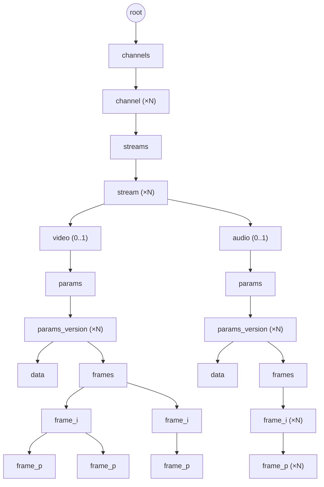

# Дерево данных: каналы, потоки, кадры

## 1. Назначение документа

Документ конкретизирует дерево (`05-data-format.md`) для доменной модели farc: разбиение данных фконтейнера на каналы, потоки (видео/аудио), версии параметров кодека и кадры (I/P, GOP). Определяет набор значений `type` и форму `value` для каждого из них.

Документ **не описывает**:
- Общий формат элемента дерева (`type`, `parent`, `sibling`, `size`, `value`/`offset`) — см. `05-data-format.md`.
- Формат TOC — см. `06-toc-format.md`.
- Формат самих кодек-параметров и кадров (SPS/PPS, ASC и т.п.) — специфика кодека, вне области farc.

## 2. Иерархия

```
/root
/root/channels
/root/channels/id
/root/channels/id/streams
/root/channels/id/streams/id
/root/channels/id/streams/id/{video,audio}/params
/root/channels/id/streams/id/{video,audio}/params/id
/root/channels/id/streams/id/{video,audio}/params/id/data      // сами параметры кодека
/root/channels/id/streams/id/{video,audio}/params/id/frames
/root/channels/id/streams/id/{video,audio}/params/id/frames/I  // ключевой кадр
/root/channels/id/streams/id/{video,audio}/params/id/frames/I/P // не ключевые кадры того же GOP
```

`id` в пути — доменный идентификатор (номер канала, номер потока, номер версии параметров), не путать с `id` узла дерева (§4).

Та же иерархия в виде схемы (ветка `audio` зеркальна ветке `video`, показана свёрнуто):



`frame_i` → `frame_p` на схеме — это `parent` (кадр GOP принадлежит своему ключевому кадру), а не `sibling`; связный список соседей (§3 в `05-data-format.md`) на схеме не показан — он определяет физический порядок создания, а не иерархию.

## 3. Типы узлов

| `type`            | Родитель          | Кратность у родителя | `value` |
|-------------------|-------------------|-----------------------|---------|
| `root`            | сам себе          | 1 (корень дерева)      | — |
| `channels`         | `root`            | 1                      | — (контейнер) |
| `channel`          | `channels`        | N                      | номер канала |
| `streams`          | `channel`         | 1                      | — (контейнер) |
| `stream`           | `streams`         | N                      | номер потока |
| `video`            | `stream`          | 0..1                   | — (тег ветки) |
| `audio`            | `stream`          | 0..1                   | — (тег ветки) |
| `params`           | `video` / `audio` | 1                      | — (контейнер) |
| `params_version`   | `params`          | N                      | — (см. §5) |
| `data`             | `params_version`  | 1                      | параметры кодека |
| `frames`           | `params_version`  | 1                      | — (контейнер) |
| `frame_i`          | `frames`          | N                      | байты ключевого кадра |
| `frame_p`          | `frame_i`         | N                      | байты не-ключевого кадра |

`video`/`audio` — не контейнеры и не повторяются: у потока не более одного узла каждого вида; отсутствие узла означает отсутствие соответствующей дорожки в потоке.

## 4. Доменные идентификаторы vs id узла дерева

`id` узла (см. `05-data-format.md` §3) — позиция элемента при создании, не переиспользуется и не несёт смысла для потребителя. Номер канала, номер потока и номер версии параметров — доменные идентификаторы, которыми оперирует потребитель (например, «открыть канал 7»); они хранятся в `value` соответствующего узла (`channel`, `stream`), а не в `parent`/`sibling`.

Поиск узла по доменному идентификатору (например, канала 7 среди детей `channels`) выполняется обходом цепочки `sibling` с проверкой `value` — количество каналов/потоков на фконтейнер невелико (см. ADR-014, регистр каналов), поэтому линейный обход по цепочке соседей не является проблемой производительности.

## 5. Заполнение узлов

- **`data`** — параметры кодека (например, SPS/PPS для H.264, ASC для AAC), непрозрачны для farc.
- **`frame_i`** — ключевой кадр (I-frame), начало новой GOP; `timestamp` — абсолютное время кадра (Unix, наносекунды; источник — микросекундная точность, младшие 3 разряда всегда нулевые, см. `05-data-format.md` §3); `value` — закодированные байты кадра.
- **`frame_p`** — не ключевой кадр той же GOP; родитель — узел `frame_i`, с которого GOP началась; `timestamp` заполняется так же, как у `frame_i`.
- **`params_version`** — фиксирует момент смены параметров кодека внутри потока (например, смена разрешения); `timestamp` — момент смены (тот же базовый механизм, что и у кадров); `value` не используется.

## 6. Открытые вопросы

- Точный формат доменного идентификатора в `value` узлов `channel`/`stream` (просто число фиксированного размера, или с дополнительными полями) — согласовать с `00-requirements.md`/ADR-014, где уже определён номер канала.
