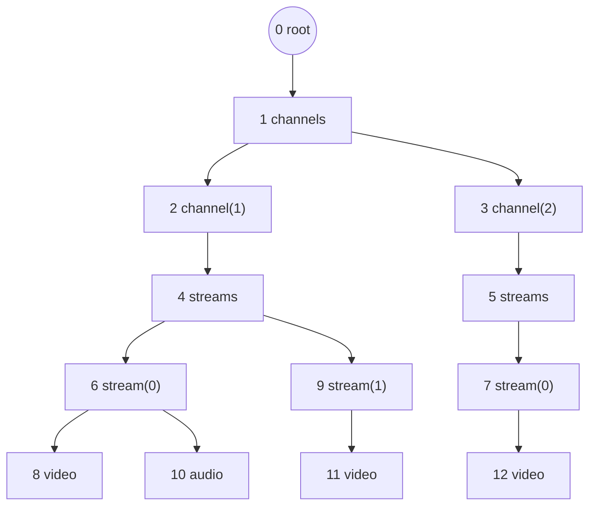

# Деревья на базе массивов (Aaron W. Hsu)

## 1. Назначение документа

Справочная глава: как устроены деревья на базе массивов в подходе Aaron W. Hsu (co-dfns, APL) и как с ними работать. Первоисточники со ссылками — §17.1. Документ объясняет теорию, на которую опирается формат дерева фконтейнера (`05-data-format.md` §2–§3) и производные индексы TOC (`06-toc-format.md` §3).

Разбираются:

- **path coordinate matrix** — полная матрица координат путей, её свойства и недостатки, и как Hsu сжимает её до пары векторов `parent` + `sibling`;
- **распространение маски** по вектору `parent` — базовая операция array-based деревьев;
- **propagation pattern** — общий шаблон «взять значение у родителя, применить операцию, повторять до сходимости»;
- **переупорядочение** в DFS и BFS с получением обеих таблиц соответствия (`старый → новый` и `новый → старый`);
- **ближайший общий предок** (LCA) — от наивного подъёма до пакетного варианта и LCA целого множества узлов;
- **изменение дерева** — добавление, удаление, изъятие и перемещение поддерева, и почему инвариант порядка одни операции делает бесплатными, а другие запрещает;
- сопутствующие вещи, без которых работа с такими деревьями не складывается в целостную картину: производные векторы, правила применения перестановок, инварианты, оценки сложности.

Все примеры построены на одном сквозном дереве (§2), все числовые результаты в документе проверены выполнением.

**Нотация.** Псевдокод здесь — **не APL**: `=` — присваивание, `==` и `!=` — сравнение, `or`/`and` — логические операции. Индекс в записи вида `m[i] = m[i] or m[parent[i]]` выписан ради наглядности и **не означает цикл** — это одна операция над всем вектором сразу. В APL, языке первоисточника, она и пишется без индекса: `m←m∨m[p]` (при `⎕IO←0`, поскольку по умолчанию APL индексирует с единицы). APL-глифы в документе появляются только там, где речь идёт собственно об APL (§15).

Документ **не описывает**:

- Формат элемента дерева на диске (`type`, `role`, `size`, `value`/`offset`) — см. `05-data-format.md`.
- Формат TOC и производных индексов — см. `06-toc-format.md`.
- Доменную иерархию каналов/потоков/кадров — см. `07-media-tree.md`.

---

## 2. Сквозной пример

Дерево из 13 узлов — упрощённый фрагмент медиа-дерева (`07-media-tree.md`): два канала, в первом канале два потока, в первом потоке видео и аудио.



Номер узла — это его **id**, он же позиция в массивах. Нумерация соответствует **порядку создания**: узлы приходят от нескольких параллельных потоков-производителей, поэтому дети одного родителя не обязаны идти подряд (у узла 4 дети — 6 и 9, между ними вклинились узлы 7 и 8 из другой ветки). Это и есть реальная ситуация записи фконтейнера, и именно она делает переупорядочение (§8, §9) нетривиальным.

| id | узел | `parent` | `sibling` | `depth` | `rank` |
|---:|------|---------:|----------:|--------:|-------:|
| 0  | root       | 0 | 0  | 0 | 0 |
| 1  | channels   | 0 | 1  | 1 | 0 |
| 2  | channel(1) | 1 | 2  | 2 | 0 |
| 3  | channel(2) | 1 | 2  | 2 | 1 |
| 4  | streams    | 2 | 4  | 3 | 0 |
| 5  | streams    | 3 | 5  | 3 | 0 |
| 6  | stream(0)  | 4 | 6  | 4 | 0 |
| 7  | stream(0)  | 5 | 7  | 4 | 0 |
| 8  | video      | 6 | 8  | 5 | 0 |
| 9  | stream(1)  | 4 | 6  | 4 | 1 |
| 10 | audio      | 6 | 8  | 5 | 1 |
| 11 | video      | 9 | 11 | 5 | 0 |
| 12 | video      | 7 | 12 | 5 | 0 |

Соглашения (те же, что в `05-data-format.md` §3):

- `parent[i] == i` — узел является корнем;
- `sibling[i] == i` — узел является первым ребёнком своего родителя (нет левого соседа);
- `depth` и `rank` (порядковый номер среди братьев, с нуля) **не хранятся** — это производные величины (§4).

В виде векторов:

```
id      =  0  1  2  3  4  5  6  7  8  9 10 11 12
parent  =  0  0  1  1  2  3  4  5  6  4  6  9  7
sibling =  0  1  2  2  4  5  6  7  8  6  8 11 12
depth   =  0  1  2  2  3  3  4  4  5  4  5  5  5
rank    =  0  0  0  1  0  0  0  0  0  1  1  0  0
```

---

## 3. Path coordinate matrix

### 3.1. Что это такое

Каждый узел дерева однозначно определяется **путём от корня**, записанным как последовательность порядковых номеров ребёнка на каждом уровне. Узел 10 (`audio`) — это «нулевой ребёнок корня → нулевой ребёнок → нулевой → нулевой → первый», то есть путь `[0, 0, 0, 0, 1]`.

Path coordinate matrix (матрица координат путей; у Hsu — *node coordinate matrix*, термин введён в ARRAY'16, §17.1) — это плотная матрица `n × d`, где `n` — число узлов, `d` — максимальная глубина дерева. Строка `i` — путь до узла `i`, дополненный справа до ширины `d` заполнителем.

Заполнитель выбирается так, чтобы он **сортировался раньше любого настоящего ранга** — тогда лексикографический порядок строк совпадает с прямым обходом (родитель раньше своих детей). Ниже заполнитель — `−1`, обозначен `·`.

### 3.2. Матрица для примера

| id | узел | ур.1 | ур.2 | ур.3 | ур.4 | ур.5 |
|---:|------|-----:|-----:|-----:|-----:|-----:|
| 0  | root       | · | · | · | · | · |
| 1  | channels   | 0 | · | · | · | · |
| 2  | channel(1) | 0 | 0 | · | · | · |
| 3  | channel(2) | 0 | 1 | · | · | · |
| 4  | streams    | 0 | 0 | 0 | · | · |
| 5  | streams    | 0 | 1 | 0 | · | · |
| 6  | stream(0)  | 0 | 0 | 0 | 0 | · |
| 7  | stream(0)  | 0 | 1 | 0 | 0 | · |
| 8  | video      | 0 | 0 | 0 | 0 | 0 |
| 9  | stream(1)  | 0 | 0 | 0 | 1 | · |
| 10 | audio      | 0 | 0 | 0 | 0 | 1 |
| 11 | video      | 0 | 0 | 0 | 1 | 0 |
| 12 | video      | 0 | 1 | 0 | 0 | 0 |

13 строк × 5 столбцов = 65 ячеек на 13 узлов, из них 26 значащих и 39 — заполнитель.

### 3.3. Зачем она нужна: строка матрицы — это ключ сортировки

Ценность матрицы в том, что структурные вопросы о дереве превращаются в операции над строками — без обхода указателей и без рекурсии:

| Вопрос | Ответ через матрицу |
|--------|---------------------|
| Порядок DFS (preorder) | лексикографическая сортировка строк (`⍋` в APL) |
| Порядок BFS (level-order) | сортировка по ключу (`depth`, строка) |
| `depth[i]` | число значащих ячеек в строке `i` |
| `a` — предок `b`? | строка `a` является префиксом строки `b` |
| Ближайший общий предок `a`, `b` | длина общего префикса строк (полностью — §10) |
| Все узлы поддерева `a` | строки с префиксом `a` — после DFS-сортировки это непрерывный диапазон |

Проверка на нашем примере: лексикографическая сортировка строк даёт

```
· · · · ·   → 0        0 0 0 0 1   → 10
0 · · · ·   → 1        0 0 0 1 ·   → 9
0 0 · · ·   → 2        0 0 0 1 0   → 11
0 0 0 · ·   → 4        0 1 · · ·   → 3
0 0 0 0 ·   → 6        0 1 0 · ·   → 5
0 0 0 0 0   → 8        0 1 0 0 ·   → 7
                       0 1 0 0 0   → 12
```

то есть `[0, 1, 2, 4, 6, 8, 10, 9, 11, 3, 5, 7, 12]` — ровно прямой обход дерева (сверим с §8.3).

### 3.4. Недостатки матрицы

**Память `O(n · d)`.** Это главная проблема, и она зависит не только от размера дерева, но и от его формы:

| Форма дерева | `d` | Ячеек | Комментарий |
|--------------|----|-------|-------------|
| Сбалансированное, `n = 10⁶`, `d = 10` | 10 | 10⁷ | 40 МБ при `uint32` (против 8 МБ у `parent`+`sibling`) |
| Медиа-дерево фконтейнера, `d ≈ 10` | 10 | `10·n` | ширина фиксирована доменом, но множитель 5× по памяти сохраняется |
| Вырожденная цепочка (`n = d`) | `n` | `n²` | при `n = 10⁶` — 4 ТБ, структура физически непредставима |

Ключевое: **ширина матрицы определяется самым глубоким узлом, а платят за неё все узлы**. Одна длинная ветка раздувает матрицу целиком. В медиа-дереве кадров (`07-media-tree.md`) листьев-кадров миллионы, и все они лежат на одной и той же глубине — то есть почти вся матрица состоит из повторяющихся общих префиксов пути своих родителей.

**Избыточность.** Строка `i` = строка `parent[i]` + один элемент в конце. Вся информация, которой строка отличается от строки родителя, — это одно число (`rank`). Остальные `d − 1` ячеек — копия родительской строки. То есть матрица хранит `O(n·d)` чисел там, где независимой информации `O(n)`.

**Заполнитель.** Чем неравномернее глубины, тем больше доля мусорных ячеек: в нашем примере 60 % ячеек — заполнитель. Их всё равно приходится читать и сравнивать при сортировке.

**Ширина — динамическая величина.** Появление одного узла на новой глубине требует расширить матрицу на столбец, то есть перевыделить и перекопировать всю структуру. Для append-only записи (фконтейнер пишется по мере поступления данных, `05-data-format.md` §3) это неприемлемо.

**Кэш.** Операция над деревом трогает целые строки шириной `d`, а не отдельные числа: сравнение двух узлов при сортировке — до `d` сравнений вместо одного.

### 3.5. Сжатие: матрица → `parent`

Наблюдение из §3.4: строка узла — это строка его родителя плюс собственный ранг. Значит, матрица полностью восстановима из двух векторов длины `n`: `parent` и `rank`. Формально:

```
row[i] = row[parent[i]] ++ [rank[i]]     (для не-корня)
row[root] = []                            (пустой путь)
```

Это сжатие с `n·d` чисел до `2n` — **без потерь**: матрица разворачивается обратно за `d` проходов (§8.1, шаг 2), и разворачивают её только тогда, когда она действительно нужна — например, один раз при финализации фконтейнера, чтобы построить DFS-порядок, после чего она выбрасывается.

Именно этот шаг и есть суть подхода Hsu: **матрица остаётся понятийной моделью, но не структурой данных**. В памяти живут векторы, матрица материализуется временно и локально.

### 3.6. `rank` из вектора `sibling`

Второй вектор — `rank` — тоже не хранится напрямую. Вместо него хранится `sibling` — id **левого соседа** (предыдущего ребёнка того же родителя), а для первого ребёнка — сам узел.

`rank` восстанавливается из `sibling` тем же propagation pattern (§6), только вдоль цепочки братьев, а не вдоль цепочки предков:

```
rank[i] = 0,                    если sibling[i] == i
rank[i] = rank[sibling[i]] + 1, иначе
```

Почему хранится `sibling`, а не `rank`, хотя `rank` компактнее по смыслу: **`rank` нельзя вычислить в момент создания узла, не зная, сколько братьев уже создано**, — это потребовало бы разделяемого счётчика детей на каждого родителя и согласования между потоками-писателями. `sibling` же — это id, который писателю и так известен: он только что создал предыдущего брата. Узел записывается целиком и сразу, ссылаясь только на уже существующие id (инвариант `parent <= id`, `sibling <= id`, `05-data-format.md` §3).

Итог сжатия:

| Представление | Память на узел | Восстановление остального |
|---------------|----------------|---------------------------|
| path coordinate matrix | `4·d` байт (`d` × uint32) | — |
| `parent` + `rank` | 8 байт | матрица — `O(d)` проходов |
| `parent` + `sibling` | 8 байт | `rank` — `O(log d_max)` проходов, далее матрица |

### 3.7. Что именно сделал Hsu, а что добавляет farc

Стоит различать:

- **У Hsu (co-dfns).** AST компилятора целиком известен к моменту построения структуры: компилятор работает пакетно. Узлы хранятся в **DFS-порядке**, а структура задаётся вектором `parent` (плюс `depth` как удобный производный вектор). В DFS-порядке информация о братьях **избыточна**: братья узла — это узлы с тем же `parent`, идущие после него, и их порядок задан самим порядком массива. Отдельный вектор `sibling` там не нужен.
- **У farc.** Дерево строится **инкрементально и конкурентно** (`05-data-format.md` §2): узлы приходят от разных потоков вперемешку, порядок массива — это порядок создания, а не DFS. Поэтому порядок братьев перестаёт следовать из порядка массива, и его приходится задать явно — вектором `sibling`.

Отсюда практическое следствие, к которому мы вернёмся в §8.4: **после перевода дерева в DFS-порядок вектор `sibling` становится избыточным** и может быть отброшен или пересчитан — что и делает DFS-порядок естественным для «замороженного» дерева (финализированный фконтейнер), а порядок создания — для растущего.

---

## 4. Производные векторы

Всё, что не `parent` и не `sibling`, вычисляется. Базовый набор:

| Вектор | Смысл | Как получить |
|--------|-------|--------------|
| `depth[i]` | глубина узла | propagation по `parent` (§6.2) |
| `rank[i]` | номер среди братьев | propagation по `sibling` (§3.6) |
| `nsibling[i]` | правый сосед (или `i`) | обращение `sibling`: `nsibling[sibling[j]] = j` для `sibling[j] != j` |
| `lastchild[p]` | последний ребёнок | узел `j` с `parent[j] = p`, у которого нет правого соседа |
| `firstchild[p]` | первый ребёнок | узел `j` с `parent[j] = p` и `sibling[j] = j` |
| `size[i]` | размер поддерева (в узлах) | накопление снизу вверх по уровням (§8.2) |
| `isleaf[i]` | лист | `i` не встречается в `parent` (кроме самоссылки корня) |

Для примера:

```
id       =  0  1  2  3  4  5  6  7  8  9 10 11 12
size     = 13 12  7  4  6  3  3  2  1  2  1  1  1
isleaf   =  .  .  .  .  .  .  .  .  x  .  x  x  x
```

Обращение `sibling` — типовой приём: вектор «влево» превращается в вектор «вправо» одной операцией scatter (§7.1), без сортировки:

```go
// nsibling[i] == i означает «правого соседа нет» (последний ребёнок)
func nextSibling(sibling []uint32) []uint32 {
	ns := make([]uint32, len(sibling))
	for i := range ns {
		ns[i] = uint32(i)
	}
	for j, s := range sibling {
		if int(s) != j { // не первый ребёнок → j стоит справа от s
			ns[s] = uint32(j)
		}
	}
	return ns
}
```

---

## 5. Распространение маски по вектору `parent`

Маска — булев (или битовый) вектор длины `n`: «этот узел отобран». Типовые задачи: «пометить всё поддерево канала 1», «пометить всех предков кадров, попавших во временной интервал», «пометить ветки с нераспознанной `role`, чтобы пропустить их целиком».

### 5.1. Вниз: от родителей к детям

Правило: узел получает метку, если она есть у него самого или у его родителя.

```
m[i] = m[i] or m[parent[i]]
```

Одно применение продвигает маску **на один уровень**. Повторяем, пока маска меняется.

Пример: посеем маску в узле 2 (`channel(1)`) и распространим вниз. Итерации (синхронные — все чтения из состояния предыдущего шага):

| Итерация | Помеченные узлы | Изменения |
|---------:|-----------------|-----------|
| старт | `{2}` | — |
| 1 | `{2, 4}` | да |
| 2 | `{2, 4, 6, 9}` | да |
| 3 | `{2, 4, 6, 8, 9, 10, 11}` | да |
| 4 | `{2, 4, 6, 8, 9, 10, 11}` | нет → стоп |

Результат — всё поддерево узла 2. Число итераций — высота поддерева ниже засеянного узла (здесь 3) плюс одна на обнаружение сходимости.

Самоссылка корня здесь работает бесплатно: для корня правило вырождается в `m[root] = m[root] or m[root]`, то есть в тождество. Никакой проверки «а не корень ли это» не нужно (важное следствие — §6.3).

### 5.2. Вверх: от детей к родителям

Правило зеркальное, но это уже не gather, а **scatter с редукцией**: в одну ячейку `parent[i]` пишут несколько разных `i`, поэтому операция обязана быть коммутативной и ассоциативной (`or`, `and`, `min`, `max`, `+`).

```
m[parent[i]] = m[parent[i]] or m[i]
```

Пример: посеем маску в узле 10 (`audio`) и распространим вверх.

| Итерация | Помеченные узлы |
|---------:|-----------------|
| старт | `{10}` |
| 1 | `{6, 10}` |
| 2 | `{4, 6, 10}` |
| 3 | `{2, 4, 6, 10}` |
| 4 | `{1, 2, 4, 6, 10}` |
| 5 | `{0, 1, 2, 4, 6, 10}` |
| 6 | без изменений → стоп |

Результат — цепочка предков узла 10.

### 5.3. Один проход вместо итераций: топологическая нумерация

Итерации нужны только тогда, когда порядок узлов в массиве произволен. Но в farc действует инвариант `parent[i] <= i` (`05-data-format.md` §3): **родитель физически создан раньше ребёнка**. Массив уже топологически отсортирован. Тогда:

- **вниз** — достаточно **одного прохода по возрастанию `i`**: когда мы доходим до `i`, ячейка `parent[i]` уже в финальном состоянии;
- **вверх** — достаточно **одного прохода по убыванию `i`**.

```go
// вниз: один проход, требует parent[i] <= i
func propagateDown(mask []bool, parent []uint32) {
	for i := range mask {
		mask[i] = mask[i] || mask[parent[i]]
	}
}

// вверх: один проход, требует parent[i] <= i
func propagateUp(mask []bool, parent []uint32) {
	for i := len(mask) - 1; i >= 0; i-- {
		if mask[i] {
			mask[parent[i]] = true
		}
	}
}
```

Проверено на примере: `propagateDown` от `{2}` даёт `{2, 4, 6, 8, 9, 10, 11}` за один проход, `propagateUp` от `{10}` даёт `{0, 1, 2, 4, 6, 10}` за один проход — те же результаты, что и итеративные версии выше.

!!! note "Цена односкоростного прохода"
    Однопроходная версия **последовательна**: `mask[i]` зависит от `mask[parent[i]]`, вычисленного на этом же проходе. Это цепочка зависимостей — её нельзя векторизовать или раздать по ядрам. Итеративная версия (§5.1) внутри одной итерации полностью параллельна и SIMD-дружественна, но требует до `d` итераций. Выбор: `1 × O(n)` последовательно против `d × O(n)` параллельно. Для однопоточного Go-читателя фконтейнера первое; для GPU/SIMD (мир, из которого пришёл Hsu) — второе.

### 5.4. Pointer doubling: `O(log d)` вместо `O(d)`

Если нужен параллельный вариант, но `d` велика, число итераций снижается с `O(d)` до `O(log d)` удвоением указателей (pointer jumping, §17.2): вместо «сделать шаг к родителю» — «сделать шаг к предку вдвое дальше».

```
A = parent
повторять:
    m = m or m[A]         // подтянуть маску от предка на расстоянии A
    A = A[A]              // удвоить дальность прыжка
```

Векторы предков для примера (`A1 = parent`, `A2 = A1[A1]`, `A4 = A2[A2]`):

```
id  =  0  1  2  3  4  5  6  7  8  9 10 11 12
A1  =  0  0  1  1  2  3  4  5  6  4  6  9  7
A2  =  0  0  0  0  1  1  2  3  4  2  4  4  5
A4  =  0  0  0  0  0  0  0  0  1  0  1  1  1
```

Распространение вниз от `{2}` с удвоением: после шага 1 — `{2, 4}`, после шага 2 — `{2, 4, 6, 8, 9, 10, 11}` (полный результат). Две итерации вместо трёх; на дереве глубины 1000 — 10 итераций вместо 1000.

Заметьте, что самоссылка корня и здесь работает сама: `A[A]` для корня остаётся корнем, векторы предков просто «упираются» в корень и насыщаются.

---

## 6. Классический propagation pattern

### 6.1. Формулировка

Всё, что делалось в §5, — частные случаи одного шаблона:

```
повторять:
    v_new = f(v, v[link])        // взять значение по ссылке, применить операцию
    changed = v_new != v
    v = v_new
пока changed
```

где `link` — векторное «ребро» (`parent` — вверх по дереву, `sibling` — влево по братьям, `A` — предок на расстоянии `2^k`), `f` — поэлементная операция.

Смысл шаблона: **любая рекурсия по дереву заменяется на итерирование одной векторной операции до неподвижной точки**. Ни стека, ни очереди, ни указателей — только массивы одинаковой длины, каждая итерация тривиально параллельна.

Типовые применения:

| Задача | `link` | `f` |
|--------|--------|-----|
| маска поддерева | `parent` | `or` |
| маска предков | `parent` (scatter) | `or` |
| глубина | `parent` | `v[p] + 1` |
| ранг среди братьев | `sibling` | `v[s] + 1` |
| «есть ли в поддереве узел с ролью R» | `parent` (scatter) | `or` |
| наследование атрибута от ближайшего предка, у которого он задан | `parent` | `v != none ? v : v[p]` |
| минимальное время в поддереве | `parent` (scatter) | `min` |

### 6.2. Сходимость

- **Число итераций** — длина самой длинной цепочки зависимостей: при движении по `parent` это высота дерева `d`, при движении по `sibling` — максимальное число детей у одного родителя. Плюс одна итерация на обнаружение «изменений не было».
- **Гарантия остановки** требует, чтобы `f` была **монотонной** относительно некоторого частичного порядка на значениях, а сам порядок — конечной высоты. Для булевых масок с `or` это очевидно: `false → true` необратимо, значит суммарное число изменений ограничено `n`.
- **Практический предохранитель.** Даже когда сходимость доказана, цикл `while changed` стоит ограничивать сверху известной величиной (`d_max`, или `n` как абсолютный потолок). Испорченный `parent` (цикл в графе, `parent[i] > i`, битый CRC) превращает «повторять до сходимости» в вечный цикл. На неверифицированных данных с диска цикл без верхней границы — это не алгоритм, а зависание.

```go
// глубина: propagation по parent с ограничением числа итераций
func depths(parent []uint32, maxIter int) ([]uint32, error) {
	d := make([]uint32, len(parent))
	nd := make([]uint32, len(parent))
	for it := 0; it < maxIter; it++ {
		changed := false
		for i, p := range parent {
			if int(p) == i { // корень: неподвижная точка
				nd[i] = 0
			} else {
				nd[i] = d[p] + 1
			}
			if nd[i] != d[i] {
				changed = true
			}
		}
		d, nd = nd, d
		if !changed {
			return d, nil
		}
	}
	return nil, fmt.Errorf("propagation did not converge in %d iterations: broken parent vector", maxIter)
}
```

Для примера этот код сходится за 6 итераций (5 уровней + 1 на подтверждение) и даёт `depth = [0 1 2 2 3 3 4 4 5 4 5 5 5]`.

Вариант с удвоением (§5.4) даёт ту же глубину за 3 итерации — здесь накапливается не только предок, но и пройденное расстояние:

```
L = (parent != id) ? 1 : 0       // расстояние до A
A = parent
повторять log2(d) раз:
    L = L + L[A]
    A = A[A]
```

Шаги на примере: `L1 = [0 1 2 2 2 2 2 2 2 2 2 2 2]`, `L2 = [0 1 2 2 3 3 4 4 4 4 4 4 4]`, `L3 = [0 1 2 2 3 3 4 4 5 4 5 5 5]` — совпало с итеративным результатом.

### 6.3. Ловушка самоссылки: какие операции безопасны

Кодирование корня как `parent[root] = root` — это то, что позволяет писать `v[parent[i]]` вообще без ветвлений. Но оно работает **только для идемпотентных** операций: у корня шаг превращается в `v = f(v, v)`, и это обязано быть тождеством.

| Операция | `f(x, x) = x`? | Можно ли без ветвления |
|----------|:--------------:|------------------------|
| `or`, `and` (маски) | да | да |
| `min`, `max` | да | да |
| «взять значение предка, если своё не задано» | да | да |
| `+` (сумма) | **нет** | нет — корень удваивается каждую итерацию, расходимость |
| `v[p] + 1` (глубина) | **нет** | нет — `d[root] = d[root] + 1`, расходимость |
| конкатенация пути | **нет** | нет |

Для неидемпотентных операций самоссылку надо гасить явно. Два способа:

```go
// (а) маской корня — предпочтительно: ветвление предсказуемо и векторизуемо как select
notRoot := parent[i] != uint32(i)
d[i] = d[parent[i]] + b2u(notRoot)

// (б) отдельным «нулевым» элементом-стражем, на который ссылается корень
```

Именно этот случай — самая частая причина «непонятного зависания» в array-based деревьях: код написан по шаблону из §6.1, но операция неидемпотентна, `changed` никогда не становится `false`, и без потолка итераций (§6.2) цикл не заканчивается.

---

## 7. Перестановки: gather, scatter и две таблицы соответствия

Переупорядочение дерева (§8, §9) — это применение перестановки к набору параллельных векторов. Здесь сосредоточена основная масса ошибок, поэтому фиксируем правила отдельно.

### 7.1. Gather против scatter

```
gather:   dst[i]      = src[idx[i]]     // читаем вразнобой, пишем подряд
scatter:  dst[idx[i]] = src[i]          // читаем подряд, пишем вразнобой
```

Gather безопасен всегда. Scatter корректен только если `idx` — перестановка (иначе конфликт записи) или если запись идёт с коммутативной редукцией (§5.2).

### 7.2. Две таблицы, и обе нужны

Пусть мы переставляем узлы. Возникают две таблицы, обратные друг другу:

| Таблица | Определение | Для чего |
|---------|-------------|----------|
| `new2old[k]` | какой **старый** id стоит на **новой** позиции `k` | переставить данные: `newVec[k] = oldVec[new2old[k]]` (gather) |
| `old2new[i]` | на какую **новую** позицию встал **старый** id `i` | перевести ссылки-значения и найти узел, id которого мы помним |

Одна получается из другой одним проходом:

```go
func inverse(p []uint32) []uint32 {
	inv := make([]uint32, len(p))
	for i, v := range p {
		inv[v] = uint32(i)
	}
	return inv
}
```

Обе таблицы стоит сохранять, а не пересчитывать: `new2old` нужна, чтобы отдать наружу исходный id узла (например, ссылку в «Данные» фконтейнера), `old2new` — чтобы принять снаружи старый id и найти его новую позицию.

### 7.3. Главное правило: индексные векторы переставляют **и** переводят

Обычный вектор данных (`role`, `size`, `offset`) при перестановке просто переносится:

```
newRole[k] = oldRole[new2old[k]]
```

Но `parent` и `sibling` содержат **id других узлов**. Их мало перенести — хранящиеся в них значения тоже стали неверными и требуют перевода:

```
newParent[k]  = old2new[ oldParent[ new2old[k] ] ]
newSibling[k] = old2new[ oldSibling[ new2old[k] ] ]
```

Читается изнутри наружу: «взять старый id узла, стоящего на новой позиции `k`» → «узнать его старого родителя» → «узнать, куда этот родитель переехал».

```go
// перестановка + перевод значений-индексов за один проход
func remapIndexVector(vec, new2old, old2new []uint32) []uint32 {
	out := make([]uint32, len(vec))
	for k := range out {
		out[k] = old2new[vec[new2old[k]]]
	}
	return out
}
```

Пропуск внешнего `old2new` — самая частая ошибка при переупорядочении: дерево остаётся структурно валидным по форме (все значения в диапазоне), но описывает совершенно другое дерево. Отсюда практическое требование: **после переупорядочения обязательна проверка инвариантов** (§13), она ловит этот класс ошибок мгновенно.

---

## 8. DFS-вариант: прямой обход (preorder)

Цель: получить `new2old`, `old2new`, а также `parent′`, `sibling′` в новом порядке.

### 8.1. Способ A: восстановить матрицу и отсортировать строки

Прямая реализация идеи §3.3, четыре шага:

1. **`rank` из `sibling`** (§3.6) — propagation вдоль цепочки братьев.
2. **Материализовать path coordinate matrix**: `d` проходов, на проходе `k` заполняется столбец, соответствующий предку на расстоянии `k`. Матрица временная и живёт только внутри этой процедуры.
3. **`new2old = ⍋ строк`** — устойчивая лексикографическая сортировка индексов по строкам.
4. **`old2new = inverse(new2old)`**, затем перевод `parent` и `sibling` по правилу §7.3.

Стоимость: `O(n·d)` памяти на время процедуры и `O(n·d·log n)` времени на сортировку. Способ прозрачный, но материализует именно то, от чего мы избавлялись.

### 8.2. Способ B: размеры поддеревьев и смещения (рекомендуемый)

Способ без матрицы, `O(n)` дополнительной памяти. Использует свойство прямого обхода: **позиция узла = позиция родителя + 1 + суммарный размер всех левых братьев вместе с их поддеревьями**.

1. **`depth`** — §6.2.
2. **`size` (размеры поддеревьев)** — снизу вверх: инициализировать всё единицами и, идя по уровням от самого глубокого к первому, добавлять `size[i]` в `size[parent[i]]`. Ровно `d` проходов, внутри уровня — независимые операции.
3. **Позиции сверху вниз**, по уровням от корня:
   ```
   pos[root] = 0
   pos[i]    = pos[parent[i]] + 1 + sum(size[левые братья i])
   ```
   Сумма по левым братьям — это префиксная сумма `size` вдоль цепочки `sibling`, то есть сегментированный scan (сегмент = множество детей одного родителя; Blelloch, §17.2).
4. **`old2new = pos`**, `new2old = inverse(pos)`, дальше §7.3.

Для примера: `size = [13, 12, 7, 4, 6, 3, 3, 2, 1, 2, 1, 1, 1]`, и вычисленные по смещениям позиции совпали с результатом сортировки строк матрицы из §8.1 — оба способа дают одну и ту же перестановку.

### 8.3. Результат для примера

Порядок обхода: `root → channels → channel(1) → streams → stream(0) → video → audio → stream(1) → video → channel(2) → streams → stream(0) → video`.

```
new2old = [ 0  1  2  4  6  8 10  9 11  3  5  7 12]     // на новой позиции k — старый id
old2new = [ 0  1  2  9  3 10  4 11  5  7  6  8 12]     // старый id i уехал на позицию
```

Переведённые векторы (перестановка + перевод по §7.3):

```
новая позиция k =  0  1  2  3  4  5  6  7  8  9 10 11 12
старый id       =  0  1  2  4  6  8 10  9 11  3  5  7 12
parent′         =  0  0  1  2  3  4  4  3  7  1  9 10 11
sibling′        =  0  1  2  3  4  5  5  4  8  2 10 11 12
```

| Новая позиция | Старый id | Узел | `parent′` | `sibling′` |
|--------------:|----------:|------|----------:|-----------:|
| 0  | 0  | root       | 0  | 0  |
| 1  | 1  | channels   | 0  | 1  |
| 2  | 2  | channel(1) | 1  | 2  |
| 3  | 4  | streams    | 2  | 3  |
| 4  | 6  | stream(0)  | 3  | 4  |
| 5  | 8  | video      | 4  | 5  |
| 6  | 10 | audio      | 4  | 5  |
| 7  | 9  | stream(1)  | 3  | 4  |
| 8  | 11 | video      | 7  | 8  |
| 9  | 3  | channel(2) | 1  | 2  |
| 10 | 5  | streams    | 9  | 10 |
| 11 | 7  | stream(0)  | 10 | 11 |
| 12 | 12 | video      | 11 | 12 |

Инвариант `parent′[k] <= k` и `sibling′[k] <= k` сохранился — переупорядоченное дерево остаётся валидным деревом в смысле `05-data-format.md` §3.

### 8.4. Что даёт DFS-порядок

**Поддерево — непрерывный диапазон.** Это главное. Узлы поддерева узла `k` занимают ровно `[k, k + size[k])`:

| Узел (старый id) | Новая позиция | Диапазон поддерева | Размер |
|------------------|--------------:|-------------------:|-------:|
| 0 `root`       | 0  | `[0, 13)` | 13 |
| 2 `channel(1)` | 2  | `[2, 9)`  | 7  |
| 3 `channel(2)` | 9  | `[9, 13)` | 4  |
| 4 `streams`    | 3  | `[3, 9)`  | 6  |
| 6 `stream(0)`  | 4  | `[4, 7)`  | 3  |

Практические следствия:

- «Все узлы поддерева» — это срез массива, а не обход и не propagation. Операция §5.1 (маска поддерева) вырождается в заполнение диапазона.
- «Является ли `a` предком `b`» — сравнение двух чисел: `pos[a] <= pos[b] < pos[a] + size[a]`.
- Чтение поддерева с диска — одно последовательное чтение, а не разбросанные обращения.
- `sibling` становится избыточным (§3.7): братья узла `k` — это `k`, затем `k + size[k]`, затем следующий и так далее, пока `parent′` совпадает. При желании вектор можно не хранить вовсе.

Ровно поэтому DFS-порядок — естественный кандидат для производных индексов TOC (`06-toc-format.md` §3), строящихся при финализации фконтейнера, когда дерево уже неизменно.

---

## 9. BFS-вариант: обход по уровням (level-order)

### 9.1. Способ A: устойчивая сортировка DFS-порядка по глубине

Самый короткий путь, если DFS-порядок уже посчитан:

```
new2old_bfs = new2old_dfs, устойчиво отсортированный по depth
```

Работает потому, что устойчивая сортировка сохраняет относительный порядок внутри уровня, а DFS уже упорядочил узлы каждого уровня «слева направо» — то есть по (позиция родителя, ранг). Это в точности то, что даёт классический обход очередью.

Проверка на примере. DFS-порядок и его глубины:

```
DFS     =  0  1  2  4  6  8 10  9 11  3  5  7 12
depth   =  0  1  2  3  4  5  5  4  5  2  3  4  5
```

Раскладываем устойчиво по уровням:

| Уровень | Узлы (в порядке DFS) |
|--------:|----------------------|
| 0 | 0 |
| 1 | 1 |
| 2 | 2, 3 |
| 3 | 4, 5 |
| 4 | 6, 9, 7 |
| 5 | 8, 10, 11, 12 |

Склеиваем — получаем BFS-порядок.

### 9.2. Способ B: послойное построение (без DFS)

Если DFS не нужен, BFS строится сам по себе, `d` проходов:

1. Уровень 0 — корни, позиция 0.
2. Для уровня `L = 1..d`: отобрать узлы с `depth = L`, отсортировать по ключу (`позиция родителя в BFS`, `rank`), выдать им следующие подряд идущие позиции.

Ключ доступен целиком: позиции родителей вычислены на предыдущем шаге, `rank` — из §3.6. Каждый уровень обрабатывается одной сортировкой, порядок внутри уровня получается тот же, что у очереди.

Проверено: способ B на примере даёт ровно тот же порядок, что и способ A.

### 9.3. Результат для примера

```
new2old = [ 0  1  2  3  4  5  6  9  7  8 10 11 12]
old2new = [ 0  1  2  3  4  5  6  8  9  7 10 11 12]
```

Переведённые векторы:

```
новая позиция k =  0  1  2  3  4  5  6  7  8  9 10 11 12
старый id       =  0  1  2  3  4  5  6  9  7  8 10 11 12
parent′         =  0  0  1  1  2  3  4  4  5  6  6  7  8
sibling′        =  0  1  2  2  4  5  6  6  8  9  9 11 12
```

| Новая позиция | Старый id | Узел | Уровень | `parent′` | `sibling′` |
|--------------:|----------:|------|--------:|----------:|-----------:|
| 0  | 0  | root       | 0 | 0 | 0  |
| 1  | 1  | channels   | 1 | 0 | 1  |
| 2  | 2  | channel(1) | 2 | 1 | 2  |
| 3  | 3  | channel(2) | 2 | 1 | 2  |
| 4  | 4  | streams    | 3 | 2 | 4  |
| 5  | 5  | streams    | 3 | 3 | 5  |
| 6  | 6  | stream(0)  | 4 | 4 | 6  |
| 7  | 9  | stream(1)  | 4 | 4 | 6  |
| 8  | 7  | stream(0)  | 4 | 5 | 8  |
| 9  | 8  | video      | 5 | 6 | 9  |
| 10 | 10 | audio      | 5 | 6 | 9  |
| 11 | 11 | video      | 5 | 7 | 11 |
| 12 | 12 | video      | 5 | 8 | 12 |

### 9.4. Что даёт BFS-порядок

**Вектор `parent′` неубывающий**: `[0 0 1 1 2 3 4 4 5 6 6 7 8]`. Отсюда:

- **Дети узла — непрерывный диапазон.** Там, где DFS даёт непрерывное поддерево, BFS даёт непрерывный список детей. Достаточно хранить границы (`firstchild`, `childcount`) — и обход детей превращается в цикл по срезу без чтения `sibling`.
- **Уровень — непрерывный диапазон.** Послойные алгоритмы (в том числе сам propagation pattern §6) обрабатывают уровень одним срезом и сходятся за `d` проходов без итераций «до сходимости»: обработали уровень — он больше не изменится.
- **`depth` — неубывающий вектор**, то есть границы уровней хранятся как `d + 1` чисел, а не как вектор длины `n`.

Обратная сторона: поддерево в BFS-порядке **разорвано** по уровням, поэтому чтение ветки целиком — это `d` разрозненных диапазонов вместо одного.

---

## 10. Ближайший общий предок (LCA)

### 10.1. Постановка

`LCA(a, b)` — самый глубокий узел, являющийся предком одновременно `a` и `b` (узел считается предком самого себя). В дереве он всегда существует и единственен: цепочки предков `a` и `b` обе заканчиваются корнем, значит пересекаются, а пересечение — это суффикс обеих цепочек.

Свойства, из которых складываются алгоритмы ниже:

- `LCA(a, a) = a`;
- если `a` — предок `b`, то `LCA(a, b) = a` (частный случай, который в коде надо обработать явно, иначе алгоритм проскочит мимо ответа);
- `depth[LCA(a, b)] <= min(depth[a], depth[b])`;
- LCA — это точка, где сходятся два пути к корню, поэтому все методы сводятся к одному: **синхронно поднимать оба узла, пока они не совпадут**, — вопрос лишь в том, какими шагами подниматься.

Зачем это в farc: «в каком общем узле лежат все найденные кадры» — минимальное поддерево, покрывающее результат поиска по производному индексу TOC (`06-toc-format.md` §3). Ответ на такой вопрос показывает, в пределах одного ли канала/потока/версии параметров лежит выборка, и позволяет читать один диапазон вместо разрозненных узлов.

### 10.2. Через матрицу путей

Прямое следствие §3.3: путь узла в матрице — это его полное описание, поэтому

```
depth[LCA(a, b)] = длина общего префикса строк a и b
```

Например, строки узлов 8 и 11 — `[0 0 0 0 0]` и `[0 0 0 1 0]` — совпадают в первых трёх позициях, значит LCA лежит на глубине 3. Это узел 4 (`streams`).

Обратите внимание на разрыв: префикс даёт **глубину** LCA, а не сам узел. Чтобы получить id, всё равно нужно подняться от `a` на `depth[a] − 3` шагов по `parent`. Матрица здесь не столько решает задачу, сколько объясняет её: дальше идут методы, работающие прямо на `parent`, без материализации матрицы.

### 10.3. Наивный подъём: `parent` + `depth`

Классические три фазы. Требуется только `depth` (§6.2), никаких предвычисленных таблиц:

```
пока depth[a] > depth[b]:  a = parent[a]      // 1. подтянуть глубокий узел
пока depth[b] > depth[a]:  b = parent[b]
пока a != b:                                   // 2. подниматься синхронно
    a = parent[a]
    b = parent[b]
вернуть a                                      // 3. встретились
```

Трассировки на нашем дереве (пары `(a, b)` после каждого шага):

| Запрос | Шаги | Ответ |
|--------|------|-------|
| `LCA(8, 11)` | `(8,11) → (6,9) → (4,4)` | 4 `streams` |
| `LCA(8, 10)` | `(8,10) → (6,6)` | 6 `stream(0)` |
| `LCA(10, 12)` | `(10,12) → (6,7) → (4,5) → (2,3) → (1,1)` | 1 `channels` |
| `LCA(2, 8)` | `(2,8) → (2,6) → (2,4) → (2,2)` | 2 `channel(1)` — выравнивание глубин само дало ответ |

Стоимость — `O(d)` на запрос, память сверх `depth` нулевая. Для дерева фконтейнера (`d ≈ 10`, `07-media-tree.md`) этого достаточно почти всегда: десяток разыменований на запрос дешевле любой подготовки.

### 10.4. Binary lifting: `O(log d)` на тех же векторах предков

Если запросов много, шаг «на одного родителя» заменяется прыжком на `2^k` предков — по уже построенным в §5.4 векторам `A1, A2, A4, …` (`Ak[i]` — предок `i` на расстоянии `2^k`):

```
если depth[a] < depth[b]: поменять a и b местами     // a — глубже

diff = depth[a] - depth[b]                            // 1. выровнять глубины
для k = 0 .. K:
    если бит k числа diff установлен: a = Ak[a]

если a == b: вернуть a                                // b оказался предком a

для k = K .. 0:                                       // 2. подняться максимально,
    если Ak[a] != Ak[b]:                              //    не перепрыгнув LCA
        a = Ak[a]
        b = Ak[b]

вернуть parent[a]                                     // 3. LCA ровно на шаг выше
```

Идея второй фазы: прыжок делается только если после него узлы **всё ещё различны**, то есть LCA заведомо не пройден. К концу цикла `a` и `b` стоят на детях LCA, и ответ — их общий родитель.

Трассировка `LCA(10, 12)` (глубины равны, таблицы `A1/A2/A4` — из §5.4):

| Шаг | Сравнение | Действие |
|-----|-----------|----------|
| `k=2` | `A4[10] == A4[12] == 1` | равны → пропуск (прыжок на 4 перескочил бы LCA) |
| `k=1` | `A2[10] == 4`, `A2[12] == 5` | различны → `a = 4`, `b = 5` |
| `k=0` | `A1[4] == 2`, `A1[5] == 3` | различны → `a = 2`, `b = 3` |
| итог | — | `parent[2] == 1` → `channels` |

Трассировка `LCA(8, 11)`: `k=2` — `A4` совпали, пропуск; `k=1` — `A2[8] == A2[11] == 4`, пропуск; `k=0` — `A1[8] == 6 != A1[11] == 9`, прыжок; ответ `parent[6] == 4` ✓.

Подготовка — `K + 1 = ⌈log₂ d⌉ + 1` векторов по `n` элементов, каждый следующий строится из предыдущего одним проходом (`Ak = Ak-1[Ak-1]`). Это ровно та же таблица, что нужна для распространения масок за `O(log d)` (§5.4), — строится один раз и обслуживает обе задачи.

### 10.5. Пакетный (векторный) вариант: `m` пар за `⌈log₂ d⌉` проходов

Метод из §10.4 в стиле этого документа: вместо цикла по парам — операции над векторами пар `A[0..m)` и `B[0..m)`. Ни ветвлений, ни переменного числа итераций на элемент — только gather и select:

```
глубже = depth[A] < depth[B]
A, B   = where(глубже, B, A), where(глубже, A, B)      // A — всегда глубже
diff   = depth[A] - depth[B]

для k = 0 .. K:                                        // 1. выравнивание глубин
    сдвиг = (diff >> k) & 1
    A = where(сдвиг, Ak[A], A)

для k = K .. 0:                                        // 2. синхронный подъём
    разные = Ak[A] != Ak[B]
    A = where(разные, Ak[A], A)
    B = where(разные, Ak[B], B)

L = where(A == B, A, parent[A])                        // 3. случай «предок» — здесь же
```

Три полезных свойства этой формы:

- **Число проходов не зависит от `m`**: `2(K+1) + 1` проходов по векторам длины `m`, каждый — независимая поэлементная операция.
- **Случай «один узел — предок другого» не требует раннего выхода.** Если после выравнивания `A == B`, то на фазе 2 условие `Ak[A] != Ak[B]` ложно на всех `k`, узлы не двигаются, и финальный `where` возвращает `A`. Ветка, которую в скалярном коде (§10.4) приходится писать отдельно, здесь растворяется в последнем select.
- **`Ak[A]` — это gather** (§7.1): индексируем таблицу прыжков вектором позиций. Никаких зависимостей между элементами, всё векторизуется.

### 10.6. LCA целого множества — один обратный проход

Отдельная и более частая в farc задача: дано множество узлов `S` (например, кадры, попавшие во временной интервал), нужен корень минимального поддерева, их покрывающего. Считать `LCA` попарно не нужно — задача решается **одним проходом** и без всяких таблиц прыжков:

```
cnt = 0
cnt[x] += 1 для каждого x из S
для i = n-1 .. 1:  cnt[parent[i]] += cnt[i]    // один обратный проход, §5.3
L = самый глубокий i, у которого cnt[i] == |S|
```

После прохода `cnt[i]` — это количество элементов `S`, лежащих в поддереве `i` (частный случай propagation вверх из §5.2, где вместо `or` стоит `+`). Узел содержит **все** элементы `S` тогда и только тогда, когда `cnt[i] == |S|`; такие узлы образуют цепочку от корня вниз, и самый глубокий из них и есть искомый LCA.

Пример: `S = {8, 11, 12}` (три узла `video` из разных веток).

```
id  =  0  1  2  3  4  5  6  7  8  9 10 11 12
cnt =  3  3  2  1  2  1  1  1  1  1  0  1  1
```

`cnt = 3` у узлов 0 и 1; самый глубокий — узел 1 (`channels`). Это верно: узлы 8 и 11 лежат в первом канале, а 12 — во втором, поэтому общим оказывается только `channels`. Для `S = {8, 11}` получаем `cnt = [2 2 2 0 2 0 1 0 1 1 0 1 0]`, глубочайший узел со значением 2 — узел 4 (`streams`), что совпадает с `LCA(8, 11)` из §10.3.

!!! warning "Граница цикла — не косметика"
    Цикл идёт до `i = 1`, а не до `i = 0`. Иначе корень прибавил бы себя к себе (`cnt[parent[0]] += cnt[0]`, где `parent[0] == 0`) и удвоился — ровно ловушка самоссылки из §6.3: операция `+` не идемпотентна, и на корне её нужно гасить явно. Эквивалентный вариант — условие `parent[i] != i` внутри цикла.

### 10.7. Что даёт DFS-порядок

Если дерево уже переупорядочено в DFS (§8) и известен `size`, тест «`a` — предок `b`?» становится сравнением двух чисел (§8.4):

```
isAncestor(a, b)  ==  pos[a] <= pos[b] < pos[a] + size[a]
```

Сам LCA это ещё не даёт, но делает подъём из §10.3 дешевле: подниматься можно только от одного узла, проверяя на каждом шаге, накрыл ли его диапазон второй узел, — цикл гарантированно останавливается на LCA.

Предельный по скорости вариант — **Euler tour + RMQ** (Bender, Farach-Colton, §17.2): обход дерева разворачивается в массив длины `2n − 1`, и LCA превращается в запрос минимума глубины на отрезке, то есть `O(1)` после `O(n log n)` подготовки sparse table. Для farc это, как правило, избыточно: `d ≈ 10` (`07-media-tree.md`), поэтому «медленный» `O(d)` подъём стоит десяток обращений к памяти — дешевле, чем строить и хранить структуру на `O(n log n)`.

### 10.8. Выбор метода

| Ситуация | Метод | Подготовка | Один запрос | Доп. память |
|----------|-------|------------|-------------|-------------|
| Единичные запросы, дерево «как есть» | наивный подъём (§10.3) | `depth` | `O(d)` | `4n` |
| Много одиночных запросов | binary lifting (§10.4) | `K+1` векторов предков | `O(log d)` | `4n(K+1)` |
| `m` пар пакетом | векторный (§10.5) | то же | `2(K+1)+1` проходов на все `m` | `4n(K+1) + 8m` |
| Всё множество разом | счётчики поддеревьев (§10.6) | — | 1 проход, `O(n)` | `4n` |
| Нужен только тест «предок ли» | DFS-порядок (§10.7) | DFS + `size` | `O(1)` | `4n` |
| Очень много запросов к замороженному дереву | Euler tour + RMQ (§10.7) | `O(n log n)` | `O(1)` | `O(n log n)` |

Для farc практический выбор — верхняя и четвёртая строки: `d ≈ 10`, дерево читается редко и большими порциями, а типовой вопрос звучит не «LCA двух узлов», а «минимальное поддерево, покрывающее результат поиска» (§10.6).

---

## 11. Изменение дерева: добавление, удаление, перемещение

До сих пор дерево считалось неизменным: §5–§10 отвечают на вопросы о готовой структуре. Здесь — что происходит, когда структуру нужно менять, и почему инвариант порядка (`parent[i] <= i`, `sibling[i] <= i`) одни операции пропускает бесплатно, а другие запрещает.

### 11.1. Три уровня стоимости

Любая мутация задевает три слоя, и почти всегда дороже всего третий:

1. **Поля затронутых узлов** — `parent` и `sibling` у нескольких узлов. Обычно `O(1)`.
2. **Инвариант порядка** — сохранится или нет. Если нет, теряются однопроходные propagation (§5.3) и ацикличность по построению (§13).
3. **Производные структуры** — `depth`, `size`, `pos`, таблицы прыжков `Ak`, непрерывность DFS-диапазонов. Их пересчёт — `O(n)`, и он-то и определяет реальную цену.

Понадобятся два вспомогательных вектора из §4: `nsibling` (правый сосед) и `lastchild` (последний ребёнок). Для примера из §2:

```
id        =  0  1  2  3  4  5  6  7  8  9 10 11 12
nsibling  =  0  1  3  3  4  5  9  7 10  9 10 11 12     // ≡ i, если правого соседа нет
lastchild =  1  3  4  5  9  7 10 12  —  11  —  —  —    // «—» = детей нет
```

### 11.2. Добавление узла (append) — `O(1)`

Единственная мутация, полностью совместимая с инвариантом:

```
x = n                                   // новый id — следующий по счёту
parent[x]  = p
sibling[x] = lastchild[p], если p имеет детей, иначе x
lastchild[p] = x
n = n + 1
```

Инвариант сохраняется даром: `x` — максимальный id, поэтому `parent[x] = p < x` и `sibling[x] < x` выполняются автоматически. Ни один существующий узел не трогается — это и есть свойство, ради которого farc выбрал такое представление (`05-data-format.md` §2).

Пример: добавить `audio` к узлу 9 (`stream(1)`, у которого уже есть ребёнок 11 `video`). Получаем `x = 13`, `parent[13] = 9`, `sibling[13] = lastchild[9] = 11`. Больше ничего.

В farc обе величины, нужные для строки `sibling[x] = lastchild[p]`, — это ровно тот «механизм отслеживания последнего ребёнка при конкурентной записи», который `05-data-format.md` §6 оставляет открытым вопросом реализации: writer'ы конкурируют не за дерево целиком, а за счётчик id и за одну ячейку `lastchild[p]`.

### 11.3. Вставка в середину цепочки братьев — невозможна

Вставить `x` между существующими братьями `b` и `c = nsibling[b]` означает выставить `sibling[c] = x`. Но `c` создан раньше, чем `x`, то есть `c < x`, — и `sibling[c] > c` нарушает инвариант.

Отсюда жёсткое следствие, которое стоит держать в голове: **порядок братьев в этом представлении — это порядок их создания, и переупорядочить их внутри одного родителя нельзя, не перенумеровав дерево** (§8). Никакого «вставить третьим ребёнком» не существует — только «добавить последним».

### 11.4. Удаление листа: зашивание цепочки

Удаляемый узел `x` выпадает из цепочки братьев, и его правый сосед должен перецепиться на левого:

```
R = nsibling[x]
если R != x:                            // у x есть правый сосед
    sibling[R] = sibling[x]             // подцепить его к левому соседу x
    если sibling[x] == x:               // x был первым ребёнком
        sibling[R] = R                  // теперь первым становится R
```

Инвариант при этом сохраняется всегда: `sibling[R]` получает значение `sibling[x] <= x`, а `x < R`, значит `sibling[R] < R`.

Пример: удалить узел 8 (`video`, первый ребёнок узла 6). `nsibling[8] = 10`, `sibling[8] = 8` (был первым) → `sibling[10] = 10`, и `audio` становится первым ребёнком `stream(0)`.

Это только **логическое** удаление — узел перестаёт быть достижимым по цепочкам. Физически он остаётся в массиве, потому что id равен позиции: выкинуть элемент из середины нельзя, не сдвинув все последующие. Отсюда типовая схема: маска `alive`, а физическая уборка — отдельной операцией (§11.5).

### 11.5. Удаление поддерева и компактификация

Удалять одиночный внутренний узел нельзя: его дети остались бы со ссылкой `parent` на несуществующий узел. Варианта два — снести поддерево целиком (здесь) или поднять детей к деду (§11.6).

Снос поддерева `x` — это уже знакомые кирпичи:

```
1. mask = распространение вниз от {x} (§5.1)      // всё поддерево
2. зашить цепочку братьев вокруг x (§11.4)
3. alive = не mask
4. old2new = эксклюзивная префиксная сумма alive  // -1 для мёртвых
   new2old = индексы живых узлов
5. remap parent и sibling по §7.3
```

Пример: удалить поддерево узла 3 (`channel(2)` со всем содержимым — узлы 3, 5, 7, 12). Остаётся 9 узлов:

```
new2old  =  0  1  2  4  6  8  9 10 11
parent′  =  0  0  1  2  3  4  3  4  6
sibling′ =  0  1  2  3  4  5  4  5  8
```

| Новая позиция | 0 | 1 | 2 | 3 | 4 | 5 | 6 | 7 | 8 |
|---|---|---|---|---|---|---|---|---|---|
| Старый id | 0 | 1 | 2 | 4 | 6 | 8 | 9 | 10 | 11 |
| Узел | root | channels | channel(1) | streams | stream(0) | video | stream(1) | audio | video |

Инвариант в результате соблюдён: компактификация сохраняет относительный порядок живых узлов, поэтому `parent′[k] <= k` и `sibling′[k] <= k` переносятся автоматически.

Ключевой вывод: **точечного удаления в этом представлении нет — есть пересборка `O(n)`**. Стоимость одного удаления и стоимость удаления половины дерева одинаковы, поэтому удаления копят и применяют пачкой. Шаг 2 при этом обязателен и обязан идти **до** компактификации: после перенумерации `nsibling` придётся строить заново.

### 11.6. Изъятие узла с сохранением детей (splice out)

«Вынуть узел из цепочки, детей поднять к деду». Обозначим `L = sibling[x]` (левый сосед или сам `x`), `R = nsibling[x]`, `F` — первый ребёнок `x`, `Lc = lastchild[x]`:

```
для всех детей j узла x:  parent[j] = parent[x]     // поднять к деду
sibling[F] = L, если L != x, иначе F                // дети встают на место x
если R != x:  sibling[R] = Lc                       // правый сосед — за последним ребёнком
```

Пример: изъять узел 6 (`stream(0)`) с детьми 8 (`video`) и 10 (`audio`). `L = 6` (был первым ребёнком), `R = 9`, `F = 8`, `Lc = 10`. Получаем `parent[8] = parent[10] = 4`, `sibling[8] = 8`, `sibling[9] = 10`.

!!! warning "Инвариант порядка ломается"
    `sibling[9] = 10`, а `10 > 9`. Правый сосед изъятого узла цепляется за его последнего ребёнка, а тот создан **позже** — обойти это нельзя, потому что дети `x` по определению новее самого `x`, а `R` может быть старее любого из них.

    Дерево остаётся структурно корректным (связи верны, циклов нет), но перестаёт быть топологически упорядоченным. Практически это значит: однопроходные `propagateDown`/`propagateUp` (§5.3) больше не дают верного результата, нужны итеративные версии (§5.1) или полная перенумерация (§8).

`parent` при этом остаётся в порядке: дети получают `parent[x] < x < j`, то есть строго меньший индекс. Ломается именно цепочка братьев.

### 11.7. Перемещение узла и поддерева

Самая приятная операция в этом представлении, и по причине, которую стоит проговорить: **перемещение поддерева — это изменение одного поля `parent[x]`**. Ни один потомок не трогается, сколько бы их ни было: они ссылаются на `x`, а не на его родителя, поэтому «едут» вместе с ним автоматически. Перемещение узла и перемещение поддерева — буквально одна и та же операция.

```
1. проверка цикла: новый родитель q не должен лежать в поддереве x
     — маска вниз от x (§5.1), или в DFS-порядке одно сравнение (§10.7):
       НЕ (pos[x] <= pos[q] < pos[x] + size[x])
2. отцепить: R = nsibling[x]; если R != x: sibling[R] = sibling[x]
             (и sibling[R] = R, если x был первым ребёнком)
3. parent[x]  = q
4. sibling[x] = lastchild[q], если q имеет детей, иначе x
   lastchild[q] = x
```

Шаг 1 пропускать нельзя: перенос узла под собственного потомка отрезает поддерево от корня и создаёт цикл, а цикл в `parent` превращает любой propagation (§6.2) в вечный цикл.

Пример: перенести узел 4 (`streams` первого канала, вместе с обоими потоками и их video/audio — 6 узлов) под узел 7 (`stream(0)` второго канала). Проверка цикла проходит: 7 не лежит в поддереве 4. Результат — `parent[4] = 7`, `sibling[4] = lastchild[7] = 12`, и вся шестёрка узлов переехала.

!!! warning "И здесь инвариант ломается"
    `parent[4] = 7 > 4` и `sibling[4] = 12 > 4`. Как только новый родитель создан позже перемещаемого узла, топологический порядок нарушен — а это самый обычный случай.

Что становится недействительным после перемещения:

| Производная | Что с ней | Как чинить |
|-------------|-----------|------------|
| `depth` поддерева | сдвинулась на `δ = depth[q] + 1 - depth[x]` | в DFS-порядке поддерево — срез, значит `depth[pos[x] : pos[x]+size[x]] += δ` одной операцией; иначе повторный propagation (§6.2) |
| `size` предков | у старых предков `-size[x]`, у новых `+size[x]` | подъём по двум цепочкам, `O(d)` каждая |
| `pos`, непрерывность DFS-диапазонов | разрушена: поддерево осталось на старых позициях | полное переупорядочение (§8) |
| таблицы прыжков `Ak` (§10.4) | недействительны для всего поддерева | перестроить, `O(n log d)` |
| инвариант порядка | нарушен | перенумерация (§8) либо отказ от однопроходных версий |

То есть операция стоит `O(1)` в структуре и `O(n)` во всём остальном — ровно то, о чём §11.1.

### 11.8. Сводка

| Операция | Правки полей | Инвариант порядка | Реальная стоимость |
|----------|--------------|:-----------------:|--------------------|
| Добавление (append, §11.2) | 2 поля | **сохраняется** | `O(1)` |
| Вставка в середину братьев (§11.3) | — | **невозможна** | только через §8 |
| Удаление листа, логическое (§11.4) | 1 поле | **сохраняется** | `O(1)` |
| Удаление поддерева + компактификация (§11.5) | все | **сохраняется** | `O(n)` |
| Изъятие узла, дети к деду (§11.6) | `k+2`, где `k` — число детей | **ломается** | `O(k)` + пересчёт |
| Перемещение узла/поддерева (§11.7) | 3 поля | **ломается** | `O(1)` + пересчёт `O(n)` |

Закономерность простая: **операции, добавляющие в конец, бесплатны; операции, меняющие уже записанное, стоят полной пересборки**. Инвариант `parent <= id` — не украшение: это он покупает однопроходный propagation и ацикличность без проверок (§13), и он же запрещает произвольные мутации. Одно неотделимо от другого.

### 11.9. Три стратегии

- **Неизменяемое дерево + перестроение.** Мутаций нет вообще; изменение = построить новое дерево из старого одним проходом. Выбор farc: фконтейнер пишется один раз и после перехода фблока в `ready` не меняется (`05-data-format.md` §2), поэтому из всего этого раздела нужен ровно §11.2.
- **Tombstones + периодическая компактификация.** Удаления копятся в маске `alive`, физическая уборка (§11.5) запускается пачкой. Подходит для долгоживущего in-memory дерева с редкими удалениями.
- **Отказ от инварианта порядка.** Разрешить произвольные перемещения, платя итеративным propagation (§5.1 вместо §5.3) и явной проверкой на циклы. Осмысленно, если дерево часто перестраивается, а обходы редки.

---

## 12. Сводка: три порядка и их свойства

| Свойство | Порядок создания | DFS | BFS |
|----------|:----------------:|:---:|:---:|
| Можно строить инкрементально и конкурентно | **да** | нет | нет |
| `parent[i] <= i` (топологический) | да | да | да |
| Поддерево — непрерывный диапазон | нет | **да** | нет |
| Дети — непрерывный диапазон | нет | нет | **да** |
| Уровень — непрерывный диапазон | нет | нет | **да** |
| `parent` неубывающий | нет | нет | **да** |
| `sibling` избыточен | нет | **да** | **да** |
| «`a` предок `b`?» за `O(1)` | нет | **да** | нет |
| Естественная фаза в farc | запись фконтейнера | финализация, индексы TOC | послойные обходы |

Практический вывод: **порядок создания — для записи, DFS/BFS — для чтения**. Переупорядочение выполняется один раз, при финализации, когда дерево перестало меняться, — и вместе с ним сохраняются обе таблицы соответствия (§7.2), чтобы ссылки на исходные id оставались разрешимыми.

---

## 13. Инварианты и валидация

Дерево приходит с диска и может быть повреждено. Проверки, каждая — один проход по массивам, все дёшевы по сравнению с последствиями пропуска:

| Инвариант | Проверка | Что ловит |
|-----------|----------|-----------|
| `parent[i] < n`, `sibling[i] < n` | сравнение | выход за границы, битые байты |
| `parent[i] <= i`, `sibling[i] <= i` | сравнение | нарушение порядка создания; **гарантирует ацикличность** — цикл требует ссылки вперёд |
| Ровно один узел с `parent[i] == i` | подсчёт | лес вместо дерева, потерянный корень |
| `sibling[i] != i` => `parent[sibling[i]] == parent[i]` | gather + сравнение | «сосед» из чужой ветки |
| `sibling` инъективен на не-первых детях | подсчёт вхождений | два узла, объявившие себя правым соседом одного и того же |
| Все узлы достижимы из корня | propagation вниз от корня | висячие поддеревья |
| Сходимость propagation за `<= n` итераций | счётчик итераций (§6.2) | всё остальное, что превратило бы цикл в вечный |

Проверка `parent[i] <= i` заслуживает выделения: она одновременно даёт ацикличность (доказательство по индукции: цепочка `parent` строго убывает, значит конечна и упирается в корень) и разрешает однопроходные версии propagation (§5.3). Одно сравнение окупает и то, и другое.

После любого переупорядочения (§8, §9) прогон этих же проверок на новых векторах ловит ошибку «переставили, но не перевели» из §7.3.

---

## 14. Сложность и память

`n` — число узлов, `d` — глубина, `c` — максимальное число детей у одного родителя.

| Операция | Память | Последовательно | Параллельно (число проходов) |
|----------|--------|-----------------|------------------------------|
| Хранение (`parent` + `sibling`, uint32) | `8n` байт | — | — |
| path coordinate matrix | `4nd` байт | — | — |
| Маска поддерева / предков | `n` бит | `O(n)`, 1 проход | `O(d)` или `O(log d)` с удвоением |
| `depth` | `4n` | `O(n)`, 1 проход | `O(d)` / `O(log d)` |
| `rank` | `4n` | `O(n)`, 1 проход | `O(c)` / `O(log c)` |
| `size` (поддеревья) | `4n` | `O(n)`, 1 проход | `O(d)` |
| DFS, способ A (матрица) | `4nd` | `O(nd log n)` | `O(d + log n)` |
| DFS, способ B (смещения) | `O(n)` | `O(n)` при известных `size` | `O(d)` |
| BFS из DFS | `O(n)` | `O(n)` (counting sort по `depth`) | `O(1)` сортировок |
| Применение перестановки к вектору | `4n` | `O(n)` | 1 проход |
| `LCA(a, b)`, наивный подъём (§10.3) | `4n` (`depth`) | `O(d)` | — |
| `LCA(a, b)`, binary lifting (§10.4) | `4n(K+1)`, `K = ⌈log₂ d⌉` | `O(log d)` | — |
| `LCA` для `m` пар пакетом (§10.5) | `4n(K+1) + 8m` | `O(m log d)` | `2(K+1)+1` проходов |
| `LCA` множества `S` (§10.6) | `4n` | `O(n)`, 1 проход | `O(d)` |

Стоимость мутаций (добавление, удаление, перемещение) вынесена в отдельную таблицу — §11.8.

Отдельно про однопроходные варианты: они возможны **только** благодаря инварианту `parent[i] <= i`. Для дерева с произвольной нумерацией все строки колонки «последовательно» превращаются в `O(n·d)`.

---

## 15. Словарь: APL ↔ Go

Первоисточник Hsu написан на APL, и терминология оттуда просачивается в любые обсуждения темы. Соответствия:

| APL | Название | Смысл | Go |
|-----|----------|-------|-----|
| `⍳n` | iota | `0 1 2 … n−1` | `for i := range v` |
| `v[idx]` | indexing / gather | выборка по индексам | `for k := range out { out[k] = v[idx[k]] }` |
| `⍋v` | grade up | перестановка, сортирующая `v` | `sort.SliceStable` над индексами |
| `⍒v` | grade down | то же по убыванию | — |
| `+\v` | scan | префиксная сумма | накопление в цикле |
| `∨\v` | scan | префиксное ИЛИ | то же |
| `m/v` | compress | отбор по булевой маске | `if m[i] { out = append(out, v[i]) }` |
| `v⌸k` | key | группировка по ключу | группировка в срезы / сортировка |
| `⍸m` | where | индексы истинных элементов | сбор индексов |
| `≢v` | tally | длина | `len(v)` |
| `p⍳v` | index of | поиск позиции | инвертированная таблица (§7.2) |

Главный перенос идеи, а не синтаксиса: там, где в APL строка вроде `⍋path` — целый алгоритм, в Go это явный цикл, но **та же плоская работа над массивами**, без рекурсии, без указателей и без аллокаций на узел.

---

## 16. Связь с farc

Куда это ложится в проекте:

- **Дерево «Данных» и базовый TOC** (`05-data-format.md` §3, `06-toc-format.md` §2) — это в точности пара `parent` + `sibling` из §3.6, только хранимая как **массив структур (AoS)**, а не как параллельные векторы (SoA). Причина — конкурентная запись: узел добавляется одной операцией, а не согласованной записью в несколько массивов сразу (`05-data-format.md` §2). Вся теория этой главы применима без изменений: SoA/AoS — вопрос раскладки в памяти, а не структуры.
- **Инвариант `parent <= id`, `sibling <= id`** (`05-data-format.md` §3) даёт однопроходные propagation (§5.3), бесплатную ацикличность (§13) и восстановление дерева последовательным сканированием «Данных» при потере TOC.
- **Пропуск нераспознанной `role`** (`05-data-format.md`) — это маска, распространяемая вниз по `parent` (§5.1): пометили узел с неизвестной ролью — и всё его поддерево отсекается одной операцией.
- **Производные индексы TOC** (`06-toc-format.md` §3) строятся на финализации, когда дерево уже неизменно, — то есть в условиях Hsu (§3.7). Именно здесь уместны SoA-проекции, DFS-переупорядочение (§8) и хранение обеих таблиц соответствия (§7.2), чтобы `node_id` в индексе оставался разрешимым в исходный id узла.
- **Из всех мутаций (§11) фконтейнеру нужна ровно одна** — добавление в конец (§11.2). Дерево пишется один раз и после перехода фблока в `ready` не меняется, поэтому удаление, изъятие и перемещение (§11.4–§11.7), ломающие инвариант порядка, в формат не заложены и не должны появляться «по случаю».
- **Результат поиска по индексу TOC** — это множество узлов, а не пара. Вопрос «в пределах одного канала/потока/версии параметров лежит выборка?» — это LCA множества (§10.6): один обратный проход по `parent`, без таблиц прыжков и без попарных вычислений.
- **Медиа-дерево** (`07-media-tree.md`) имеет `d ≈ 10` при миллионах листьев-кадров — то есть худший случай для path coordinate matrix (§3.4) и лучший для `parent` + `sibling`.

---

## 17. Источники

### 17.1. Первоисточники Aaron W. Hsu

- **Aaron W. Hsu. *A data parallel compiler hosted on the GPU*.** PhD dissertation, Indiana University, School of Informatics, Computing, and Engineering, ноябрь 2019.
  Постоянная ссылка: [hdl.handle.net/2022/24749](https://hdl.handle.net/2022/24749) · [прямой PDF](https://scholarworks.iu.edu/dspace/bitstreams/dcbd5240-8454-4533-bc0c-ac3ee7628b8e/download) (29 МБ) · [издание на Leanpub](https://leanpub.com/arcfide_dissertation).
  Полное изложение метода: представление AST векторами, преобразования деревьев без обхода указателей, DFS-порядок и вектор `parent` (§3.5–§3.7), propagation вместо рекурсии (§6). Основа всего этого документа.

- **Aaron W. Hsu. *The key to a data parallel compiler*.** ARRAY'16 — 3rd ACM SIGPLAN International Workshop on Libraries, Languages, and Compilers for Array Programming, Санта-Барбара, 14 июня 2016, с. 32–40. DOI [10.1145/2935323.2935331](https://dl.acm.org/doi/10.1145/2935323.2935331).
  Более короткий и ранний источник, и именно тот, где введён термин **node coordinate matrix** (§3) и показан оператор Key (`⌸`, §15) как способ выполнять произвольные вычисления над поддеревьями чисто массивными средствами.

- **Co-dfns** — компилятор APL, реализующий метод: [github.com/Co-dfns/Co-dfns](https://github.com/Co-dfns/Co-dfns).
  Справочные страницы APL Wiki: [Co-dfns](https://aplwiki.com/wiki/Co-dfns), [Aaron Hsu](https://aplwiki.com/wiki/Aaron_Hsu).

### 17.2. Смежные первоисточники

Техники, которые документ использует как стандартные, но которые к Hsu не относятся:

- **Guy E. Blelloch. *Prefix Sums and Their Applications*.** CMU-CS-90-190, Carnegie Mellon University, 1990. [PDF](https://www.cs.cmu.edu/~guyb/papers/Ble93.pdf).
  Сегментированный scan (§8.2) и префиксная сумма как основа компактификации (§11.5).

- **Michael A. Bender, Martín Farach-Colton. *The LCA Problem Revisited*.** LATIN 2000, LNCS 1776, с. 88–94. [Springer](https://link.springer.com/chapter/10.1007/10719839_9).
  Euler tour + RMQ — предельный по скорости вариант LCA, упомянутый в §10.7.

- **Joseph JáJá. *An Introduction to Parallel Algorithms*.** Addison-Wesley, 1992.
  Классическое изложение pointer jumping (§5.4) и параллельных обходов; свободной онлайн-версии нет.

### 17.3. Документы farc

- `05-data-format.md` — формат дерева фконтейнера.
- `06-toc-format.md` — TOC и производные индексы.
- `07-media-tree.md` — доменная иерархия каналов, потоков и кадров.
