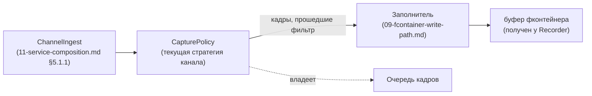
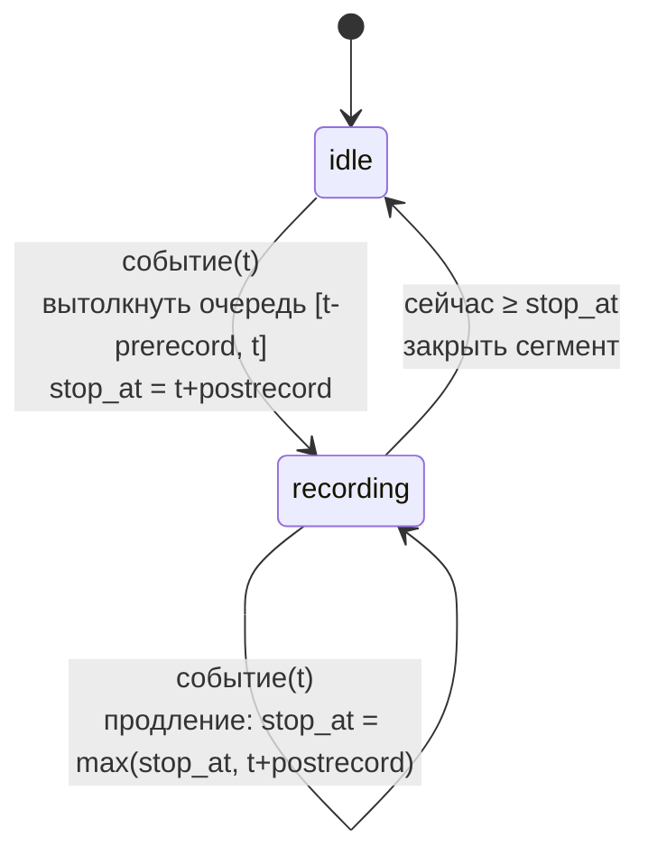

# Политика захвата

## 1. Назначение документа

Этот документ описывает компонент **CapturePolicy** — то, что решает, *какие* кадры канала попадают в фконтейнер и *когда* начинается и заканчивается запись очередного фконтейнера. Компонент живёт на уровне `ChannelIngest` (`11-service-composition.md` §5.1.1) — по одному экземпляру на канал — и владеет очередью кадров этого канала.

Документ **не описывает**:
- Формат самого фконтейнера и порядок вызовов Заполнителя — `09-fcontainer-write-path.md`, `07-media-tree.md`.
- Физическую запись байт на диск, `fchunk_size`, таймаут `T` — ADR-017, `02-storage.md`.
- Конкретные HTTP-маршруты команд (старт/стоп записи, событие, смена политики) — предмет отдельной спецификации API; здесь только то, какая команда нужна и что она значит для CapturePolicy.
- Синтаксис расписания (cron-подобный, явные интервалы и т.д.) — открытый вопрос, раздел 8.

## 2. Терминология

- **CapturePolicy** — компонент, один экземпляр на канал, владеет очередью кадров канала и решает, отправлять ли очередной кадр Заполнителю.
- **Очередь кадров** — кольцевой буфер кадров канала (с метками времени) в памяти `ChannelIngest`, отдельный от пула буферов Recorder'а (`00-requirements.md` §4.7). Хранит кадры за последнее скользящее окно, даже когда запись не идёт. Для видео, для кодеков h.264 и h.265 хранит GOP (группа ключевого кадра и его не ключевых), дабы в фконтейнер всегда попадали неключевые кадры с их ключевым кадром.
- **Сегмент записи** — непрерывный отрезок времени, в течение которого кадры канала отправляются в один фконтейнер; соответствует одному циклу «получить буфер → заполнить → вернуть» у `ChannelIngest` (`11-service-composition.md` §5.1.1).
- **Предзапись** (`prerecord`) — длительность окна перед моментом триггера, кадры из которого должны попасть в фконтейнер.
- **Постзапись** (`postrecord`) — длительность окна после момента триггера, кадры из которого должны попасть в фконтейнер.
- **Продление записи** — повторный триггер (событие/окно расписания), пришедший во время уже идущего сегмента, отодвигает момент остановки дальше, но никогда не приближает его: `stop_at = max(stop_at, t + postrecord)`. Ведёт себя как перезапускаемый таймер постзаписи, а не как «сдвиг» в обе стороны.

## 3. Место в композиции

`ChannelIngest` депакетизирует RTP в кадры и передаёт каждый кадр в `CapturePolicy` канала, а не напрямую Заполнителю. `CapturePolicy` решает: положить кадр в очередь и ничего не отправлять, отправить кадр Заполнителю немедленно, либо вытолкнуть в Заполнитель накопленную часть очереди. Кадры параметров потока (`09-fcontainer-write-path.md` §3, «добавить параметры потока») фильтрации не подлежат — они не кадры канала в этом смысле, а метаданные, и передаются Заполнителю напрямую при каждой смене параметров, независимо от состояния CapturePolicy; вопрос, как CapturePolicy гарантирует, что при старте сегмента записи в фконтейнере уже есть актуальный `config` под нужную ветку (контракт Заполнителя — кадр должен лежать «под самым последним `config`»), — открытый вопрос (раздел 8).

Начало сегмента записи (первый кадр в новый фконтейнер) и его конец (последний кадр, буфер возвращается Recorder'у) определяются исключительно переходами состояния CapturePolicy, описанными ниже — `ChannelIngest` сам не решает, писать кадр или нет, только исполняет команду CapturePolicy «дай буфер»/«верни буфер» в нужный момент.

## 4. Общий контракт CapturePolicy

Независимо от стратегии, CapturePolicy канала:
- Принимает каждый кадр от `ChannelIngest` и решает его судьбу (в очередь / Заполнителю / и то и другое).
- Постоянно наполняет очередь кадров, независимо от того, идёт сейчас запись или нет — иначе предзапись невозможна.
- Хранит одно из двух состояний сегмента: `idle` (запись не идёт, буфер не запрошен) или `recording` (сегмент открыт, буфер получен и заполняется).
- Принимает административные команды, специфичные для своей стратегии (раздел 5), и команду «сменить политику» (раздел 6), приходящие через `HttpApiServer` (`11-service-composition.md` §5.1.2, требует отдельного расширения — раздел 8).
- При переходе `idle → recording` инициирует у `ChannelIngest` получение нового буфера у Recorder'а; при переходе `recording → idle` — возврат буфера с `begin`/`end`.

## 5. Реализации

### 5.1. Постоянная запись (`continuous`)

Первая реализация. Кадры отправляются в фконтейнер без всякой условной фильтрации — если сегмент открыт (`recording`), каждый кадр идёт Заполнителю сразу же, как только получен.

Очередь кадров нужна не для фильтрации, а для отложенного старта: команда «начать запись» может указывать метку времени начала `from_time` в прошлом (в пределах глубины очереди). При получении такой команды в состоянии `idle`:
1. Открыть сегмент (получить буфер).
2. Вытолкнуть Заполнителю все кадры очереди с меткой ≥ `from_time`, по порядку.
3. Дальше — обычная живая передача каждого нового кадра.

Команда «начать запись» без `from_time` эквивалентна `from_time = сейчас` (без выталкивания очереди). Команда «остановить запись» переводит в `idle` и возвращает буфер. Если `from_time` старше глубины очереди — часть данных недостижима; в этом случае выталкиваются все кадры, что есть в очереди (то есть фактически с самого раннего доступного кадра), без ошибки/алерта.

### 5.2. Запись по событию (`event`)

Очередь всегда хранит скользящее окно длиной `prerecord` (кадры старше — вытесняются). Событие приходит извне с меткой времени `event_time`.

- **Событие в состоянии `idle`:** открыть сегмент; вытолкнуть Заполнителю кадры очереди с меткой ≥ `event_time − prerecord`; перейти в `recording`; назначить `stop_at = event_time + postrecord`. Дальше — живая передача каждого нового кадра, пока не наступит `stop_at`.
- **Событие в состоянии `recording`:** запись продлевается — `stop_at = max(stop_at, event_time + postrecord)`. Событие, чей `event_time + postrecord` оказался раньше уже назначенного `stop_at` (постзапись мала или события пришли не по порядку), никак не сокращает уже идущую запись — оно просто не отодвигает остановку дальше.
- **Достижение `stop_at`** при отсутствии новых событий: закрыть сегмент (вернуть буфер), перейти в `idle`. Требует таймера/периодической проверки в `recording`, а не только реакции на входящие кадры.

### 5.3. Запись по расписанию (`schedule`)

Через версию после `event`. Источник триггеров — не внешнее событие, а расписание канала: интервалы `[window_start, window_end)`, конфигурация формата которых не определена (раздел 8).

Наступление `window_start` играет роль «событие в `idle`» из раздела 5.2 (со своим `prerecord`); наступление `window_end` играет роль назначения `stop_at = window_end + postrecord`. Пересечение или соприкосновение соседних окон расписания продлевает запись тем же правилом, что повторный триггер во время `recording` в разделе 5.2 (`stop_at = max(stop_at, t + postrecord)`), — то есть `schedule` переиспользует ту же машину состояний, что и `event`, отличаясь только источником меток `t` (расписание вместо внешнего события) и тем, что `window_end` заранее известен, а не приходит асинхронно.

## 6. Смена политики захвата канала во время работы

Требование: для указанного канала сменить текущую стратегию CapturePolicy (`continuous` ↔ `event` ↔ `schedule`) без остановки `ChannelIngest` и без переподключения RTSP-сессии.

Механика на уровне компонентов: `HttpApiServer` принимает команду «сменить политику канала N» → делегирует в `IngestManager` (`11-service-composition.md` §5.1.1) → находит нужный `ChannelIngest` → заменяет его текущий экземпляр CapturePolicy на новый (новая стратегия + параметры).

Что происходит с очередью кадров и открытым сегментом при замене — не определено спецификацией задачи и требует отдельного решения (раздел 8): в частности, донашивает ли новая стратегия старую очередь (пере-используя уже накопленное окно) или начинает с пустой; и что происходит с сегментом, если смена приходит в состоянии `recording` (доигрывается ли текущий сегмент до своего `stop_at`/явного стопа под старой стратегией, или обрывается немедленно).

## 7. Конфигурация канала

Дополняет список каналов приёма (`11-service-composition.md` §9): для каждого канала — тип стратегии CapturePolicy (`continuous`/`event`/`schedule`) и её параметры (`prerecord`, `postrecord` для `event`/`schedule`; расписание для `schedule`; глубина очереди/максимальная глубина отложенного старта для `continuous`). Хранится ли это в общем файле конфигурации процесса рядом с RTSP-ссылкой канала, либо отдельно (раз меняется во время работы, в отличие от статичного списка каналов) — открытый вопрос.

## 8. Открытые вопросы

- Как CapturePolicy гарантирует, что в фконтейнере есть актуальный `config` под нужную ветку до первого кадра нового сегмента (контракт Заполнителя, `09-fcontainer-write-path.md` §3–4) — особенно при отложенном старте (`continuous`, `from_time` в прошлом), когда смена параметров потока могла произойти уже после `from_time`, но до фактического начала сегмента.
- Формат расписания для `schedule` (cron-подобный, явные интервалы, часовой пояс) — не выбран.
- Источник команд «начать запись [с `from_time`]», «остановить запись», «событие(`t`)», «сменить политику канала» — предполагается `HttpApiServer` (`11-service-composition.md` §5.1.2), но там эти команды пока не перечислены; требуется дополнить его раздел «Управление» либо явно исключить событие/расписание из HTTP API в пользу отдельного входа.
- Поведение очереди кадров и открытого сегмента при смене политики во время `recording` (раздел 6) — донашивается ли очередь, обрывается ли текущий сегмент или доигрывается до конца.
- Место хранения параметров CapturePolicy канала (общий конфиг процесса vs изменяемое во время работы состояние) — раздел 7.
- Соотношение с существующей ответственностью `ChannelIngest` «при перегрузке сам решает, какие данные не записывать» (`11-service-composition.md` §5.1.1, backpressure): это независимый механизм (backpressure может отбросить кадр, уже пропущенный CapturePolicy) или должен быть поглощён CapturePolicy как ещё одна причина не отправлять кадр Заполнителю.
