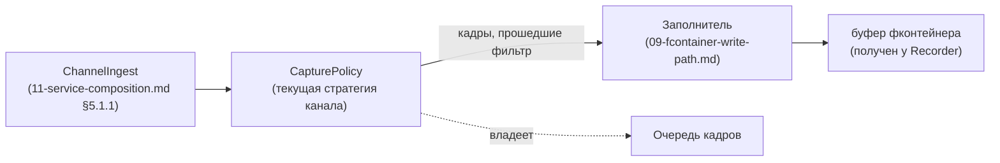
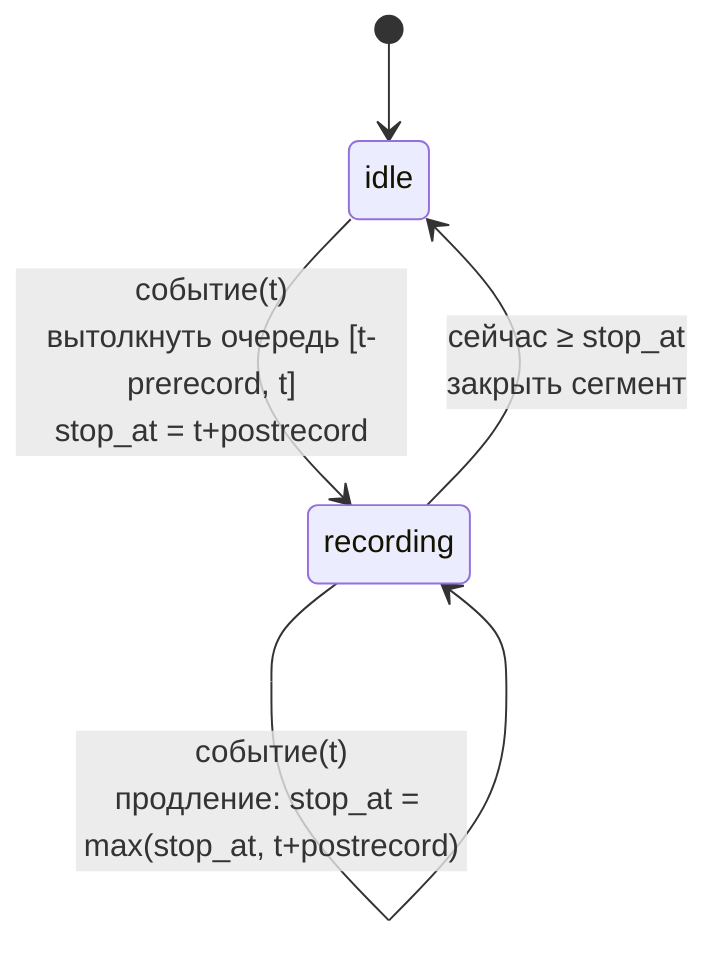

# Политика захвата

## 1. Назначение документа

Этот документ описывает компонент **CapturePolicy** — то, что решает, *какие* кадры канала попадают в фконтейнер и *когда* начинается и заканчивается запись очередного фконтейнера. Компонент живёт на уровне `ChannelIngest` (`11-service-composition.md` §5.1.1) — по одному экземпляру на канал — и владеет очередью кадров этого канала.

Документ **не описывает**:
- Формат самого фконтейнера и порядок вызовов Заполнителя — `09-fcontainer-write-path.md`, `07-media-tree.md`.
- Физическую запись байт на диск, `fchunk_size`, таймаут `T` — ADR-017, `02-storage.md`.
- Конкретные HTTP-маршруты команд (старт/стоп записи, событие, смена политики) — предмет отдельной спецификации API; здесь только то, какая команда нужна и что она значит для CapturePolicy.
- Синтаксис расписания (cron-подобный, явные интервалы, часовой пояс) — отложено до реализации `schedule` (раздел 5.3), не предмет этой версии документа.

## 2. Терминология

- **CapturePolicy** — компонент, один экземпляр на канал, владеет очередью кадров канала и решает, отправлять ли очередной кадр Заполнителю.
- **Очередь кадров** — кольцевой буфер кадров канала (с метками времени) в памяти `ChannelIngest`, отдельный от пула буферов Recorder'а (`00-requirements.md` §4.7). Хранит кадры за последнее скользящее окно, даже когда запись не идёт. Для видео, для кодеков h.264 и h.265 хранит GOP (группа ключевого кадра и его не ключевых), дабы в фконтейнер всегда попадали неключевые кадры с их ключевым кадром.
- **Сегмент записи** — непрерывный отрезок времени, в течение которого кадры канала отправляются в один фконтейнер; соответствует одному циклу «получить буфер → заполнить → вернуть» у `ChannelIngest` (`11-service-composition.md` §5.1.1).
- **Предзапись** (`prerecord`) — длительность окна перед моментом триггера, кадры из которого должны попасть в фконтейнер.
- **Постзапись** (`postrecord`) — длительность окна после момента триггера, кадры из которого должны попасть в фконтейнер.
- **Продление записи** — повторный триггер (событие/окно расписания), пришедший во время уже идущего сегмента, отодвигает момент остановки дальше, но никогда не приближает его: `stop_at = max(stop_at, t + postrecord)`. Ведёт себя как перезапускаемый таймер постзаписи, а не как «сдвиг» в обе стороны.

## 3. Место в композиции

`ChannelIngest` депакетизирует RTP в кадры и передаёт каждый кадр в `CapturePolicy` канала, а не напрямую Заполнителю. `CapturePolicy` решает: положить кадр в очередь и ничего не отправлять, отправить кадр Заполнителю немедленно, либо вытолкнуть в Заполнитель накопленную часть очереди.

Смена параметров потока (новый SDP при подключении, либо изменение параметров на лету) также проходит через `CapturePolicy`, а не мимо неё: именно `CapturePolicy` вызывает у Заполнителя «добавить параметры потока» (`09-fcontainer-write-path.md` §3) и получает в ответ `id` нового узла `config`. Этот `id` — то, с чем каждый кадр связан (деталь реализации — либо кадр несёт ссылку на свой `config` сам, либо `CapturePolicy` хранит «текущий `id` потока» отдельно от кадра); при вызове «добавить кадры потока» (§4) `CapturePolicy` передаёт именно этот `id`. Так как единственный путь кадра к Заполнителю лежит через `CapturePolicy`, а `id` нового `config` появляется только по возврату из «добавить параметры потока», порядок «сначала параметры, потом кадры под ними» соблюдается сам собой — `CapturePolicy` физически не может отправить кадр с `id` параметров, которые ещё не добавлены.

Пока сегмент не открыт (`idle`, буфер не запрошен — тогда нет ни фконтейнера, ни Заполнителя, которому можно позвонить), `CapturePolicy` не вызывает Заполнителя при смене параметров, а сама кэширует последние известные параметры потока — независимо от состояния сегмента. При открытии нового сегмента (`idle → recording`) она первым делом воспроизводит Заполнителю нужный `config` — или несколько по очереди, если за время в очереди/предзаписи параметры менялись не один раз и в неё попали кадры разных `config`: каждый добавляется в новое дерево по отдельности, в порядке возникновения, — и только после этого делает первый вызов «добавить кадры потока».

Начало сегмента записи (первый кадр в новый фконтейнер) и его конец (последний кадр, буфер возвращается Recorder'у) определяются исключительно переходами состояния CapturePolicy, описанными ниже — `ChannelIngest` сам не решает, писать кадр или нет, только исполняет команду CapturePolicy «дай буфер»/«верни буфер» в нужный момент.

## 4. Общий контракт CapturePolicy

Независимо от стратегии, CapturePolicy канала:
- Принимает каждый кадр от `ChannelIngest` и решает его судьбу (в очередь / Заполнителю / и то и другое).
- Постоянно наполняет очередь кадров, независимо от того, идёт сейчас запись или нет — иначе предзапись невозможна.
- Хранит одно из двух состояний сегмента: `idle` (запись не идёт, буфер не запрошен) или `recording` (сегмент открыт, буфер получен и заполняется).
- Принимает административные команды, специфичные для своей стратегии (раздел 5), и команду «сменить политику» (раздел 6), приходящие через `HttpApiServer` (`11-service-composition.md` §5.1.2, требует отдельного расширения — раздел 8).
- При переходе `idle → recording` инициирует у `ChannelIngest` получение нового буфера у Recorder'а; при переходе `recording → idle` — возврат буфера с `begin`/`end`.
- Принимает и снимает ограничение «пропускать кадры» — ещё одна причина не отправлять кадр Заполнителю, наравне с решением своей стратегии (раздел 5), но с внешним источником: само ограничение CapturePolicy не выбирает, а только исполняет (см. ниже).

### Ограничение при перегрузке (backpressure)

Backpressure по очереди записи (норма/предупреждение/перегрузка/нет буферов, `00-requirements.md` §4.7) обнаруживается на уровне `StorageUnit`, в который пишет канал, — и именно `StorageUnit` решает, какому каналу (то есть какому `CapturePolicy`) наложить ограничение «пропускать кадры» и когда его снять. `StorageUnit` видит все каналы, пишущие в него (регистр каналов `IndexManager`, ADR-014), и может выбрать, кого именно ограничить, — в отличие от каждого `CapturePolicy` по отдельности, которому не с чем сравнить нагрузку своего канала с нагрузкой соседних на том же хранилище.

Это меняет прежнюю формулировку `11-service-composition.md` §5.1.1 («при перегрузке сам решает, какие данные не записывать... и это `ChannelIngest`») — решение принимает `StorageUnit`, `CapturePolicy`/`ChannelIngest` только исполняет уже наложенное ограничение (снижает GOP или дожидается ключевого кадра, раздел 2 — «Очередь кадров»).

## 5. Реализации

### 5.1. Постоянная запись (`continuous`)

Первая реализация. Кадры отправляются в фконтейнер без всякой условной фильтрации — если сегмент открыт (`recording`), каждый кадр идёт Заполнителю сразу же, как только получен.

Очередь кадров нужна не для фильтрации, а для отложенного старта: команда «начать запись» может указывать метку времени начала `from_time` в прошлом (в пределах глубины очереди). При получении такой команды в состоянии `idle`:
1. Открыть сегмент (получить буфер).
2. Вытолкнуть Заполнителю все кадры очереди с меткой ≥ `from_time`, по порядку.
3. Дальше — обычная живая передача каждого нового кадра.

Команда «начать запись» без `from_time` эквивалентна `from_time = сейчас` (без выталкивания очереди). Команда «остановить запись» переводит в `idle` и возвращает буфер. Если `from_time` старше глубины очереди — часть данных недостижима; в этом случае выталкиваются все кадры, что есть в очереди (то есть фактически с самого раннего доступного кадра), без ошибки/алерта.

### 5.2. Запись по событию (`event`)

Очередь всегда хранит скользящее окно длиной `prerecord` (кадры старше — вытесняются). Событие приходит извне с меткой времени `event_time`.

- **Событие в состоянии `idle`:** открыть сегмент; вытолкнуть Заполнителю кадры очереди с меткой ≥ `event_time − prerecord`; перейти в `recording`; назначить `stop_at = event_time + postrecord`. Дальше — живая передача каждого нового кадра, пока не наступит `stop_at`.
- **Событие в состоянии `recording`:** запись продлевается — `stop_at = max(stop_at, event_time + postrecord)`. Событие, чей `event_time + postrecord` оказался раньше уже назначенного `stop_at` (постзапись мала или события пришли не по порядку), никак не сокращает уже идущую запись — оно просто не отодвигает остановку дальше.
- **Достижение `stop_at`** при отсутствии новых событий: закрыть сегмент (вернуть буфер), перейти в `idle`. Требует таймера/периодической проверки в `recording`, а не только реакции на входящие кадры.

### 5.3. Запись по расписанию (`schedule`)

Через версию после `event`. Источник триггеров — не внешнее событие, а расписание канала: интервалы `[window_start, window_end)`, конфигурация формата которых не определена (раздел 8).

Наступление `window_start` играет роль «событие в `idle`» из раздела 5.2 (со своим `prerecord`); наступление `window_end` играет роль назначения `stop_at = window_end + postrecord`. Пересечение или соприкосновение соседних окон расписания продлевает запись тем же правилом, что повторный триггер во время `recording` в разделе 5.2 (`stop_at = max(stop_at, t + postrecord)`), — то есть `schedule` переиспользует ту же машину состояний, что и `event`, отличаясь только источником меток `t` (расписание вместо внешнего события) и тем, что `window_end` заранее известен, а не приходит асинхронно.

## 6. Смена политики захвата канала во время работы

Требование: для указанного канала сменить текущую стратегию CapturePolicy (`continuous` ↔ `event` ↔ `schedule`) без остановки `ChannelIngest` и без переподключения RTSP-сессии.

Механика на уровне компонентов: `HttpApiServer` принимает команду «сменить политику канала N» → делегирует в `IngestManager` (`11-service-composition.md` §5.1.1) → находит нужный `ChannelIngest` → заменяет его текущий экземпляр CapturePolicy на новый (новая стратегия + параметры).

Очередь кадров и текущие параметры потока (кэш «последний известный `config`», раздел 3) передаются новому экземпляру CapturePolicy как есть — не пересоздаются с нуля. Новая стратегия продолжает наполнять и потреблять ту же очередь, и при открытии сегмента ей не нужно ждать первого кадра параметров заново — они уже есть.

Уже открытый сегмент (`recording`) на момент замены сразу переходит под правила новой стратегии — не доигрывается под старой.

Если новая стратегия — `event`/`schedule`, а переход был из `continuous` (где `stop_at` не назначается вовсе), `stop_at` для уже идущего сегмента не назначается искусственно — сегмент считается так, будто он был открыт только что самой новой стратегией, но без триггера: `stop_at` остаётся неопределён (эквивалент «минус бесконечности» в правиле продления, раздел 2), пока не придёт первое событие/окно расписания. Оно устанавливает `stop_at = event_time + postrecord` тем же правилом `max`, что и обычное продление (раздел 5.2) — здесь `max` вырождается в простое присваивание, потому что прежнего значения не было. Предзапись при этом не воспроизводится и очередь не выталкивается повторно — сегмент и так уже открыт и получает кадры вживую.

## 7. Конфигурация канала

Дополняет список каналов приёма (`11-service-composition.md` §9): для каждого канала — тип стратегии CapturePolicy (`continuous`/`event`/`schedule`) и её параметры (`prerecord`, `postrecord` для `event`/`schedule`; расписание для `schedule`; глубина очереди/максимальная глубина отложенного старта для `continuous`). Хранится рядом с RTSP-ссылкой канала, в том же общем файле конфигурации процесса (`11-service-composition.md` §9) — несмотря на то, что политику можно сменить во время работы (раздел 6), это не выносит её в отдельное изменяемое хранилище состояния: правка конфигурации при работающем сервисе — это и есть штатный способ сменить исходную стратегию канала на будущее.

При старте `farcd` `IngestManager` создаёт каждый `ChannelIngest` сразу с `CapturePolicy`, указанной в конфигурации канала (раздел 6 меняет её только во время работы уже запущенного процесса, это не альтернатива стартовой конфигурации).

## 8. Открытые вопросы

- Источник команд «начать запись [с `from_time`]», «остановить запись», «событие(`t`)», «сменить политику канала» — `HttpApiServer` (`11-service-composition.md` §5.1.2), но там эти команды пока не перечислены; требуется дополнить его раздел «Управление». «Событие(`t`)» принимается через отдельный эндпоинт, не общий с остальными командами: источник события (внешний детектор/аналитика) может слать их редко и непредсказуемо (секунды — часы между ними), поэтому только этому эндпоинту нужен очень длинный keep-alive/idle-таймаут соединения — обычные короткие команды (старт/стоп/смена политики) под общей конфигурацией таймаутов `HttpApiServer` этого не требуют. Конкретное значение таймаута и маршрут — предмет отдельной спецификации API (раздел 1).
- Канал соединения `StorageUnit` (Storage) → конкретный `CapturePolicy` (Archive, `IngestManager`/`ChannelIngest`) для наложения/снятия ограничения при backpressure не определён — `StorageUnit` и `ChannelIngest` сейчас не связаны напрямую нигде в композиции (`11-service-composition.md`). Кандидаты: через `NotificationBus`/`IngestManager`-подписку (аналогично тому, как `EventPushServer` подписан на все `NotificationBus`), либо расширение статуса, уже возвращаемого при «получить буфер»/«вернуть буфер» (`00-requirements.md` §4.7–4.8), персональным флагом ограничения для конкретного канала. Также не определено, какой именно компонент внутри `StorageUnit` принимает это решение (естественный кандидат — `Recorder`, где и обнаруживается перегрузка очереди, опираясь на регистр каналов `IndexManager`).
