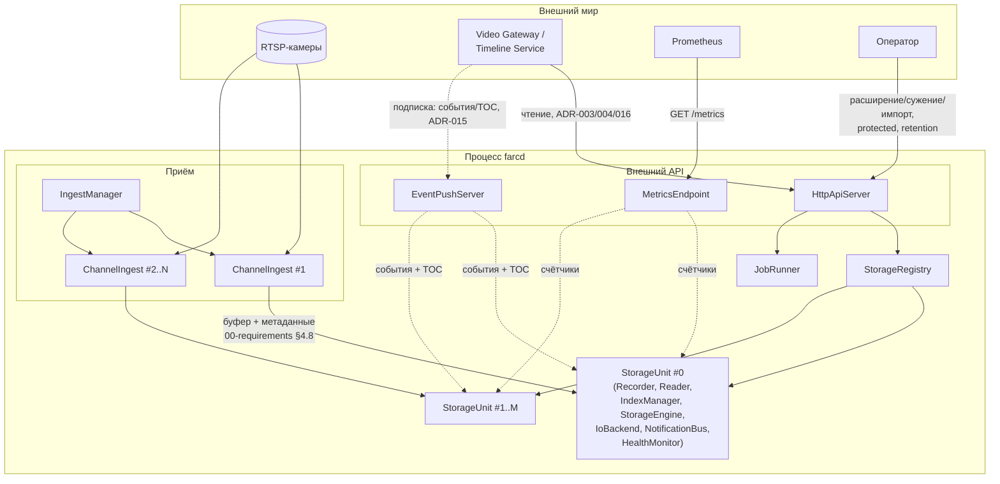
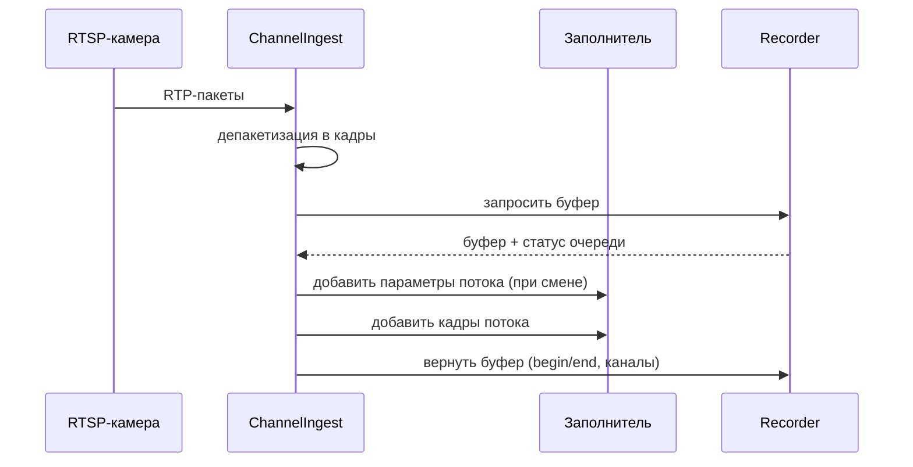
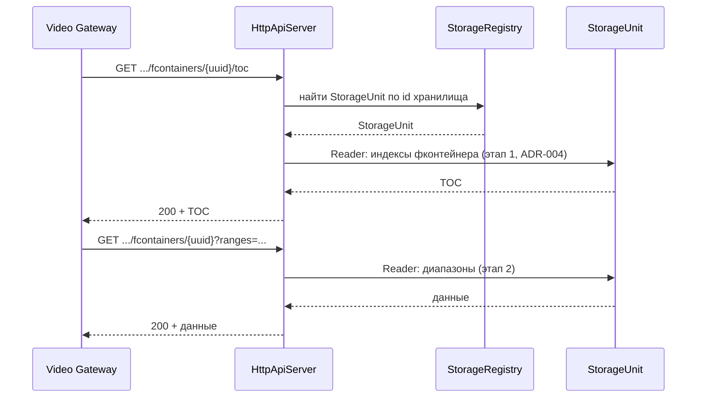
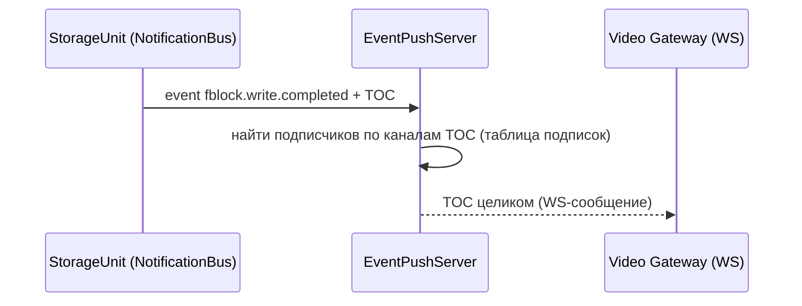
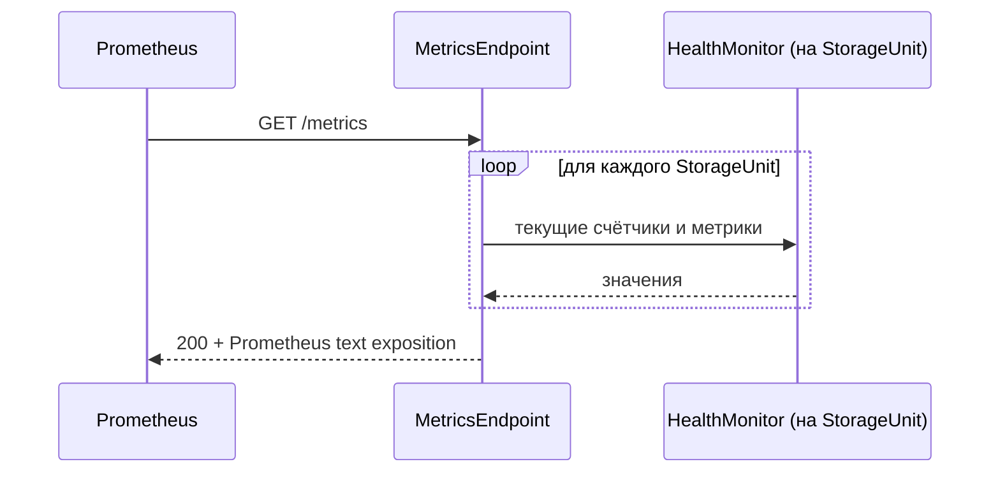

# Композиция сервиса farc

## 1. Назначение документа

Этот документ описывает архитектуру сервиса `farcd` целиком: как библиотечное ядро farc (Recorder, Reader, IndexManager, StorageEngine, IoBackend — детально описанные в `01-architecture.md`, `02-storage.md`, `04-storage-operations.md`, `09-fcontainer-write-path.md`), так и компоненты процесса, которые превращают это ядро в работающий сервис — приём RTSP, HTTP API, WebSocket, метрики.

Здесь ядро не переописывается заново — за деталями отсылка к соответствующим документам, — но оно является полноправной частью общей архитектуры, а не вынесенным за скобки основанием. Часть компонентов процесса уже спроектирована в существующих документах — там просто дать ссылку. Часть — нет, там предлагается название компонента и его контракт.

Документ **не описывает**:
- Бинарный формат данных — `03-storage-format.md`, `05-data-format.md`, `06-toc-format.md`.
- Алгоритмы операций над Storage (инициализация, ConsistencyCheck, выбор фблока, расширение/сужение, импорт) — `04-storage-operations.md`.
- Формат дерева фконтейнера и API заполнения — `07-media-tree.md`, `09-fcontainer-write-path.md`.
- Конкретные HTTP-маршруты, коды ответов, формат сообщений WebSocket — предмет отдельной спецификации API, когда до неё дойдёт очередь.

## 2. Соотношение с системным контекстом (`01-architecture.md`)

Диаграмма системного контекста в `01-architecture.md` §0 рисует `Writer` («заполняет буферы фконтейнеров») отдельным узлом, передающим буфер в Farc через API из `00-requirements.md` §4.8. Формально этот API не различает, кто его вызывает — внешний процесс или код внутри самого процесса farc.

Этот документ фиксирует конкретную реализацию узла `Writer` для `farcd`: farcd сам читает RTSP-потоки и сам вызывает свой Recorder — роль потребителя (`00-requirements.md` §2, «Потребитель») в развёртывании по умолчанию исполняет сервис farcd, а не отдельный внешний процесс. Внешний процесс-производитель остаётся возможным (библиотечный контракт этого не запрещает), но не является целевым сценарием использования и здесь не рассматривается.

## 3. От требования к компоненту

| Что нужно | Компонент | Где детализировано |
|---|---|---|
| Писать байты не зная структуры; смещение приходит снаружи; сигнализировать о битом фблоке; переключать реализацию по конфигу; читать байты | `StorageEngine` + `IoBackend` | `02-storage.md` §4.2.4–4.2.5, ADR-010 |
| Заполнять фконтейнер, строить TOC | `Recorder` (+ Заполнитель) | `09-fcontainer-write-path.md`, `04-storage-operations.md` §7.2, `06-toc-format.md` §5 |
| Использовать RTSP-ссылки, передавать данные в Recorder | `ChannelIngest` / `IngestManager` — **новое**, §4.1 | этот документ |
| Заполнять структуру фблока, считать CRC32 | `Recorder` | `04-storage-operations.md` §7.2 |
| Читать байты с диска сразу или в два этапа | `Reader` + `StorageEngine` | `02-storage.md` §4.2.2, ADR-004, `04-storage-operations.md` §8 |
| Знать режим записи и срок хранения, отвечать на «куда писать следующий фблок» | `IndexManager` | `02-storage.md` §4.2.3, `04-storage-operations.md` §6; уточнение режима — §4.4 этого документа |
| Объединять всё необходимое для одного хранилища | `StorageUnit` — **новое имя для уже существующего уровня**, §4.2 | `02-storage.md` §3–4.2 (переименование без изменения устройства) |
| Управлять хранилищами, создавать `StorageUnit` | `StorageRegistry` | `02-storage.md` §4.1.1 |
| Предоставлять HTTP API | `HttpApiServer` — **новое**, §4.3 | этот документ |
| Единственный WS-сервер: ретранслировать события и push TOC подписчикам | `EventPushServer` — **новое**, заменяет `EventStream`, §4.4 | этот документ, ADR-015, `02-storage.md` §4.1.4 |
| Предоставлять метрики для Prometheus | `MetricsEndpoint` | `02-storage.md` §4.1.3 |
| Получать метрики и обрабатывать перед отправкой | `HealthMonitor` (на каждый `StorageUnit`) | `02-storage.md` §4.2.7 |

Все компоненты таблицы вместе образуют архитектуру сервиса; дальше подробно раскрываются только строки «новое» и переименование — остальные не переопределяются здесь заново, у них уже есть детальное описание в перечисленных документах.

## 4. Компоненты процесса: новые и переименованные

### 4.1. IngestManager и ChannelIngest

**Проблема:** данные не появляются сами — их нужно забрать с камеры. `00-requirements.md` §4.8 описывает API получения/заполнения/возврата буфера, но не говорит, кто его вызывает в реальном развёртывании.

**IngestManager** (уровень Archive) — владеет набором `ChannelIngest`, создаёт по одному на каждый канал из конфигурации, запускает и останавливает их вместе с процессом.

**ChannelIngest** (один на канал) — отвечает за один RTSP-источник:
- Подключается по RTSP-ссылке из конфигурации, разбирает SDP (`07-media-tree.md` §description, реальные примеры из практики).
- На старте и при каждой смене параметров потока вызывает у Заполнителя «добавить параметры потока» (`09-fcontainer-write-path.md` §3).
- Депакетизирует RTP в кадры, вызывает «добавить кадры потока» (`09-fcontainer-write-path.md` §4) для каждого потока (video/audio) канала.
- Управляет циклом буфера Recorder'а: получить буфер → заполнить через Заполнитель → вернуть с `begin`/`end`/списком каналов (`00-requirements.md` §4.8).
- Реагирует на статус очереди, который возвращает Recorder (норма/предупреждение/перегрузка/нет буферов, `00-requirements.md` §4.7): при перегрузке сам решает, какие данные не записывать (например, снижает GOP или дожидается ключевого кадра) — farc не отбрасывает данные сам, но кто-то выше должен, и это ChannelIngest.
- Переподключается при разрыве RTSP-сессии; переподключение не влияет на уже переданные Recorder'у данные.

**Маршрутизация канал → хранилище** задаётся конфигурацией (один канал пишется в одно хранилище постоянно; перенос канала между хранилищами — не автоматическая операция, см. ADR-014 «канал может мигрировать», это ручная реконфигурация плюс операция импорта, `04-storage-operations.md` §11).

### 4.2. StorageUnit

`02-storage.md` §3–4.2 уже описывает ровно этот уровень — набор из одного экземпляра `Recorder`, `Reader`, `IndexManager`, `StorageEngine`, `IoBackend`, `NotificationBus`, `HealthMonitor` и опционального `Catalog`, работающих с одним Storage — но не даёт этому набору отдельного имени, обращаясь к нему как к «уровню Storage». Здесь этому набору присваивается имя **StorageUnit**, чтобы `StorageRegistry` (§4.1.1 там же) могло явно сказать «создать `StorageUnit` для Storage X» и держать одну единицу на каждое хранилище с общим статусом (`stopped`/`running`/`job-in-progress`).

Переименование не меняет устройство, описанное в `02-storage.md` — только даёт имя тому, что уже нарисовано на диаграмме §3.

### 4.3. HttpApiServer

**Проблема:** `01-architecture.md` рисует стрелки `VideoGW → Farc` для чтения и `Operator → Farc` для управления, но не называет компонент, который эти запросы принимает.

**HttpApiServer** (уровень Archive) — единая точка входа для синхронных запросов по HTTP:
- **Чтение** (ADR-003, ADR-004, ADR-016): фблок целиком; TOC фконтейнера; произвольные диапазоны данных фконтейнера по UUID; поиск кандидатов по `(канал, t1, t2)` (ADR-014); резолв «канал+время» без смещений (ADR-016 fallback).
- **Управление**: запуск операций через `JobRunner` (расширение, сужение, импорт, `04-storage-operations.md` §9–11), установка/снятие `protected` через `IndexManager`, изменение `retention.days` (`00-requirements.md` §4.5).
- Каждый запрос сначала резолвится в конкретный `StorageUnit` через `StorageRegistry` по идентификатору хранилища, дальше делегируется в `Reader`/`IndexManager`/`JobRunner` этого `StorageUnit`.
- Не хранит состояние между запросами — оно всё в `StorageUnit`.

### 4.4. EventPushServer

**Проблема:** ADR-015 (пересмотрено) решает держать один WebSocket-сервер для всех исходящих событий farcd вместо двух параллельных транспортов — SSE `EventStream` (`02-storage.md` §4.1.4, компактные события) и отдельного WS-канала только для TOC. Этот документ называет объединённый компонент и его контракт.

**EventPushServer** (уровень Archive) — единственная точка исходящих push-событий farcd, заменяет `EventStream` и ранее предложенный отдельный `TocPushServer`:
- Принимает WebSocket-подключения; при подключении клиент указывает, какие сообщения ему нужны: компактные события фблока (`00-requirements.md` §4.9, `02-storage.md` §7), TOC целиком, либо оба. Подписка на TOC — по конкретным каналам (клиент подписывается на интересующие его номера каналов, а не на всё хранилище).
- Подписан на все события `NotificationBus` каждого `StorageUnit`. Компактные события (`fblock.write.started/completed`, `fblock.deleted`, `storage.alert`, `job.*`) пересылаются подписавшимся на них как есть.
- TOC завершённого фконтейнера приходит вместе с событием `fblock.write.completed` — Recorder уже построил его при финализации (`06-toc-format.md` §5), отдельного чтения через `Reader` для этого не требуется.
- Подписчикам, запросившим TOC, рассылает TOC целиком по каналам, присутствующим во фконтейнере (маска канала посчитана в момент финализации, ADR-014) — по таблице подписок из первого пункта; отдельно релевантность не вычисляется, это прямая адресная отправка.
- Восстановление пропущенного при разрыве соединения — открытый вопрос (ADR-015): для TOC подписчик восстанавливается через fallback-чтение по `(канал, t1, t2)` — ADR-016, тот же путь, что и для впервые подключившегося подписчика; для компактных событий схема навёрстывания не решена (раньше это закрывал SSE `Last-Event-ID`, но SSE больше не используется).

Единый транспорт вместо двух — прямое следствие пересмотра ADR-015 (сравнение вариантов, п. 4): компактные события и TOC различаются только объёмом полезной нагрузки на сообщение, а не природой доставки (оба — push подписчику по постоянному соединению), поэтому обслуживаются одним сервером с типизацией сообщения, а не двумя разными транспортами.

### 4.5. Уточнение: режим записи в IndexManager

Пользовательское требование «знать текущий режим записи — до заполнения или циклический» указывает на пробел в уже принятом алгоритме: `select_next_index` (`04-storage-operations.md` §6.2) всегда пытается приоритет 2 (`ready` с истёкшим сроком хранения), то есть всегда ведёт себя как режим «циклическая запись». Режим «запись до заполнения» (`01-architecture.md` §0, режим 2) как отдельно управляемое поведение в псевдокоде не отражён.

Предложение: `write_mode` (`fill_until_full` / `cyclic`) — параметр Storage в JSON-параметрах пролога (ADR-009), рядом с `retention.days`. `IndexManager` при `write_mode = fill_until_full` не выполняет приоритет 2 вообще — после исчерпания `uninitialized` сразу возвращает `NO_SPACE` и алерт, независимо от истёкшего срока хранения. Это не меняет формат (свободное место в параметрах уже предусмотрено ADR-009), но требует явного шага при внедрении: добавить проверку `write_mode` перед приоритетом 2 в псевдокоде `04-storage-operations.md` §6.2. Здесь это только зафиксировано как решение; сама правка алгоритма — предмет правки того документа, не этого.

## 5. Диаграмма компонентов процесса

## 6. Потоки данных

### 6.1. Приём и запись

Далее — без изменений, см. `02-storage.md` §6.1 (выбор индекса, `in_progress`, запись по фчанкам, `ready`).

### 6.2. Чтение по HTTP

### 6.3. Push TOC по WebSocket

### 6.4. Сбор метрик

`HealthMonitor` — это и есть «кто-то, кто получает метрики и обрабатывает их перед отправкой» (`02-storage.md` §4.2.7): он копит счётчики по мере событий записи/чтения и следит за порогами внутри одного `StorageUnit`. `MetricsEndpoint` только агрегирует и рендерит по запросу, сам ничего не считает.

## 7. Конфигурация сервиса

Расширяет `04-storage-operations.md` §2.1 (список Storage, параметры HTTP/метрик/событий) двумя новыми разделами:

- **Список каналов приёма:** идентификатор канала, RTSP-ссылка, целевой Storage.
- **Параметры WebSocket-сервера** (`EventPushServer`): адрес, лимиты подключений — отдельно от HTTP-параметров, так как это разные серверы (могут слушать разные порты).

Пути к каталогам на SSD и список Storage остаются как описано — этот документ ничего в них не меняет.

## 8. Открытые вопросы

- Политика ChannelIngest при backpressure (что именно отбрасывать — целые GOP, только B-кадры, ждать ключевой кадр) — решение принимается на стороне ChannelIngest, конкретный алгоритм здесь не специфицирован.
- Аутентификация и TLS для RTSP-подключений к камерам — не рассмотрено.
- Формат сообщения WebSocket-подписки (какими каналами/фильтрами клиент задаёт интерес и какие типы сообщений — события/TOC/оба — в `EventPushServer`) — предмет отдельной спецификации API.
- Схема восстановления пропущенных компактных событий при разрыве WebSocket-соединения (замена SSE `Last-Event-ID`) — открытый вопрос ADR-015.
- Правка псевдокода `select_next_index` под `write_mode` (§4.5) — техдолг в `04-storage-operations.md`, не выполнена в рамках этого документа.
