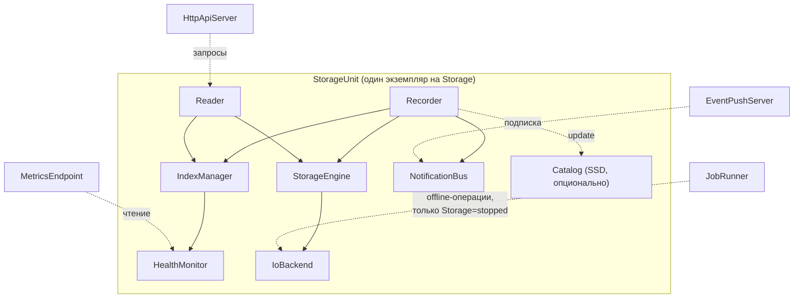
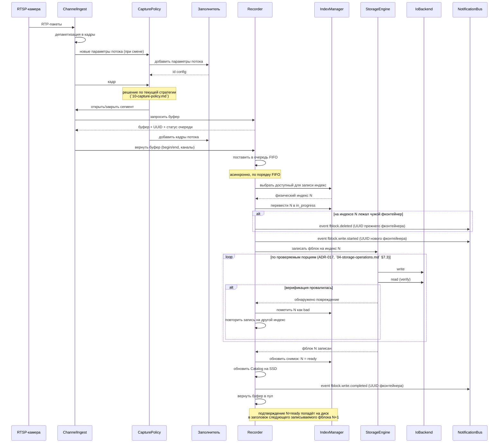
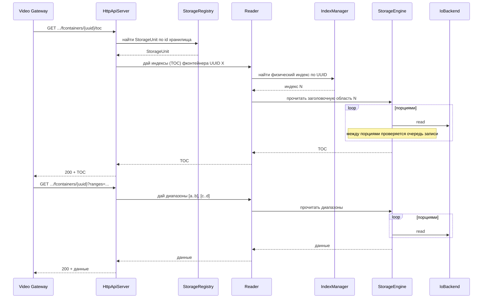
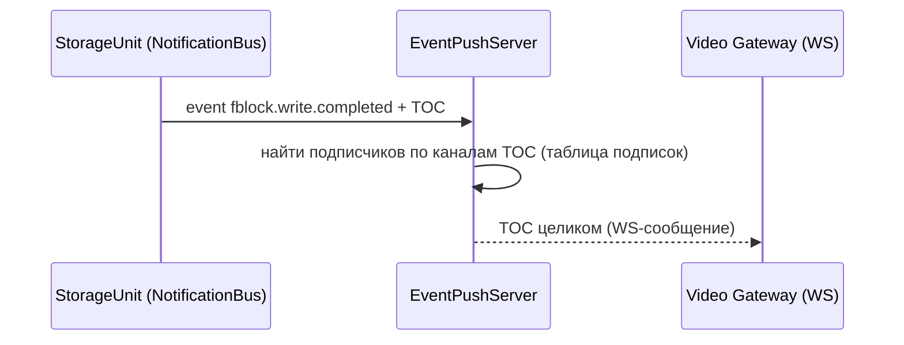
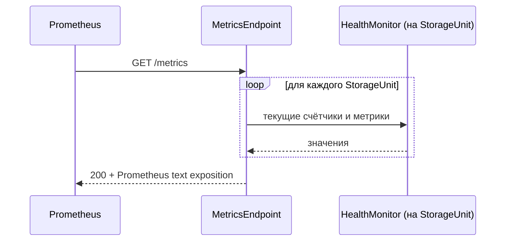
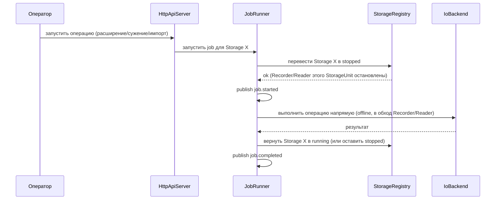

# Композиция сервиса farc

## 1. Назначение документа

Этот документ — полное и самодостаточное описание структуры процесса `farcd`: какие компоненты существуют, за что каждый отвечает, как они связаны друг с другом и какие данные между ними перемещаются. Документ охватывает **все** компоненты — и библиотечное ядро (`Recorder`, `Reader`, `IndexManager`, `StorageEngine`, `IoBackend`, `NotificationBus`, `HealthMonitor`, `Catalog`, детально спроектированные в `02-storage.md`), и компоненты процесса, которые превращают это ядро в работающий сервис — приём RTSP, HTTP API, WebSocket, метрики, оркестрация долгих операций.

Описания компонентов ядра здесь — сокращённое, но не противоречащее изложение того, что уже спроектировано в `02-storage.md`; при расхождении в деталях алгоритмов авторитетным источником остаётся `02-storage.md` (и `04-storage-operations.md` для конкретных алгоритмов) — этот документ обязан оставаться с ними в синхронизации, но не обязан повторять каждую деталь.

Документ **не описывает**:
- Бинарный формат данных — `03-storage-format.md`, `05-data-format.md`, `06-toc-format.md`.
- Конкретные алгоритмы операций над Storage (инициализация, ConsistencyCheck, выбор фблока, расширение/сужение, импорт — пошагово) — `04-storage-operations.md`. Здесь только то, *какой компонент* выполняет операцию и *с кем взаимодействует*.
- Формат дерева фконтейнера и API его заполнения — `07-media-tree.md`, `08-array-trees.md`, `09-fcontainer-write-path.md`.
- Конкретные HTTP-маршруты, коды ответов, формат сообщений WebSocket — предмет отдельной спецификации API.

### О применимости DDD

Терминология и тактические паттерны DDD (агрегаты, репозитории, bounded context как формальный артефакт) здесь сознательно не используются. Сложность farc — в бинарном формате, дисковых алгоритмах и конкурентности, а не в изменяющихся бизнес-правилах, которые нужно защищать инвариантами поверх множества сущностей. Полезные идеи DDD у сервиса уже есть явочным порядком: единый язык терминов (фблок, фконтейнер, регистр каналов — `00-requirements.md` §2) и доменные события (`fblock.write.completed` и т.п. через `NotificationBus`, раздел 8). Этого достаточно; формальная DDD-обвязка добавила бы только переименование того, что уже описано ниже.

## 2. Терминология

Полный глоссарий — `00-requirements.md` §2. Здесь — только то, что нужно держать в голове при чтении этого документа:

- **Archive** — процесс `farcd` целиком; на сервере работает один экземпляр.
- **Storage** — один раздел диска/блочное устройство, с которым `farcd` работает эксклюзивно.
- **Фблок** — физический слот фиксированного размера внутри Storage, адресуется индексом (`offset = index × fblock_size`).
- **Фконтейнер** — самодостаточные данные потребителя, размещённые в одном фблоке (ADR-013); лежащее внутри дерево — `07-media-tree.md`.
- **UUID фконтейнера** — логический идентификатор, которым оперирует потребитель; отличается от физического индекса фблока (ADR-013).

## 3. Топология и режимы работы

Один процесс `farcd` обслуживает **все локальные хранилища сервера** — не по процессу на диск: N дисков одного сервера не требуют N процессов, каждое хранилище — отдельный экземпляр библиотеки (`StorageUnit`, раздел 5.2) внутри одного процесса.

Storage работает в одном из двух режимов, задаваемых при конфигурации:
1. **Циклическая запись** (`cyclic`) — перезапись `ready`-фблоков по истечении срока хранения.
2. **Запись до заполнения** (`fill_until_full`) — остановка записи с алертом при исчерпании `uninitialized`-фблоков, без перезаписи `ready`. См. уточнение в разделе 5.2.4.

Инициализация Storage — ленивая (ADR-006): пишется только фблок 0, остальные фблоки остаются `uninitialized` и заполняются по мере записи. Занимает секунды независимо от размера диска.

## 4. Соотношение с системным контекстом

Системный контекст (`01-architecture.md` §0) рисует `Writer` («заполняет буферы фконтейнеров») отдельным узлом, передающим буфер в Farc через API из `00-requirements.md` §4.8. Формально этот API не различает, кто его вызывает — внешний процесс или код внутри самого процесса farc.

Этот документ фиксирует конкретную реализацию узла `Writer` для `farcd`: farcd сам читает RTSP-потоки и сам вызывает свой Recorder — роль потребителя (`00-requirements.md` §2, «Потребитель») в развёртывании по умолчанию исполняет сам сервис farcd, а не отдельный внешний процесс. Внешний процесс-производитель остаётся возможным (библиотечный контракт этого не запрещает), но не является целевым сценарием использования и здесь не рассматривается.

## 5. Полная карта компонентов

Компоненты делятся на два уровня: **Archive** — один экземпляр на процесс, точка входа для внешнего мира; **Storage** — экземпляр на каждое хранилище, объединяются именем `StorageUnit`.

### 5.1. Уровень Archive

#### 5.1.1. IngestManager и ChannelIngest

**Проблема:** данные не появляются сами — их нужно забрать с камеры. `00-requirements.md` §4.8 описывает API получения/заполнения/возврата буфера, но не говорит, кто его вызывает в реальном развёртывании.

**IngestManager** — владеет набором `ChannelIngest`, создаёт по одному на каждый канал из конфигурации, запускает и останавливает их вместе с процессом. Обрабатывает команду смены политики захвата канала (`10-capture-policy.md` §6), находя нужный `ChannelIngest` и заменяя его текущий `CapturePolicy`.

**ChannelIngest** (один на канал) — отвечает за один RTSP-источник:
- Подключается по RTSP-ссылке из конфигурации, разбирает SDP (`07-media-tree.md`).
- На старте и при каждой смене параметров потока передаёт новые параметры своему `CapturePolicy` (`10-capture-policy.md`, один экземпляр на канал) — именно `CapturePolicy` вызывает у Заполнителя «добавить параметры потока» (`09-fcontainer-write-path.md` §3) и хранит возвращаемый `id` для последующих кадров (`10-capture-policy.md` §3).
- Депакетизирует RTP в кадры и передаёт каждый кадр своему `CapturePolicy` (текущая стратегия — постоянная запись/по событию/по расписанию); `CapturePolicy` решает, отправлять ли кадр Заполнителю через «добавить кадры потока» (`09-fcontainer-write-path.md` §4) немедленно, отложить в очередь, или то и другое.
- Управляет циклом буфера Recorder'а по команде `CapturePolicy`: получить буфер (переход `idle → recording`) → заполнить через Заполнитель → вернуть с `begin`/`end`/списком каналов (переход `recording → idle`, `00-requirements.md` §4.8).
- При перегрузке очереди (норма/предупреждение/перегрузка/нет буферов, `00-requirements.md` §4.7) не решает сам, какие данные не записывать — это решает `StorageUnit`, в который пишет канал (он один видит нагрузку всех каналов на себя, `10-capture-policy.md` §4); `ChannelIngest`/`CapturePolicy` только исполняет уже наложенное ограничение (например, снижает GOP или дожидается ключевого кадра) — farc не отбрасывает данные сам, но кто-то выше должен, и это `CapturePolicy` канала. Канал связи `StorageUnit → CapturePolicy` для этого ограничения не определён — открытый вопрос (`10-capture-policy.md` §8).
- Переподключается при разрыве RTSP-сессии; переподключение не влияет на уже переданные Recorder'у данные.

**Маршрутизация канал → хранилище** задаётся конфигурацией (один канал пишется в одно хранилище постоянно; перенос канала между хранилищами — не автоматическая операция, ADR-014, ручная реконфигурация плюс операция импорта, раздел 5.1.5).

#### 5.1.2. HttpApiServer

**Ответственность:** единая точка входа для синхронных запросов по HTTP.

**Взаимодействие:**
- **Чтение** (ADR-003, ADR-004, ADR-016): фблок целиком; TOC фконтейнера; произвольные диапазоны данных фконтейнера по UUID; поиск кандидатов по `(канал, t1, t2)` (ADR-014); резолв «канал+время» без смещений (ADR-016 fallback).
- **Управление**: запуск операций через `JobRunner` (расширение, сужение, импорт), установка/снятие `protected` через `IndexManager` целевого `StorageUnit`, изменение `retention.days`.
- Каждый запрос сначала резолвится в конкретный `StorageUnit` через `StorageRegistry` по идентификатору хранилища, дальше делегируется в `Reader`/`IndexManager`/`JobRunner` этого `StorageUnit`.
- Не хранит состояние между запросами — оно всё в `StorageUnit`.

#### 5.1.3. EventPushServer

**Ответственность:** единственная точка исходящих push-событий farcd, заменяет ранее рассматривавшиеся `EventStream` (SSE) и отдельный `TocPushServer` (ADR-015).

**Взаимодействие:**
- Принимает WebSocket-подключения; при подключении клиент указывает, какие сообщения ему нужны: компактные события фблока (раздел 8), TOC целиком, либо оба. Подписка на TOC — по конкретным каналам.
- Подписан на все события `NotificationBus` каждого `StorageUnit`. Компактные события пересылаются подписавшимся на них как есть, с пометкой Storage-источника.
- TOC завершённого фконтейнера приходит вместе с событием `fblock.write.completed` — Recorder уже построил его при финализации, отдельного чтения через `Reader` для этого не требуется.
- Подписчикам, запросившим TOC, рассылает TOC целиком по каналам, присутствующим во фконтейнере (маска канала посчитана при финализации, ADR-014) — прямая адресная отправка, не broadcast.
- Восстановление пропущенного при разрыве соединения — открытый вопрос ADR-015: для TOC есть fallback через `(канал, t1, t2)` (ADR-016, тот же путь, что и для впервые подключившегося подписчика); для компактных событий схема навёрстывания не решена.

#### 5.1.4. MetricsEndpoint

**Ответственность:** предоставляет метрики состояния всех Storage во внешний мир в формате Prometheus text exposition.

**Взаимодействие:**
- При запросе `GET /metrics` собирает значения из `HealthMonitor` каждого `StorageUnit` и возвращает их с меткой `storage="<id>"`.
- Не хранит историю — все метрики читаются по требованию; агрегацией и долговременным хранением занимается внешняя система (Prometheus/VictoriaMetrics).
- Категории метрик: счётчики состояний фблоков (`uninitialized`/`ready`/`bad`/`protected`/`writable`), глубина и статус очереди записи, счётчики успешных записей и провалов верификации, активные чтения, состояние Storage (`stopped`/`running`/`job`), занятость регистра каналов. Точный список имён метрик — `02-storage.md` §8.

#### 5.1.5. JobRunner

**Ответственность:** оркеструет долгие операции над Storage: `ConsistencyCheck` (проверка целостности при старте), `GeometryManager` (расширение/сужение, включая расширение ёмкости регистра каналов), `Importer` (импорт данных из другого Storage). Все выполняются только над остановленным Storage. Алгоритмы каждой операции — `04-storage-operations.md` §5, §9–11.

**Взаимодействие:**
- Принимает запросы на запуск операций от `HttpApiServer`.
- Через `StorageRegistry` переводит целевой Storage в состояние `stopped` (если он работает) и фиксирует статус `job-in-progress`; на время операции `Recorder`/`Reader` этого `StorageUnit` не существуют.
- Запускает нужную операцию, которая работает с файлом Storage через `IoBackend` напрямую, в обход `Recorder`/`Reader`.
- По завершении операции возвращает Storage в состояние `stopped` или `running`, в зависимости от команды.
- Публикует события `job.started`/`job.completed` в `NotificationBus` целевого `StorageUnit` (раздел 8).

#### 5.1.6. StorageRegistry

**Ответственность:** владеет набором экземпляров `StorageUnit`, хранит их идентификаторы и текущий статус (`stopped`/`running`/`job-in-progress`). Обеспечивает поиск `StorageUnit` по идентификатору для остальных компонентов Archive.

**Взаимодействие:**
- Принимает команды «открыть Storage», «закрыть Storage» — при старте процесса и по явной команде.
- Отдаёт `StorageUnit` компонентам `HttpApiServer`, `MetricsEndpoint`, `EventPushServer`, `JobRunner` по идентификатору хранилища.
- Блокирует операции, несовместимые со статусом Storage (например, нельзя запустить `Importer` поверх `running`).

### 5.2. Уровень Storage (StorageUnit)

**StorageUnit** — имя для набора из одного экземпляра `Recorder`, `Reader`, `IndexManager`, `StorageEngine`, `IoBackend`, `NotificationBus`, `HealthMonitor` и опционального `Catalog`, работающих с одним Storage, с общим статусом (`stopped`/`running`/`job-in-progress`). Компоненты внутри StorageUnit существуют по одному экземпляру на Storage: N хранилищ — N параллельных наборов.

#### 5.2.1. Recorder

**Ответственность:** сторона записи. Владеет пулом буферов фиксированного размера и очередью готовых к записи буферов (FIFO); реализует цикл выдачи/приёма буфера и постановки его на запись.

**Взаимодействие:**
- Отвечает на запрос потребителя (`ChannelIngest`, раздел 5.1.1) «дай буфер»: возвращает свободный буфер вместе со статусом очереди (норма/предупреждение/перегрузка/нет буферов), генерирует UUID будущего фконтейнера.
- Принимает заполненный буфер вместе с метаданными (`begin`/`end`, список каналов) и ставит его в очередь.
- Извлекает буферы из очереди по FIFO: резолвит каналы в компактные позиции через `IndexManager` (ADR-014), запрашивает у `IndexManager` доступный для записи индекс `N`, переводит его в `in_progress`, публикует `fblock.write.started` (и `fblock.deleted`, если на месте `N` уже лежал фконтейнер) в `NotificationBus`, передаёт буфер в `StorageEngine`.
- По результату от `StorageEngine`: при успехе — обновляет снимок индексов через `IndexManager` (`N = ready`), обновляет `Catalog` на SSD, публикует `fblock.write.completed`, возвращает буфер в пул; при обнаруженном повреждении — просит `IndexManager` перевести `N` в `bad` и повторяет попытку на другом индексе (ADR-005 — запись не прерывается чтением).
- Не дожидается закрытия фконтейнера потребителем: передаёт накопленные данные на физическую запись порциями, по достижении заданного размера или по таймауту, что раньше (ADR-017, алгоритм — `04-storage-operations.md` §7.3–7.4).

#### 5.2.2. Reader

**Ответственность:** сторона чтения. Обслуживает запросы `HttpApiServer` на получение данных из фблоков; реализует многоэтапное чтение (ADR-004).

**Взаимодействие:**
- Принимает запрос «кандидаты по каналу N и времени `[t1,t2]`» (ADR-014, когда UUID заранее не известен): резолвит канал через `IndexManager`, возвращает список UUID/индексов с пересекающимся `[begin,end]`.
- Принимает запрос «TOC фконтейнера с UUID X»: находит физический индекс через `IndexManager`, читает заголовочную область через `StorageEngine`.
- Принимает запрос «диапазоны из фконтейнера с UUID X»: группирует диапазоны, передаёт в `StorageEngine`.
- Управляет пулом буферов чтения, чтобы не выделять память на каждый запрос.

#### 5.2.3. IndexManager

**Ответственность:** хранит в памяти индексы Storage — карту состояний фблоков (`uninitialized`/`in_progress`/`ready`/`bad`, флаг `protected`) и метаданных лежащих в них фконтейнеров (UUID, время актуальности, битовая маска каналов). Владеет регистром каналов (ADR-014). Отвечает за все переходы состояний фблока и за выбор фблока при записи.

**Взаимодействие:**
- При старте Storage получает от `ConsistencyCheck` (JobRunner, раздел 5.1.5) уже выверенные индексы и загружает их в память.
- По запросу `Recorder`'а выбирает следующий доступный для записи физический индекс: приоритет 1 — `uninitialized`, приоритет 2 — `ready` с истёкшим сроком хранения и без `protected`. Если подходящего нет — «нет места», `Recorder` поднимает алерт через `NotificationBus`.
- По запросу `Recorder`'а резолвит номера каналов буфера в компактные позиции регистра, регистрируя новые. Если регистр исчерпан — алерт `channel_registry_full`.
- По запросу `Reader`'а — физический индекс по UUID, либо список кандидатов по `(канал, t1, t2)`.
- Принимает команды на изменение состояния фблока, включая установку/снятие `protected` (только для `ready`) по команде `HttpApiServer`.
- Уведомляет `HealthMonitor` о любых изменениях счётчиков состояний.

Состояния фблока — `uninitialized → in_progress → ready`, с необратимым переходом в `bad` из любого состояния при обнаруженной порче; `protected` — ортогональный модификатор поверх `ready`. Полная машина состояний и переходов — `02-storage.md` §5.

#### 5.2.4. Уточнение: режим записи в IndexManager

Алгоритм выбора индекса (`04-storage-operations.md` §6.2) всегда пробует приоритет 2 (`ready` с истёкшим сроком хранения) — то есть всегда ведёт себя как режим `cyclic` (раздел 3). Режим `fill_until_full` как отдельно управляемое поведение в текущем псевдокоде не отражён.

Предложение: `write_mode` (`fill_until_full` / `cyclic`) — параметр Storage в JSON-параметрах пролога (ADR-009), рядом с `retention.days`. При `write_mode = fill_until_full` `IndexManager` не выполняет приоритет 2 вообще — после исчерпания `uninitialized` сразу возвращает `NO_SPACE` и алерт, независимо от истёкшего срока хранения. Это зафиксировано здесь как решение; правка псевдокода `select_next_index` — техдолг в `04-storage-operations.md` (раздел 10 этого документа).

#### 5.2.5. StorageEngine

**Ответственность:** владеет единственным каналом доступа к диску внутри Storage. Реализует write-verify при записи, порционное чтение и арбитраж между записью и чтением.

**Взаимодействие:**
- Принимает от `Recorder` команду «записать фблок на индекс N»: пишет буфер порциями через `IoBackend` с верификацией каждой (write-verify, алгоритм — `04-storage-operations.md` §7.3); при расхождении сообщает `Recorder`'у «обнаружено повреждение».
- Принимает от `Reader` команду «прочитать диапазон из фблока N»: разбивает на порции меньше единицы физической записи (ADR-005) и читает через `IoBackend`.
- **Между порциями чтения проверяет очередь записи** — если есть готовый к записи буфер, сначала выполняет запись целиком, затем продолжает чтение (реализация приоритета записи над чтением, ADR-005).
- Не знает о структуре фблока кроме разбиения на порции записи/чтения — все смещения и размеры задаются вызывающим.

#### 5.2.6. IoBackend

**Ответственность:** тонкая обёртка над файлом или блочным устройством. Единственный компонент, делающий системные вызовы к диску: «записать N байт по смещению», «прочитать M байт по смещению».

**Взаимодействие:**
- Принимает команды от `StorageEngine` (режим `running`) или от `JobRunner` напрямую (offline-операции, раздел 5.1.5).
- Инкапсулирует различия платформ и режимов (обычный ввод-вывод vs `O_DIRECT` на Linux, ADR-010). На чтении бэкенд `direct` сам округляет диапазон до границ выравнивания — вызывающий код просит произвольные `(смещение, длина)`, ничего не зная о выравнивании.

#### 5.2.7. NotificationBus

**Ответственность:** локальная шина событий одного Storage.

**Взаимодействие:**
- Принимает события от `Recorder` (начало/завершение записи, удаление) и от `JobRunner` (начало/завершение долгой операции, алерты).
- Транслирует события подписчику — `EventPushServer` уровня Archive.
- Не хранит историю — навёрстывание пропущенного при разрыве WebSocket-соединения — забота `EventPushServer` (открытый вопрос ADR-015).

#### 5.2.8. HealthMonitor

**Ответственность:** держит счётчики состояний и метрики одного Storage, следит за порогами и поднимает алерты.

**Взаимодействие:**
- Принимает обновления счётчиков от `IndexManager` (количество фблоков в каждом состоянии, занятость регистра каналов) и события записи/чтения от `Recorder`/`Reader`.
- Предоставляет текущие значения `MetricsEndpoint` по запросу.
- При пересечении порога (например, доля битых фблоков > 5%) публикует `storage.alert` в `NotificationBus`.

#### 5.2.9. Catalog

**Ответственность:** опциональная копия заголовков всех фблоков Storage на быстром диске (SSD), ускоряющая старт (ADR-007) — без неё старт требует полного сканирования заголовков фблоков на основном диске (`04-storage-operations.md` §4).

**Взаимодействие:**
- Обновляется `Recorder`'ом после каждой успешной записи фблока.
- Читается `ConsistencyCheck` (JobRunner) при старте Storage; при отсутствии или повреждении каталога — fallback на сканирование основного диска.
- Свежесть снимка определяется монотонным `write_sequence`, а не временем на стороне ОС (ADR-008).

## 6. Диаграммы компонентов

### 6.1. Процесс целиком

```mermaid
graph TB
    subgraph External["Внешний мир"]
        Cameras[("RTSP-камеры")]
        VideoGW["Video Gateway /<br/>Timeline Service"]
        Prom["Prometheus"]
        Operator["Оператор"]
    end

    subgraph FarcProcess["Процесс farcd"]
        subgraph Ingest["Приём"]
            IngestManager --> CI1["ChannelIngest #1"]
            IngestManager --> CI2["ChannelIngest #2..N"]
        end

        subgraph Api["Внешний API"]
            HttpApiServer
            EventPushServer
            MetricsEndpoint
        end

        StorageRegistry --> SU1["StorageUnit #0<br/>(Recorder, Reader,<br/>IndexManager, StorageEngine,<br/>IoBackend, NotificationBus,<br/>HealthMonitor, Catalog)"]
        StorageRegistry --> SU2["StorageUnit #1..M"]
        JobRunner
    end

    Cameras --> CI1
    Cameras --> CI2
    CI1 -->|буфер + метаданные<br/>00-requirements §4.8| SU1
    CI2 --> SU2

    VideoGW -->|чтение, ADR-003/004/016| HttpApiServer
    VideoGW -.подписка: события/TOC, ADR-015.-> EventPushServer
    Operator -->|расширение/сужение/импорт,<br/>protected, retention| HttpApiServer
    Prom -->|GET /metrics| MetricsEndpoint

    HttpApiServer --> StorageRegistry
    HttpApiServer --> JobRunner
    JobRunner -.offline-операции,<br/>только stopped, §7.5.-> SU1
    JobRunner -.offline-операции.-> SU2
    EventPushServer -.события + TOC.-> SU1
    EventPushServer -.события + TOC.-> SU2
    MetricsEndpoint -.счётчики.-> SU1
    MetricsEndpoint -.счётчики.-> SU2
```

### 6.2. Внутреннее устройство StorageUnit

Диаграмма ниже раскрывает один блок `StorageUnit` из диаграммы 6.1 — состав повторяется для каждого хранилища.



## 7. Потоки данных

### 7.1. Приём и запись



### 7.2. Чтение по HTTP



Fallback-режим, когда потребитель не знает смещений заранее (только `(fblock id/UUID, канал, t1, t2)`) — `Reader` сам резолвит нужные узлы через TOC (ADR-016); не отдельный компонент, а другой вход в тот же `Reader`.

### 7.3. Push TOC по WebSocket



### 7.4. Сбор метрик



### 7.5. Долгие операции (JobRunner)



Алгоритмы самих операций (`ConsistencyCheck`, `GeometryManager`, `Importer`) — `04-storage-operations.md` §5, §9–11.

## 8. События

Все события публикуются в `NotificationBus` локально и ретранслируются клиентам через `EventPushServer`. Каждое событие содержит идентификатор Storage-источника и сквозной `id`.

| Тип события | Публикует | Когда |
|-------------|-----------|-------|
| `fblock.write.started` | `Recorder` | Перед первым обращением к диску для записи |
| `fblock.write.completed` | `Recorder` | После успешной записи и верификации всех данных фблока |
| `fblock.deleted` | `Recorder` | Перед перезаписью фблока — теряется прежний фконтейнер |
| `storage.alert` | `HealthMonitor` | При пересечении порога (например, доля битых > 5%) |
| `job.started` / `job.completed` | `JobRunner` | Начало/завершение долгой операции над Storage |

Схема навёрстывания пропущенных событий при разрыве WebSocket-соединения — открытый вопрос ADR-015.

## 9. Конфигурация сервиса

Один файл конфигурации на процесс farcd (`04-storage-operations.md` §2.1), с разделами:

- **Список Storage:** идентификатор, путь к файлу/устройству, путь к каталогу на SSD (опционально, ADR-007).
- **Список каналов приёма:** идентификатор канала, RTSP-ссылка, целевой Storage.
- **Параметры HTTP-сервера** (`HttpApiServer`).
- **Параметры WebSocket-сервера** (`EventPushServer`): адрес, лимиты подключений — отдельно от HTTP-параметров, так как это разные серверы (могут слушать разные порты).
- **Параметры метрик** (`MetricsEndpoint`).

Параметры конкретного Storage (`retention.days`, `write_mode` и т.д.) хранятся не здесь, а в самом Storage — в JSON-параметрах пролога фблока 0 (ADR-009), что позволяет переносить Storage между серверами без правки внутренних данных.

## 10. Открытые вопросы

- Политика ChannelIngest при backpressure (что именно отбрасывать — целые GOP, только B-кадры, ждать ключевой кадр) — решение принимается на стороне ChannelIngest, конкретный алгоритм здесь не специфицирован.
- Аутентификация и TLS для RTSP-подключений к камерам — не рассмотрено.
- Формат сообщения WebSocket-подписки (какими каналами/фильтрами клиент задаёт интерес и какие типы сообщений — события/TOC/оба — в `EventPushServer`) — предмет отдельной спецификации API.
- Схема восстановления пропущенных компактных событий при разрыве WebSocket-соединения — открытый вопрос ADR-015.
- Правка псевдокода `select_next_index` под `write_mode` (раздел 5.2.4) — техдолг в `04-storage-operations.md`, не выполнена в рамках этого документа.
