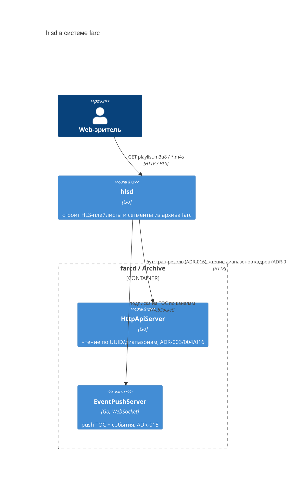
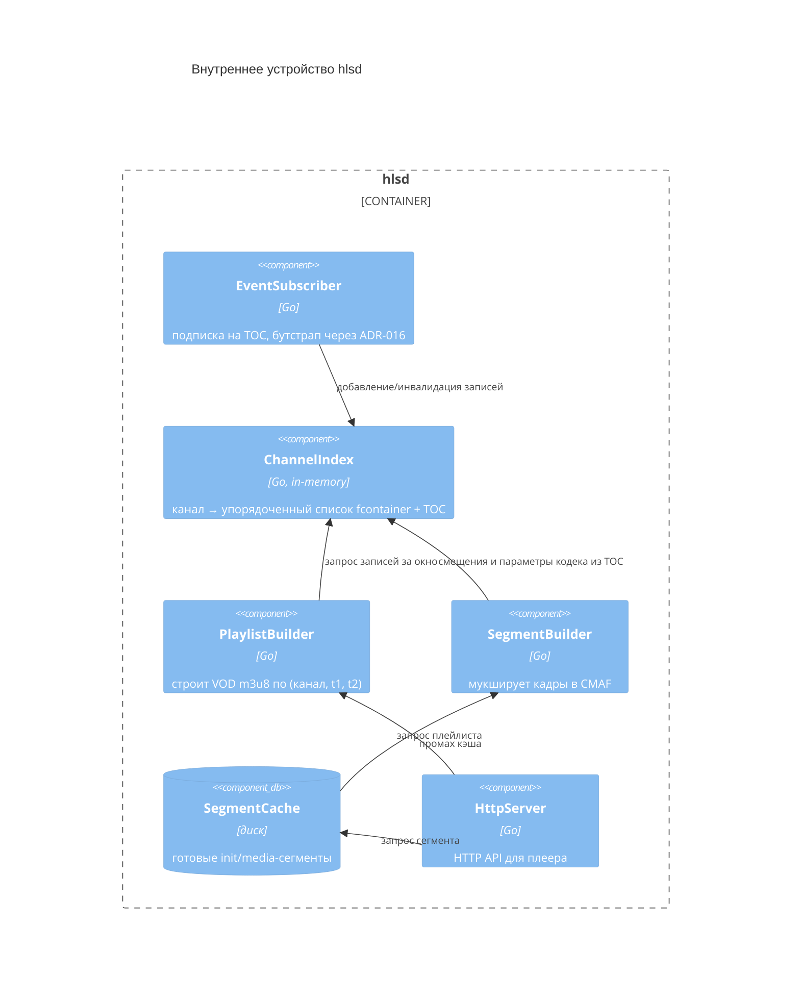
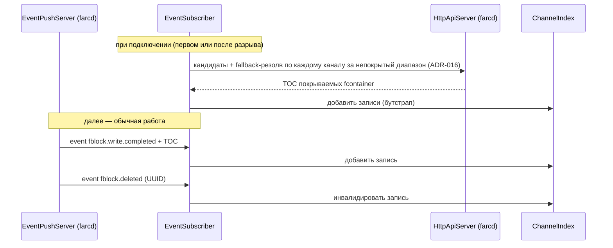
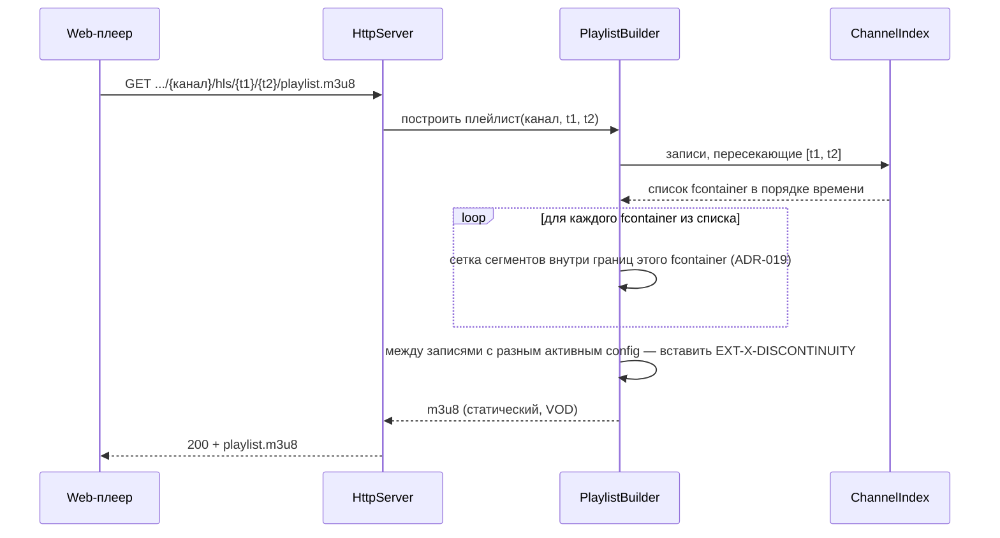
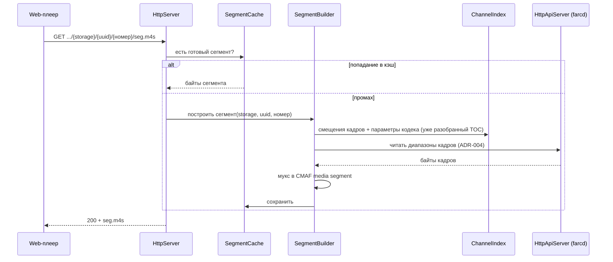

# hlsd: HLS-сервис архивного воспроизведения

## 1. Назначение документа

Этот документ описывает `hlsd` — процесс, реализующий роль «Video Gateway» из системного контекста (`01-architecture.md`, диаграмма 6.1 в `11-service-composition.md`) для одного конкретного сценария: **просмотр архива farc в браузере через HLS**. `hlsd` — отдельный процесс, не часть `farcd`; общается с ним только через уже существующий внешний API (`HttpApiServer`, `EventPushServer`), без прямого доступа к Storage.

Область документа:
- Только воспроизведение архива (VOD). Live-просмотр текущего видеопотока с камер — не через `hlsd`: его обслуживает mediamtx через WebRTC/WHEP, а канал в mediamtx заводит отдельный процесс `apid`, оркеструющий farcd и mediamtx при создании/изменении/удалении канала (ADR-022, `.scratch/live-page/`). Это уже не "вне farc" — просто не через этот сервис.
- Кодеки в рамках документа — H.264 (видео) + AAC (аудио): оба совместимы с HLS/MSE нативно, `hlsd` выполняет только ремукс (перепаковку уже закодированных кадров в CMAF), без перекодирования. Другие кодеки, встречающиеся в `07-media-tree.md` (H.265, PCM, G.711), в текущей версии не поддерживаются — см. §8.

Документ **не описывает**:
- Внутреннее устройство `farcd` — оно уже описано в `02-storage.md`, `04-storage-operations.md`, `11-service-composition.md`; здесь `farcd` — чёрный ящик с уже определённым внешним API.
- Формат CMAF/fMP4 как таковой — это документированный внешний стандарт (ISO/IEC 14496-12), а не изобретение farc.
- Web-клиент (плеер в браузере) — потребитель API `hlsd`, его устройство вне области.

## 2. Терминология

Базовый глоссарий — `00-requirements.md` §2. Дополнительно к нему, специфично для этого документа:

- **hlsd** — процесс, описываемый этим документом; конкретная реализация роли «Video Gateway».
- **Сегмент** — единица HLS-плейлиста, CMAF media segment (`.m4s`), отдаётся `hlsd` одним HTTP-ответом.
- **Init-сегмент** — CMAF-ресурс с параметрами кодека (`init.mp4`), общий для всех медиа-сегментов одного fcontainer; ссылки на параметры кодека берутся из узлов `data`/`codec`/`param_sps`/`param_pps` медиа-дерева (`07-media-tree.md` §3.2–3.3).
- **Сетка сегментов** — последовательность границ времени внутри одного fcontainer, по которым `hlsd` режет его данные на сегменты (§6.2).

## 3. Место в системе

`hlsd` — внешний потребитель `farcd`, использующий ровно те же два канала, что и любой другой Video Gateway (`11-service-composition.md` §5.1.2–5.1.3):

- **`HttpApiServer`** — резолв кандидатов по `(канал, t1, t2)`, чтение данных фконтейнера по диапазонам (ADR-004), fallback-резолв `(uuid, канал, t1, t2)` → данные (ADR-016), а также `GET /channels` — список каналов, реально существующих на этом `farcd` (ADR-021).
- **`EventPushServer`** — WebSocket-подписка на TOC по каналам (ADR-015): `hlsd` указывает при подключении интересующие каналы, получает TOC целиком вместе с `fblock.write.completed`, а также `fblock.deleted` при перезаписи. Тот же эндпоинт `/events/ws` обслуживает и второй, независимый вид подписки — глобальную (`storage=""`), на события жизненного цикла канала (`channel.created`/`channel.removed`, ADR-021), которую использует `ChannelReconciler` (§4.7), а не `EventSubscriber`.

`hlsd` не обращается к диску Storage напрямую и не участвует в приёме RTSP — это исключительная зона ответственности `farcd` (`ChannelIngest`, `11-service-composition.md` §5.1.1).

## 4. Карта компонентов

### 4.1. EventSubscriber

**Ответственность:** поддерживает WebSocket-подключение к `EventPushServer` сконфигурированного `farcd` (в v1 — ровно один, ADR-020), подписывается на TOC по одному конкретному каналу. Один экземпляр на канал — не общий на всё хранилище; `ChannelReconciler` (§4.7) создаёт и останавливает их по мере того, как каналы появляются/пропадают/переезжают на другое хранилище (ADR-021), а не только один раз при старте процесса.

**Взаимодействие:**
- При успешном подключении (первом или после разрыва) инициирует бутстрап: для каждого канала запрашивает через `HttpApiServer` кандидатов и данные TOC за диапазон, не покрытый уже имеющимся индексом (ADR-016, тот же путь, что и для впервые подключившегося подписчика, — `11-service-composition.md` §5.1.3).
- Получив `fblock.write.completed` + TOC — передаёt запись в `ChannelIndex` (добавление).
- Получив `fblock.deleted` — передаёт UUID в `ChannelIndex` (инвалидация).
- Решение о построении локального индекса из push, а не резолве на каждый запрос плейлиста — ADR-018.

### 4.2. ChannelIndex

**Ответственность:** хранит в памяти, по каждому обслуживаемому каналу, упорядоченный по времени список записей `(fcontainer UUID, storage id, begin, end, разобранный TOC этого канала)`.

**Взаимодействие:**
- Обновляется `EventSubscriber`'ом (добавление/инвалидация записей).
- Отдаёт `PlaylistBuilder`'у список записей, пересекающих запрошенное окно `[t1, t2]` конкретного канала.

### 4.3. PlaylistBuilder

**Ответственность:** по запросу `(канал, t1, t2)` строит статический HLS-плейлист (VOD).

**Взаимодействие:**
- Запрашивает у `ChannelIndex` записи, пересекающие окно.
- Для каждой записи строит сетку сегментов **в границах одного fcontainer**, не пересекающую границу соседних записей (ADR-019) — точный алгоритм сетки § 6.2.
- Между сегментами, взятыми из двух разных fcontainer с отличающимся активным `config` (сменой SPS/PPS/ASC), вставляет `#EXT-X-DISCONTINUITY`.
- Не читает данные кадров — только метаданные из уже разобранного TOC в `ChannelIndex`.

### 4.4. SegmentBuilder

**Ответственность:** по запросу конкретного сегмента `(storage id, fcontainer UUID, номер сегмента внутри контейнера)` строит CMAF init-сегмент или медиа-сегмент.

**Взаимодействие:**
- Смещения нужных кадров и параметров кодека берёт из уже имеющегося в `ChannelIndex` TOC — отдельного резолва через ADR-016 для этого не требуется (TOC уже разобран `EventSubscriber`'ом при получении).
- Читает сами байты кадров у `HttpApiServer` по готовым смещениям (ADR-004).
- Мукширует кадры в CMAF (init-сегмент — из `param_sps`/`param_pps`/аудио-эквивалентов; медиа-сегмент — из `frame_data`/`frame_time`/`frame_kind` в границах сегмента).
- Передаёт результат в `SegmentCache` на сохранение.

### 4.5. SegmentCache

**Ответственность:** дисковый кэш готовых init- и медиа-сегментов.

**Взаимодействие:**
- Ключ — `(storage id, fcontainer UUID, номер сегмента)`; за счёт сетки, не пересекающей границу fcontainer (ADR-019), и привязки сетки к самому fcontainer, а не к произвольному окну запроса, разные запросы одного и того же участка архива (перемотка, повторный просмотр инцидента) обращаются к одному и тому же ключу.
- При инвалидации записи в `ChannelIndex` (`fblock.deleted`) уже закэшированные на диске сегменты не удаляются немедленно — данные физически скопированы в кэш и переживают перезапись оригинала в Storage; удаляются только по обычной политике вытеснения кэша (см. §8).
- Политика вытеснения — квота по объёму на диске, конкретный алгоритм (LRU и т.п.) — открытый вопрос, §8.

### 4.6. HttpServer

**Ответственность:** единственная точка входа для web-плеера.

**Взаимодействие:**
- `GET /channels/{канал}/hls/{t1}/{t2}/playlist.m3u8` → `PlaylistBuilder`.
- `GET /segments/{storage}/{uuid}/{номер}/init.mp4` и `.../seg.m4s` → сперва `SegmentCache` (попадание — отдать как есть), при промахе — `SegmentBuilder`, затем сохранение в `SegmentCache` и отдача.

### 4.7. ChannelReconciler

**Ответственность:** держит набор обслуживаемых каналов в актуальном состоянии относительно живого списка каналов на `farcd` (ADR-021) — без перезапуска процесса `hlsd`.

**Взаимодействие:**
- При старте, и заново при каждом (пере)подключении к глобальной подписке `/events/ws` (§3), запрашивает `GET /channels` и сравнивает с текущим набором: для каждого канала, которого не было или который сменил хранилище — запускает новый `EventSubscriber` (останавливая старый, если хранилище сменилось); для каждого канала, которого больше нет на `farcd` — останавливает его `EventSubscriber`. Полный список из конфигурационного файла (§7) используется только как начальное значение до первой такой сверки — далее живой список `farcd` полностью её вытесняет.
- Пока подключение к глобальной подписке живо, дополнительно периодически (не только по событию) повторяет ту же сверку — `PublishChannelEvent` на стороне `farcd` не гарантирует доставку при переполненном буфере подписчика (ADR-021), так что периодическая сверка ограничивает, насколько устаревшим может стать состояние между случайно пропущенным событием и следующим переподключением.
- Остановка канала (пропал на `farcd`, либо переезжает на другое хранилище) — это не только остановка `EventSubscriber`: тот же шаг очищает записи канала в `ChannelIndex` (§4.2). Без этого при переезде канала на другое хранилище устаревшие записи, привязанные к старому хранилищу, обслуживались бы бесконечно — раньше от этого спасал только перезапуск процесса, который выбрасывал весь `ChannelIndex` целиком.

## 5. Диаграммы

### 5.1. Контейнеры (C4, уровень 2)

### 5.2. Компоненты hlsd (C4, уровень 3)

## 6. Потоки данных

### 6.1. Индексация TOC (push + бутстрап)

### 6.2. Построение плейлиста

### 6.3. Отдача сегмента

## 7. Конфигурация

Конфигурация процесса `hlsd` разделена между переменными окружения и одним JSON-файлом, по тому же признаку, что и у farc (`04-storage-operations.md` §2.1): статические параметры сервиса — в env, site-специфичные данные — в файле.

Переменные окружения (`HLSD_HTTP_IP`/`HLSD_HTTP_PORT`, `HLSD_FARC_HTTP`/`HLSD_FARC_WS`, `HLSD_TARGET_SEGMENT_DURATION`, `HLSD_CACHE_DIR`, `HLSD_CACHE_QUOTA_BYTES`):

- Адрес собственного HTTP-сервера `hlsd` (плеерный API).
- Единственный `farcd`, с которым работает `hlsd` (в v1 ровно один процесс, не список — ADR-020): адрес `HttpApiServer` (`HLSD_FARC_HTTP`), адрес `EventPushServer` (`HLSD_FARC_WS`).
- Целевая длительность сегмента (номинальная, до снапа на ближайший I-кадр и до границы fcontainer).
- Путь и квота дискового кэша сегментов.

JSON-файл:

- Список каналов — теперь это только начальный (bootstrap) список, не единственный источник истины: `ChannelReconciler` (§4.7) сверяет его с живым `GET /channels` на `farcd` при старте и на каждом переподключении к глобальной подписке событий канала, и живой список `farcd` полностью вытесняет то, что было в файле, начиная с первой такой сверки (ADR-021 — резолвит открытый вопрос §8 из более ранней версии этого документа про "источник истины для связки канал → хранилище").

Сам JSON-файл хранится на Docker volume, а не в файле репозитория — как и `farc.config.json` (`04-storage-operations.md` §2.1). Volume изначально пуст; `hlsconfig.EnsureExists` при старте создаёт в нём пустой, но валидный конфиг (`{"channels": []}`), если файла ещё нет. Как и `farc.config.json`, `hlsd` переписывает этот файл сам в рантайме: `ChannelReconciler` (`internal/hlsd`'s `startChannel`/`stopChannel`) вызывает `hlsconfig.Save` после каждого изменения отслеживаемого набора каналов, так что файл отражает реально обслуживаемый список — начальный (bootstrap) список на следующем перезапуске сходится к тому, что было живым на момент прошлой остановки, а не к тому, что оператор записал туда вручную когда-то раньше.

## 8. Открытые вопросы

- **Кодеки за пределами H.264/AAC.** H.265 (видео) и PCM/G.711 (аудио) встречаются в `07-media-tree.md`, но не поддерживаются: H.265 плохо декодируется в Chrome/Firefox, PCM/G.711 не воспроизводится через MSE/HLS без AAC. Добавление потребует отдельного компонента транскодирования (видео H.265→H.264 и/или аудио →AAC) — вне области этого документа.
- **Политика вытеснения дискового кэша** — квота по объёму зафиксирована (§4.5, §7), конкретный алгоритм (LRU по времени последнего обращения, по размеру и т.п.) не выбран.
- **Схема восстановления после длинного разрыва WebSocket-соединения.** Бутстрап через ADR-016 (§6.1) закрывает случай «нет какого-либо индекса», но не специфицирует, как определить точную границу непокрытого диапазона после разрыва посреди работы (в отличие от первого подключения, где непокрытый диапазон — вся история канала) — тот же открытый вопрос, что и в ADR-015, применительно к TOC-индексу `hlsd`.
