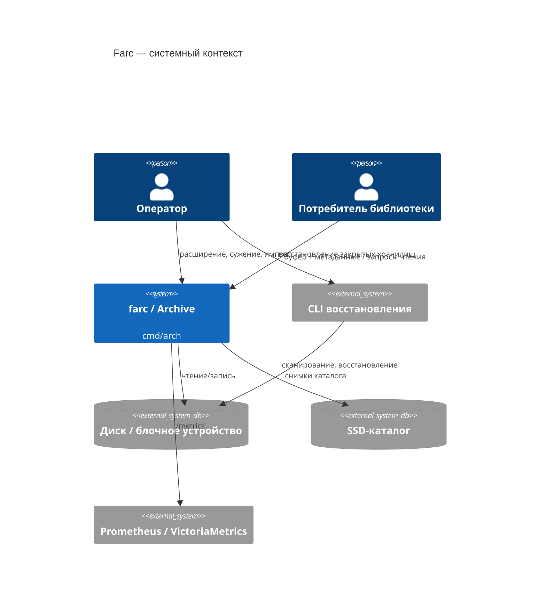
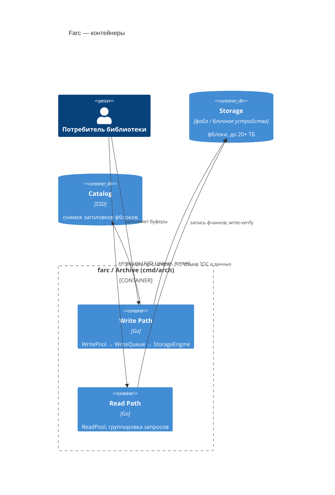

# Как писать архитектурную документацию: arc42 + C4

Это гайд по формату, а не по содержанию: он не описывает архитектуру farc, а фиксирует, **в каком виде** её нужно описывать, чтобы документы оставались сравнимыми и поддерживаемыми при будущих изменениях. Ссылайтесь на этот документ в code review, если PR меняет `docs/docs/archive/*` или добавляет ADR.

## Зачем два инструмента, а не один

**arc42** и **C4** решают разные задачи и не конкурируют:

| | Что это | Отвечает на вопрос |
|---|---|---|
| **arc42** | Скелет документа: обязательный набор разделов и их порядок | "Какие темы вообще нужно раскрыть и где искать ответ на вопрос X?" |
| **C4** | Нотация для диаграмм | "На каком уровне зума рисовать систему — целиком, по процессам, по компонентам внутри процесса?" |

C4-диаграммы физически живут внутри arc42: системный контекст — в разделе 3, диаграммы контейнеров/компонентов — в разделе 5. Одно без другого работает хуже: чистый arc42 без C4 скатывается в диаграммы произвольной нотации разного авторства (как сейчас — один `graph LR` без явного уровня зума); чистый C4 без arc42 не говорит, куда девать риски, качественные требования и глоссарий.

## Структура документа (адаптированный arc42)

Полный arc42 — 12 разделов из немецкоязычной инженерной традиции; часть из них для проекта на стадии проектирования избыточна. Ниже — обязательный минимум для farc, с привязкой к уже существующим файлам:

| № | Раздел arc42 | Файл в проекте | Статус |
|---|---|---|---|
| 1 | Введение и цели | `00-requirements.md` | есть |
| 2 | Ограничения (constraints) | `00-requirements.md` (частично) | есть частично |
| 3 | Контекст и границы системы (System Context) → **C4 уровень 1** | `01-architecture.md`, раздел 0 | есть, но не в C4-нотации |
| 4 | Стратегия решения (Solution Strategy) | `01-architecture.md`, разделы "Режимы работы" | есть частично |
| 5 | Структура (Building Block View) → **C4 уровни 2–3** | `01-architecture.md` + `02-storage.md` | есть, но не в C4-нотации |
| 6 | Поведение в runtime (Runtime View) | `01-architecture.md` разделы 2–4 | есть как проза, не как sequence-диаграммы |
| 7 | Deployment View | — | отсутствует |
| 8 | Сквозные решения (Cross-cutting Concepts) | `03-storage-format.md` и др. | есть, но разбросано |
| 9 | Архитектурные решения | `adr/*.md` | есть, уже в правильном формате |
| 10 | Качественные требования (Quality Tree + сценарии) | — | отсутствует |
| 11 | Риски и технический долг | частично в ADR ("предложено") | есть частично |
| 12 | Глоссарий | разбросан по документам (fblock, fchunk, TOC...) | нет единого места |

Разделы 7, 10, 12 сейчас не существуют отдельно — заводить их стоит не заранее "про запас", а когда появится first реальный повод (первый деплой на несколько хостов → раздел 7; первый спор о конкретных цифрах NFR → раздел 10).

## C4: четыре уровня диаграмм

| Уровень | Что показывает | Для farc |
|---|---|---|
| **1. System Context** | Систему как чёрный ящик и её внешних акторов/системы | farc, оператор, потребитель библиотеки, Prometheus, диск, SSD-каталог — уже нарисовано в `01-architecture.md`, раздел 0, но обычным `graph LR`, а не диаграммой C4 |
| **2. Container** | Отдельно деплоящиеся/исполняемые единицы и протоколы между ними | Archive-процесс (`cmd/arch`), CLI восстановления, Storage (диск/блочное устройство), SSD-каталог |
| **3. Component** | Внутренние компоненты одного контейнера | Внутри Archive: WritePool, WriteQueue, StorageEngine, ReadPool, Catalog — то, что сейчас в разделах 2.1 и 3.1 текстом |
| **4. Code** | Классы/структуры конкретного компонента | Обычно не нужен — код и так самодокументируется (`internal/traa` и т.п.); рисовать только для действительно неочевидных структур данных |

Правило: **не пропускать уровни и не смешивать их на одной диаграмме.** Если на диаграмме контекста (уровень 1) появляется "WriteQueue" — это компонент уровня 3, ему там не место.

## Нотация и технические конвенции

- Диаграммы — только **mermaid** (уже подключён в `docs/mkdocs.yaml` через `pymdownx.superfences`), чтобы рендерились и в MkDocs, и прямо в GitHub/GitLab preview.
- Mermaid поддерживает нативные типы `C4Context`, `C4Container`, `C4Component` — используйте их вместо `graph LR` для C4-диаграмм, это даёт единообразную легенду (Person/System/Container/Component) без ручной раскраски.
  - Поддержка этих типов в связке mermaid + mkdocs-material местами менее стабильна, чем у `graph`/`flowchart`. Если диаграмма не рендерится в контейнерной сборке доков (см. память: доки собираются только в контейнере, не локально) — временный fallback: `graph LR` с `subgraph`, имитирующий границы Person/System/Container, и явной пометкой уровня C4 в заголовке блока.
- Текст в диаграммах — на русском; доменные термины (`fblock`, `fchunk`, `TOC`, `CRC32`, `UUID`) не переводятся и не склоняются внутри диаграмм.
- Каждая C4-диаграмма подписывается заголовком с явным уровнем: `### Контекст (C4, уровень 1)`, `### Контейнеры (C4, уровень 2)` и т.д. — чтобы при чтении сразу было видно масштаб, без необходимости лезть в код диаграммы.

### Шаблон: System Context (уровень 1)

### Шаблон: Container (уровень 2)

## Как это применять в PR, меняющем архитектуру

1. **Определите уровень изменения**: новый контейнер/процесс → уровень 2; новый внутренний компонент существующего процесса → уровень 3; ни то ни другое, просто новый факт о системе → возможно, это не диаграмма, а раздел 8 (сквозные решения).
2. **Обновите диаграмму соответствующего уровня**, не трогая остальные — уровни независимы.
3. **Решение с альтернативами и обоснованием** (например, "выбрали X вместо Y потому что...") → новый ADR в `adr/`, а не абзац внутри `01-architecture.md`. Текущие ADR уже используют этот формат — сохраняйте его.
4. **Новый термин** → дополните глоссарий (раздел 12; до его появления как отдельного файла — `00-requirements.md`).
5. Если меняется что-то, влияющее на измеримые характеристики (пропускная способность, задержка восстановления, ёмкость) → раздел 10 (quality tree), даже если раздела ещё нет как файла — заведите его первым таким изменением.

## Что этот документ намеренно не делает

Он не переписывает `01-architecture.md` — это отдельная задача (перевод раздела 0 в `C4Context`, разделов 2.1/3.1 в `C4Container`/`C4Component`). Этот гайд фиксирует целевой формат, к которому существующие доки будут приводиться постепенно.
